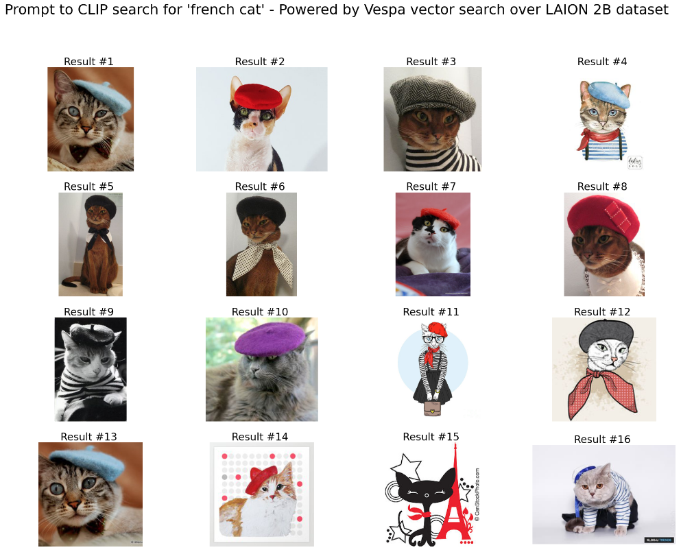
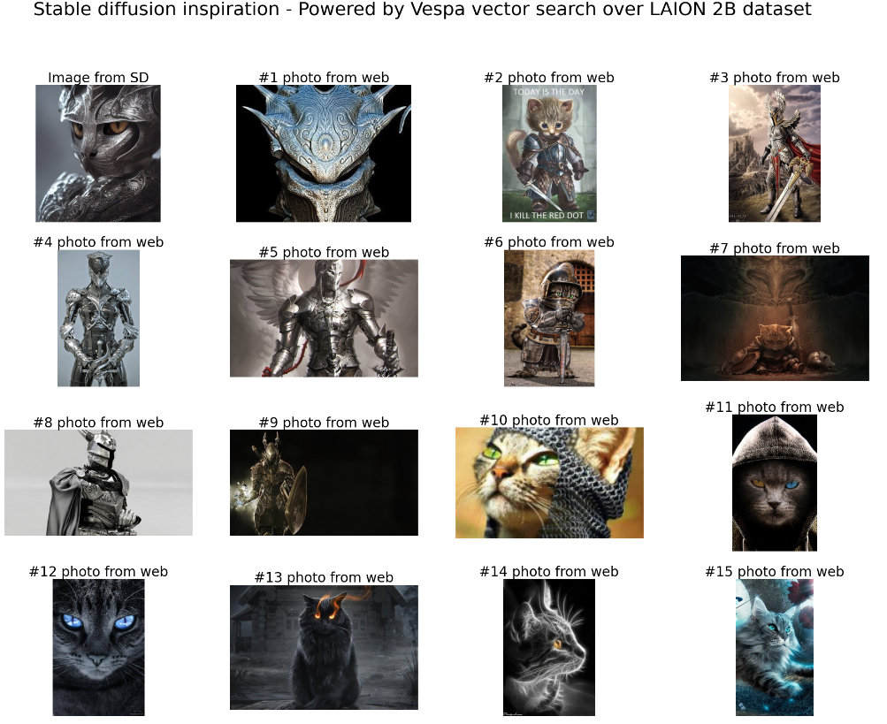

<!-- Copyright Yahoo. Licensed under the terms of the Apache 2.0 license. See LICENSE in the project root.-->

# Scalable Ultra-Large Vector Search 

This sample application combines two sample applications to implement 
cost-efficient large scale vector search over multimodal AI powered vector representations; 
[text-image-search](https://github.com/vespa-engine/sample-apps/tree/master/text-image-search) and 
[billion-scale-vector-search](https://github.com/vespa-engine/sample-apps/tree/master/billion-scale-vector-search).

# The Vector Dataset
This sample app use the [LAION-5B](https://laion.ai/blog/laion-5b/) dataset,
 the biggest open accessible image-text dataset in the world.

>Large image-text models like ALIGN, BASIC, Turing Bletchly, FLORENCE & GLIDE have 
> shown better and better performance compared to previous flagship models like CLIP and DALL-E.
> Most of them had been trained on billions of image-text pairs and unfortunately, no datasets of this size had been openly available until now. 
> To address this problem we present LAION 5B, a large-scale dataset for research purposes 
> consisting of 5,85B CLIP-filtered image-text pairs. 2,3B contain English language, 
> 2,2B samples from 100+ other languages and 1B samples have texts that do not allow a certain language assignment (e.g. names ). 

The LAION-5B dataset was used to train the popular text-to-image 
generative [StableDiffusion](https://huggingface.co/spaces/stabilityai/stable-diffusion) model. 

Note the following about the dataset

>Be aware that this large-scale dataset is un-curated. 
> Keep in mind that the un-curated nature of the dataset means that collected 
> links may lead to strongly discomforting and disturbing content for a human viewer.

The released dataset does not contain image data itself, but CLIP vector representations and meta data like `url` and `caption`.

# Use cases 

The app can be used to implement several use cases over the LAION dataset:

- Search the free text `caption` or `url` fields in the LAION dataset using Vespa's standard text-matching functionality.
- Vector search, given a text prompt, search the image vector representations (CLIP ViT-L/14), for example 'french cat'. 
- Given an image vector representation, search for similar images in the dataset. This can for example
be used to take the output image of StableDiffusion to find similar images in the training dataset. 

All this combined using [Vespa's query language](https://docs.vespa.ai/en/query-language.html),
 and also in combination with filters. 

# Vespa Primitives Demonstrated 

The sample application demonstrates many Vespa primitives: 

- Importing a [ONNX](https://onnx.ai/) exported version of [CLIP ViT-L/14](https://github.com/openai/CLIP) 
for [accelerated inference](https://blog.vespa.ai/stateful-model-serving-how-we-accelerate-inference-using-onnx-runtime/) 
in [Vespa stateless](https://docs.vespa.ai/en/overview.html) containers. 
The CLIP model allows mapping free text prompt to a joint image-text vector space with 768 dimensions.
- [HNSW](https://docs.vespa.ai/en/approximate-nn-hnsw.html) indexing of vector centroids drawn
from the dataset, and combination with classic Inverted File as described in 
[Billion-scale vector search using hybrid HNSW-IF](https://blog.vespa.ai/vespa-hybrid-billion-scale-vector-search/).
- Decoupling of vector storage and vector similarity computations. The stateless layer performs vector
similarity computation over the full precision vectors. By using Vespa's support for accelerated inference with [onnxruntime](https://onnxruntime.ai/). 
Moving the majority of the vector compute to the stateless layer allows for faster auto-scaling with daily query volume changes. 
The full precision vectors are stored in Vespa's summary log store, using lossless compression (zstd). 
- Dimension reduction with PCA - The centroid vectors are compressed from 768 dimensions to 128 dimensions. This allows indexing 6x more
centroids on the same instance type due to the reduced memory footprint. With Vespa's support for distributed search, coupled with powerful 
high memory instances, this allows Vespa to scale cost efficiently to trillion sized vector datasets. 
- The trained PCA matrix matmul operation which projects the 768 dim vector to 128 dims is 
evaluated in Vespa using accelerated inference, both at indexing time and at query time. The PCA weights are represented also using ONNX.  
- Phased ranking. The image vectors are reduced as well to 128 dimensions with semi-fast access using `paged` tensor attributes, while full 
precision vectors are on disk. The first-phase course search ranks vectors in the reduced vector space and results are merged from all nodes before
the final ranking phase in the stateless layer. The second phase is implemented in the stateless container layer using [accelerated inference](https://blog.vespa.ai/stateful-model-serving-how-we-accelerate-inference-using-onnx-runtime/) 
- Combining approximate nearest neighbor search with [filters](https://blog.vespa.ai/constrained-approximate-nearest-neighbor-search/), filtering
can be on url, caption, image height, width, safety probability, nswf label and more. 
- Hybrid ranking, both textual sparse matching features and the CLIP similarity can be used when ranking images. 
- Reduced tensor cell precision. The original LAION-5B dataset uses `float16`. The app uses Vespa's support for `bfloat16` tensors,
  saving 50% of storage compared to full `float` representation.
- Caching, both reduced vectors (128) cached by the OS buffer cache, and full version 768 dims are cached using Vespa summary cache.  
- Query-time vector de-duping and diversification of the search engine result page using document to document similarity instead of query to document similarity. Also
accelerated by stateless model inference. 
- Scale, from a single node deployment to multi-node deployment using managed [Vespa Cloud](https://cloud.vespa.ai/), 
or self-hosted on-premise. 

These reproducing steps, demonstrates the functionality using a smaller subset of the 5B vector dataset, suitable
for reproducing on a laptop. 

# Reproducing 

**Requirements:**

* [Docker](https://www.docker.com/) Desktop installed and running. 6GB available memory for Docker is recommended.
  Refer to [Docker memory](https://docs.vespa.ai/en/operations/docker-containers.html#memory)
  for details and troubleshooting
* Operating system: Linux, macOS or Windows 10 Pro (Docker requirement)
* Architecture: x86_64 or arm64
* [Homebrew](https://brew.sh/) to install [Vespa CLI](https://docs.vespa.ai/en/vespa-cli.html), or download
  a vespa cli release from [Github releases](https://github.com/vespa-engine/vespa/releases).
* [Java 17](https://openjdk.java.net/projects/jdk/17/) installed.
* Python3 and numpy to process the vector dataset 
* [Apache Maven](https://maven.apache.org/install.html) - this sample app uses custom Java components and Maven is used
  to build the application. 

Verify Docker Memory Limits:

<pre>
$ docker info | grep "Total Memory"
</pre>

Install [Vespa CLI](https://docs.vespa.ai/en/vespa-cli.html):

<pre >
$ brew install vespa-cli
</pre>

Set target env, it's also possible to deploy this app to [Vespa Cloud](https://cloud.vespa.ai/)
using target cloud. For Vespa cloud deployments to [perf env](https://cloud.vespa.ai/en/reference/zones.html) 
replace the [src/main/application/services.xml](src/main/application/services.xml) with 
[src/main/application/cloud-services.xml](src/main/application/cloud-services.xml). 

For local deployment using docker image use:

<pre data-test="exec">
$ vespa config set target local
</pre>

For cloud deployment using [Vespa Cloud](https://cloud.vespa.ai/) use:
<pre>
$ vespa config set target cloud
$ vespa config set application tenant-name.myapp.default
$ vespa auth login 
$ vespa auth cert
</pre>

See also [Cloud Vespa getting started guide](https://cloud.vespa.ai/en/getting-started). 

<pre data-test="exec">
$ git clone https://github.com/vespa-engine/sample-apps.git && cd sample-apps
$ git checkout jobergum/billion-scale-image-search 
$ cd billion-scale-image-search
</pre>

Pull and start the vespa docker container image:

<pre data-test="exec">
$ docker pull vespaengine/vespa
$ docker run --detach --name vespa --hostname vespa-container \
  --publish 8080:8080 --publish 19071:19071 \
  vespaengine/vespa
</pre>

Verify that the configuration service (deploy api) is ready:

<pre data-test="exec">
$ vespa status deploy --wait 300
</pre>

Download this sample application:

#TODO 
<pre>
$ vespa clone billion-scale-image-search myapp && cd myapp
</pre>

## Download Vector Data

These instruction uses the first split file (0000) of a total of 2314 files in the LAION2B-en split:

Download the vector data file:

<pre data-test="exec">
$ wget \
  https://mystic.the-eye.eu/public/AI/cah/laion5b/embeddings/laion2B-en/img_emb/img_emb_0000.npy
</pre>

Download the meta data file:

<pre data-test="exec">
$ wget  \
  https://mystic.the-eye.eu/public/AI/cah/laion5b/embeddings/laion2B-en/laion2B-en-metadata/metadata_0000.parquet
</pre>

Process the dataset into Vespa feed format. 

Install python dependencies:

<pre data-test="exec">
$ pip3 install pandas numpy requests mmh3 pyarrow 
</pre>

Generate centroids, this process randomly selects vectors from the dataset to represent
centroids. Performing an incremental clustering can improve vector search recall and allow to
have fewer centroids. For simplicity, this tutorial uses random sampling. 

<pre data-test="exec">
$ python3 src/main/python/create-centroid-feed.py img_emb_0000.npy > centroids.jsonl
</pre>

Generate the image feed, this merges the embedding data with the metadata 

<pre data-test="exec">
$ python3 src/main/python/create-joined-feed.py metadata_0000.parquet img_emb_0000.npy > feed.jsonl
</pre>

To process the entire dataset, we recommend starting several processes, each operating on separate split files 
as the processing is single-threaded. 

## Build and deploy Vespa app 

Download an exported CLIP ONNX model or use the [export utility](src/main/python/clip_export.py). The
pre-exported model has been quantized for more efficient inference on CPU. 

<pre data-test="exec">
$ curl -L -o src/main/application/models/text_transformer.onnx \
  https://data.vespa.oath.cloud/sample-apps-data/clip_text_transformer.onnx
</pre>

In addition to the CLIP text encoder, the model directory contains three small ONNX models:

- `vespa_innerproduct_ranker.onnx` which is used to perform vector similarity (inner dot product) between the query and the vectors
in the stateless container.
- `vespa_pairwise_similarity.onnx` which is used to perform matrix multiplication between the top retrieved vectors.
- `pca_transformer.onnx` which is used for dimension reduction, projecting the orginal 768 dim vector space to a 128 dimensional space. 

These `ONNX` model files are generated by specifying the compute operation using `torch` and using torch's
ability to export the model to ONNX format:

- [ranker_export.py](src/main/python/ranker_export.py)
- [similarity_export.py](src/main/python/similarity_export.py)
- [pca_transformer_export.py](src/main/python/pca_transformer_export.py)

Build the sample app (make sure you have JDK 17, verify with `mvn -v`)

<pre data-test="exec" data-test-expect="BUILD SUCCESS" data-test-timeout="300">
$ mvn clean package -U
</pre>

Deploy the application. This step deploys the application package built in the previous step:

<pre data-test="exec" data-test-assert-contains="Success">
$ vespa deploy --wait 300
</pre>

Wait for the application endpoint to become available:

<pre data-test="exec">
$ vespa status --wait 300
</pre>

Basic verfication
Running [Vespa System Tests](https://docs.vespa.ai/en/reference/testing.html)
which runs a set of basic tests to verify that the application is working as expected.
<pre data-test="exec" data-test-assert-contains="Success">
$ vespa test src/test/application/tests/system-test/feed-and-search-test.json
</pre>

Download the [vespa-feed-client](https://docs.vespa.ai/en/vespa-feed-client.html):

<pre data-test="exec">
$ curl -L -o vespa-feed-client-cli.zip \
    https://search.maven.org/remotecontent?filepath=com/yahoo/vespa/vespa-feed-client-cli/8.48.22/vespa-feed-client-cli-8.48.22-zip.zip
$ unzip -o vespa-feed-client-cli.zip
</pre>

The _centroid_ vectors **must** be indexed first:

<pre data-test="exec">
$ ./vespa-feed-client-cli/vespa-feed-client \
  --file centroids.jsonl --endpoint http://localhost:8080/
$ ./vespa-feed-client-cli/vespa-feed-client \
  --file feed.jsonl --endpoint http://localhost:8080/
</pre>

# Query the data

Passing `prompt` and Vespa will encode the prompt using the embedded CLIP model:

<pre data-test="exec">
$ vespa query \
 'yql=select documentid, license caption, url, height, width from image where nsfw contains "unlikely"'\
 'hits=10' \
 'prompt=two dogs running on a sandy beach'
</pre>

Regular query, matching over the `default` fieldset, searching the `caption` and the `url` field, ranked by 
the `text` ranking profile:

<pre data-test="exec">
$ vespa query \
 'yql=select caption, url from image where nsfw contains "unlikely" and userQuery()'\
 'hits=10' \
 'query=two dogs running on a sandy beach' \
 'ranking=text'
</pre>

## Shutdown and remove the Docker container:

<pre data-test="after">
$ docker rm -f vespa
</pre>

### Text prompt french cat

### Image to Image

