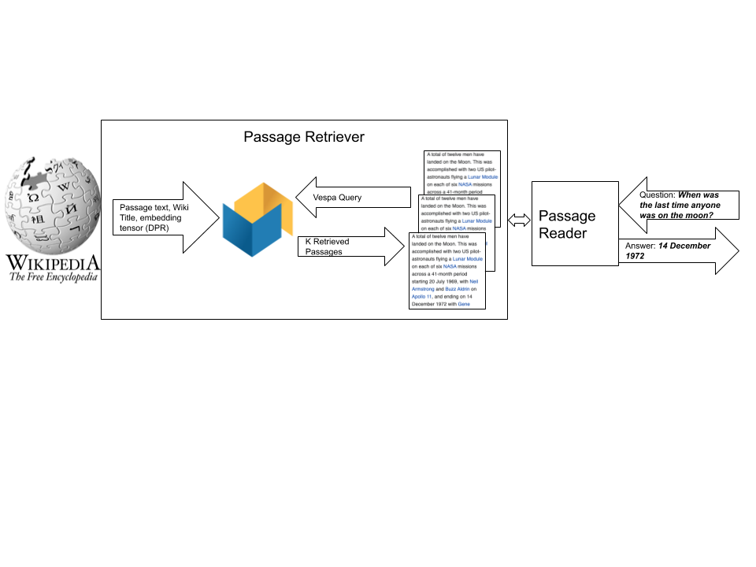

<!-- Copyright Verizon Media. Licensed under the terms of the Apache 2.0 license. See LICENSE in the project root.-->

# Vespa sample application - Open-Domain Question Answering

In this sample application we use Vespa.ai's support for [fast approximate nearest neighbor search](https://docs.vespa.ai/documentation/approximate-nn-hnsw.html) 
to perform dense embedding retrieval over Wikipedia for question answering using 
Facebook's [Dense Passage Retriever Model](https://github.com/facebookresearch/DPR) described in the 
[Dense Passage Retrieval for Open-Domain Question Answering](https://arxiv.org/abs/2004.04906) paper. 

We reproduce the retrieval metrics and reader evaluation metrics as reported in the paper 
where the trained dense embedding representation and retrieval outperforms sparse term based retrieval (TF-IDF variants). 
We also introduce a simple 
hybrid model which combines sparse and dense retrieval which gives a small lift in accuracy for top-k retrieval metrics. 

Using Vespa.ai as serving engine for passage retrieval for question answering allows representing both sparse term based and dense embedding retrieval 
in the same schema, which also enables hybrid retrieval using a combination of the two approaches. With Vespa's support for running Transformer based
models like BERT via Vespa's ONNX run time support we are also able to deploy the DPR BERT query embedding encoder used for the dense embedding retrieval in 
the same system and also the DPR BERT based Reader component which re-scores the retrieved passages and finds the 
best answer spans.

## Question Answering System Architecture 

A typical architecture for Open Domain Question Answering consist of two main components:

* A **Retriever** Component which is capable of retrieving relevant passages for a question from a potentially very large document corpus
* A **Reader** Component which uses the retrieved context/passages to produce an answer to the question

<figure>

</figure> 

### The Retriever

### The Reader 

## Vespa Document & Retrieval Model 

We represent the passage text and Wikipedia title and corresponding passage embedding tensor from DPR 
in the same Vespa [document schema](src/main/application/schemas/wiki.sd). We also store the generated token ids from the BERT
tokenization as Vespa tensor fields. These fields are not used by the retriever component but by the reader. 
<pre>
schema wiki {

  document wiki {

    field title type string {
      indexing: summary | index
      index: enable-bm25
    }

    field title_token_ids type tensor<float>(d0[256]) {
        indexing: summary | attribute
    }

    field text type string {
      indexing: summary | index
      index: enable-bm25
    }

    field text_token_ids type tensor<float>(d0[256]) {
      indexing: summary |attribute
    }

    field id type long {
      indexing: summary | attribute
    }

    field text_embedding type tensor<float>(x[769]){
      indexing: attribute | index  
      attribute {
        distance-metric:euclidean
      }
      index {
        hnsw {
          max-links-per-node: 32
          neighbors-to-explore-at-insert: 500
        }
      }
    }
  }
  fieldset default {
    fields: title, text
  }
}
</pre> 

The above Vespa document schema allows retrieval using different strategies using the same platform:

* **Sparse retrieval** Using traditional term based (High dimensional, sparse)
* **Dense retrieval** Using trained embedding representations of query and document (Low dimensional, dense) 
* **Hybrid** Using a combination of the above 

The schema defines 2 string fields which are indexed which enables fast and efficient term based retrieval. 
The *id* represents the Wikipedia passage id as assigned in the pre-computed dataset published by Facebook Research. 
The *text_embedding* tensor is a dense 769 dimensional tensor which represents the document (text and title) and
we enable [HNSW index for fast approximate nearest neighbor search](https://docs.vespa.ai/documentation/approximate-nn-hnsw.html). 

The dual query and document encoder of the DPR retrieval system uses the inner dot product between
the query tensor and the document tensor to represent the rank score using 768 dimensions (BERT-base). 
We transform the 768 dimensional inner product space
to euclidean space using an [euclidean transformation](https://www.microsoft.com/en-us/research/wp-content/uploads/2016/02/XboxInnerProduct.pdf)  
which adds one dimension so our representation becomes 
769 dimensional where we can use the euclidean distance metric when finding the nearest neighbors for a input query tensor.
The DPR implementation uses the same space transformation when using [Faiss with HNSW index](https://github.com/facebookresearch/faiss). 

 
## Vespa Retrieval & Ranking
We can express our retrieval strategies by 
* A Vespa [search api request](https://docs.vespa.ai/documentation/query-api.html) with a query 
specified using the [Vespa YQL query language](https://docs.vespa.ai/documentation/reference/query-language-reference.html) 
* A [ranking](https://docs.vespa.ai/documentation/ranking.html) specification which controls how we score documents retrieved by the query  

In the following sub section we use **what is the weight of a honda fit?** as a sample question 
to illustrate our Vespa query specifications.
The sample question is from the [Natural Questions dev set](https://github.com/efficientqa/nq-open). 

Vespa assigns rank score using ranking expressions, configured in a ranking profile in the document schema. The rank profile
can also specify [multi-phased ranking](https://docs.vespa.ai/documentation/phased-ranking.html). Choosing rank profile is a run time 
request parameter (ranking.profile).

### Dense
The dense retrieval uses Vespa's approximate nearest neighbor search operator. We compute 
the query embedding tensor from the input textual question
representation and retrieve the top 10 closest neighbors using euclidean distance. 

### Sparse

### Hybrid 

## Experiments 

### Retriever Accuracy Summary 

The following table summarizes the retriever accuracy using the 3610 dev questions in the Natural Questions for
Open Domain Question Answering tasks.

| Retrieval Model             | ANN hnsw.exploreAdditionalHits |Recall@10 | Recall@20 | Recall@100 |
|-----------------------------|---------------------------|-----------|-----------|------------|
| sparse                      |NAN                        | 0.503047  | 0.582825  | 0.689474   |
| dense                       | 100                       | 0.741828  | 0.794183  | 0.854294   |
| dense                       |1000                       | 0.750970  | 0.804155  | 0.863989   |
| hybrid                      |1000                       | **0.759834**  | **0.811911**  |**0.864543**   |

When using HNSW index we sacrifice some accuracy/quality for speed and we include results for the dense retrieving using two values for the *hnsw.exploreAdditionalHits* to
see the impact on the retriever accuracy. 
The original DPR paper reports 0.794 Recall @20 and 0.86 Recall @100 so our results are inline with the findings in the DPR paper. We can see
that the hybrid model where we combine dense and sparse retrieval has slightly better performance for Recall@10 and Recall@20 than dense alone. 

### Reader Accuracy Summary 

We evaluate the Reader accuracy using the Exact Match (EM) metric.  

| Retrieval Model | EM(@10)   | EM (@20)| 
|-----------------|-----------|---------|
| sparse          | 24.65     | 26.62   | 
| dense           | 40.36     | 40.66   | 
| hybrid          | 40.55     | 40.83   | 

## Reproducing this work  - Requirements for running this sample application:

* [Docker](https://www.docker.com/) installed and running  
* git client to checkout the sample application repository and DPR and Maven installed 
* Operating system: macOS or Linux, Architecture: x86_64
* Minimum **128GB** system memory 
* python3 and DPR dependencies, see [DPR repo](https://github.com/facebookresearch/DPR) 
 
See also [Vespa quick start guide](https://docs.vespa.ai/documentation/vespa-quick-start.html). 

## Checkout the sample-apps repository and install DPR requirements
<pre>
$ git clone --depth 1 https://github.com/vespa-engine/sample-apps.git
$ export VESPA_SAMPLE_APPS=`pwd`/sample-apps
$ TODO MUST build zip before mapping volume 
$ docker run --detach --name vespa --hostname vespa-container \
  --volume $VESPA_SAMPLE_APPS:/vespa-sample-apps --publish 8080:8080 vespaengine/vespa
</pre>

Wait for configuration service to start (Wait for the command below return a 200 OK):

<pre>
$ docker exec vespa bash -c 'curl -s --head http://localhost:19071/ApplicationStatus'
</pre>

Build the application and deploy application:

<pre>
$ cd $VESPA_SAMPLE_APPS/dense-passage-retrieval-with-ann/
$ mvn package -U
$ docker exec vespa bash -c '/opt/vespa/bin/vespa-deploy prepare \
  /vespa-sample-apps/dense-passage-retrieval-with-ann/target/applization.zip && \
  /opt/vespa/bin/vespa-deploy activate'
</pre>

## Setup DPR
<pre>
$ cd $VESPA_SAMPLE_APPS/dense-passage-retrieval-with-ann/
$ git clone --depth 1 https://github.com/facebookresearch/DPR.git
$ cd DPR; pip3 install .
</pre>

## Download the Wikipedia data and pre-computed embeddings

Thanks to [Facebook Research](https://opensource.fb.com/) for providing both the pre-tokenized Wikipedia text passages and the corresponding passage embeddings. 
Note that the data is large, the text passage representation (data.wikipedia_split) is 13G and the pre-computed embeddings is 62G.

To download the pre-generated Wikipedia snippets and the pre-computed passage embeddings use the DPR download utility: 
<pre>
python3 data/download_data.py  --resource data.wikipedia_split 
python3 data/download_data.py  --resource data.retriever_results.nq.single.wikipedia_passages
cd ..
</pre>

## Join passage text and embedding to Vespa feed format

We join this data and create a Vespa feed file with one Vespa put document operation per line [Vespa json feed format](https://docs.vespa.ai/documentation/reference/document-json-format.html). 
The scripts reads the entire Wikipedia passage into memory and reads
one embedding file at a time and emit a join of the textual passage meta data with the precomputed DPR embedding. 
 
<pre>
$ cd $VESPA_SAMPLE_APPS/dense-passage-retrieval-with-ann/ 
$ python3 make-vespa-feed.py DPR/data/wikipedia_split/psgs_w100.tsv DPR/data/retriever_results/nq/single/wikipedia_passages_* > feed.jsonl
</pre>

Sample data emitted (newline formatted for readability):

<pre>
{
  "put": "id:wiki:wiki::3", 
  "fields": {
    "title": "Aaron", 
    "text": "his rod turn into a snake. Then he stretched out his rod in order to .. While Joshua went with Moses to the top,",
    "id": 3, 
    "text_embedding": {"values": [-0.23045846819877625,....]}
  }
}
</pre>

We are now ready to index the data in our Vespa installation. The feed file is 273G uncompressed. 

## Feed data to Vespa

We feed the documents using the [Vespa http feeder client](https://docs.vespa.ai/documentation/vespa-http-client.html):
<pre>
$ java -jar vespa-http-client-jar-with-dependencies.jar --file feed.jsonl --endpoint http://your-vespa-instance-hostname:8080 
</pre>
We can obtain the feeding client jar from the docker image by :
<pre>
docker cp vespa:/opt/vespa/lib/jars/vespa-http-client-jar-with-dependencies.jar . 
</pre>

Loading the data to Vespa using a single content node instance with 36 vcpu's takes about 5 hours (21M passages , 1350 puts/s sustained, with visibility-delay 1.0 seconds
and real time indexing). Note that indexing both build inverted indexes for efficient sparse term based retrieval and HNSW graph for fast efficient dense embedding retrieval. 

## Experiments 

### Retriever experiments 
To run all questions in the Natural Question dev set run:

<pre>
$ cd $VESPA_SAMPLE_APPS/dense-passage-retrieval-with-ann/
$ python3 retrieve.py natural-questions-open-dev.json.gz dense http://your-vespa-instance-hostname:8080
$ python3 retrieve.py natural-questions-open-dev.json.gz sparse http://your-vespa-instance-hostname:8080 
$ python3 retrieve.py natural-questions-open-dev.json.gz hybrid http://your-vespa-instance-hostname:8080 
</pre>

The above will create three results files, *results-dense.json*,  *results-sparse.json* and *results-hybrid.json*. 
We can evaluate the Retriever accuracy metrics by running the *compute-recall.py* script

<pre>
$ python3 compute-recall.py results-dense.json
$ python3 compute-recall.py results-sparse.json
$ python3 compute-recall.py results-hybrid.json
</pre>

### Reader experiments 
Using the DPR reader we can use the result files produced by the previous step (retriever evaluation) to evaluate the reader accuracy 
<pre>
cd DPR;
python3 data/download_data.py --resource checkpoint.retriever.single.nq.bert-base-encoder
python3 train_reader.py --prediction_results_file ../prediction_sparse.json  --eval_top_docs 100 --model_file checkpoint/reader/nq-single/hf-bert-base.cp --dev_file ../results-sparse.json --passages_per_question_predict 100 --sequence_length 350
python3 train_reader.py --prediction_results_file ../prediction_dense.json  --eval_top_docs 100 --model_file checkpoint/reader/nq-single/hf-bert-base.cp --dev_file ../results-dense.json --passages_per_question_predict 100 --sequence_length 350
</pre>

