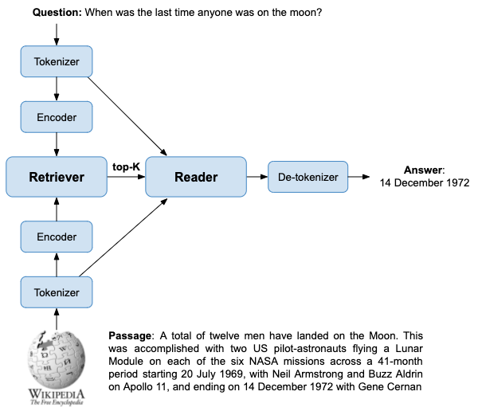
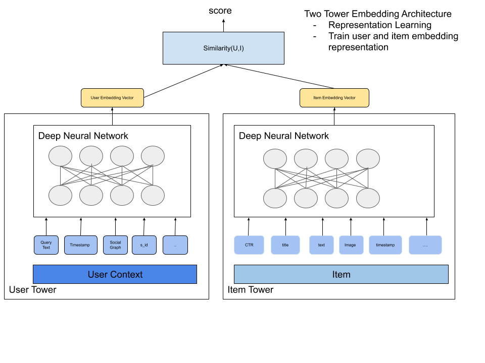
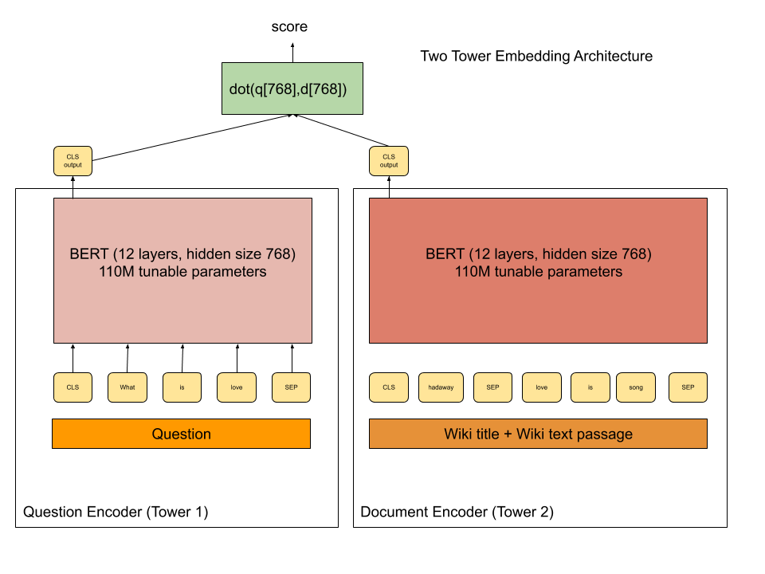
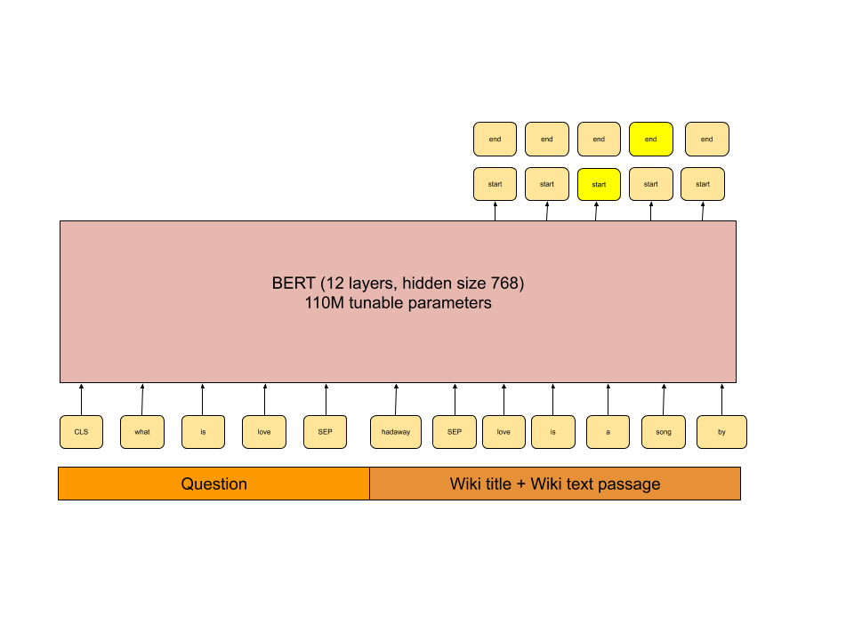

<!-- Copyright Yahoo. Licensed under the terms of the Apache 2.0 license. See LICENSE in the project root.-->

# Vespa sample application - Open-Domain Question Answering

This sample application demonstrates how to build an open domain
retrieval-based question-answering **serving** system using Vespa.  This
application implements the [Dense Passage Retriever](https://github.com/facebookresearch/DPR)
system, and demonstrates:

* Term-based (sparse) retrieval using [BM25](https://docs.vespa.ai/en/reference/bm25.html), accelerated by [WeakAnd](https://docs.vespa.ai/en/using-wand-with-vespa.html)
* Semantic similarity (dense) retrieval, accelerated by Vespa's [approximate nearest neighbor search](https://docs.vespa.ai/en/approximate-nn-hnsw.html) 
* Transformer (BERT) Inference for query text to vector encoding and answer extraction
* Custom [Searcher components](https://docs.vespa.ai/en/searcher-development.html)

For more details, refer to the companion blog post:
[Efficient open-domain question-answering on Vespa](https://blog.vespa.ai/efficient-open-domain-question-answering-on-vespa/).

This README contains the following:

- [A quick start](#quick-start) on how to test the sample application on a small data set
- Instructions on [how to feed the entire Wikipedia dataset](#how-to-feed-the-entire-dataset)
- [Experiments](#experiments) and [results](#results)

<figure>

</figure>

## Quick start

The following is a recipe on how to get started with a tiny set of sample data.
The sample data only contains the first 100 passages of the full dataset, but
this should be able to run on for instance a laptop. For the full dataset to
recreate the results in the DPR paper, see the [next section](#how-to-feed-the-entire-dataset).

Requirements:
* [Docker](https://www.docker.com/) Desktop installed and running. 6GB available memory for Docker is recommended.
  Refer to [Docker memory](https://docs.vespa.ai/en/operations/docker-containers.html#memory)
  for details and troubleshooting
* Operating system: Linux, macOS or Windows 10 Pro (Docker requirement)
* Architecture: x86_64
* [Homebrew](https://brew.sh/) to install [Vespa CLI](https://docs.vespa.ai/en/vespa-cli.html), or download
  a vespa cli release from [Github releases](https://github.com/vespa-engine/vespa/releases).
* [Java 11](https://openjdk.java.net/projects/jdk/11/) installed.
* python3.7+ installed. Using Python runtime environments (e.g. using [Conda](https://conda.io/projects/conda/en/latest/index.html)) is highly recommended
* [Apache Maven](https://maven.apache.org/install.html) This sample app uses custom Java components and Maven is used
  to build the application.
* zstd: `brew install zstd`

See also [Vespa quick start guide](https://docs.vespa.ai/en/vespa-quick-start.html).

Validate Docker resource settings, should be minimum 6GB:

<pre>
$ docker info | grep "Total Memory"
</pre>

Install [Vespa CLI](https://docs.vespa.ai/en/vespa-cli.html).

<pre >
$ brew install vespa-cli
</pre>

Set target env, it's also possible to deploy to [Vespa Cloud](https://cloud.vespa.ai/)
using target cloud.

For local deployment using docker image use

<pre data-test="exec">
$ vespa config set target local
</pre>

For cloud deployment using [Vespa Cloud](https://cloud.vespa.ai/) use

<pre>
$ vespa config set target cloud
$ vespa config set application tenant-name.myapp.default
$ vespa auth login 
$ vespa auth cert
</pre>

See also [Cloud Vespa getting started guide](https://cloud.vespa.ai/en/getting-started). It's possible
to switch between local deployment and cloud deployment by changing the `config target`.

Pull and start the vespa docker container image:

<pre data-test="exec">
$ docker pull vespaengine/vespa
$ docker run --detach --name vespa --hostname vespa-container \
  --publish 8080:8080 --publish 19071:19071 \
  vespaengine/vespa
</pre>

Verify that configuration service (deploy api) is ready

<pre data-test="exec">
$ vespa status deploy --wait 300
</pre>

Download this sample application

<pre data-test="exec">
$ vespa clone dense-passage-retrieval-with-ann myapp && cd myapp
</pre>

Download and setup the Transformer models, and build the application package.
This can take some time as the two BERT-based models are around 100Mb each. The quick
start uses quantized model versions. 

<pre data-test="exec">
$ pip3 install -r requirements.txt
$ mkdir -p src/main/application/models/
$ python3 bin/export-reader-model.py src/main/application/models/reader.onnx
$ mv src/main/application/models/reader-quantized.onnx src/main/application/models/reader.onnx
$ python3 bin/export-query-model.py src/main/application/models/question_encoder.onnx
$ mv src/main/application/models/question_encoder-quantized.onnx src/main/application/models/question_encoder.onnx
</pre>

Build the application package 
<pre data-test="exec" data-test-expect="BUILD SUCCESS" data-test-timeout="300">
$ mvn clean package -U
</pre>

Deploy the application package:
<pre data-test="exec" data-test-assert-contains="Success">
$ vespa deploy --wait 300
</pre>

Wait for the application endpoint to become available

<pre data-test="exec">
$ vespa status --wait 300
</pre>

Running [Vespa System Tests](https://docs.vespa.ai/en/reference/testing.html)
which runs a set of basic tests to verify that the application is working as expected.

<pre data-test="exec" data-test-assert-contains="Success">
$ vespa test src/test/application/tests/system-test/passage-ranking-system-test.json
</pre>

Feed sample data using the [vespa-feed-client](https://docs.vespa.ai/en/vespa-feed-client.html):

<pre data-test="exec">
$ curl -L -o vespa-feed-client-cli.zip \
    https://search.maven.org/remotecontent?filepath=com/yahoo/vespa/vespa-feed-client-cli/7.527.20/vespa-feed-client-cli-7.527.20-zip.zip
$ unzip vespa-feed-client-cli.zip
</pre>

<pre data-test="exec">
$ ./vespa-feed-client-cli/vespa-feed-client --file sample-feed.jsonl --endpoint http://localhost:8080
</pre>

Run a question: 

<pre data-test="exec" data-test-assert-contains='prediction": "2, 700"'>
$ curl -s "http://localhost:8080/search/?query=what+is+the+population+of+achill+island%3F" | python3 -m json.tool
</pre>

Run another question: 

<pre data-test="exec" data-test-assert-contains='prediction": "78. 29'>
$ curl -s "http://localhost:8080/search/?query=what+is+the+boiling+point+of+ethanol%3F" | python3 -m json.tool
</pre>

After you are done, shutdown and remove the container:

<pre data-test="after">
$ docker rm -f vespa
</pre>

## How to feed the entire dataset

To run the full dataset, minimum **128GB** system memory for the content node is recommended.
Refer to [Docker memory](https://docs.vespa.ai/en/operations/docker-containers.html#memory)
for details and troubleshooting:

Since the DPR repo depends on a different version of transformers library,
the following steps needs to be a performed in a different python environment.
We recommend using e.g. conda.
How to install and configure conda is outside of the scope of this work
but the  below creates a python3.7 runtime environment named DPR.
This isolates the environment where the DPR dependencies are installed.

<pre>
$ conda create -n DPR python=3.7
$ conda activate DPR
$ git clone git@github.com:facebookresearch/DPR.git
$ cd DPR
$ pip3 install .
</pre>

Thanks to [Facebook Research](https://opensource.fb.com/) for providing both
the pre-tokenized Wikipedia text passages and the corresponding passage embeddings.
Note that the data is large, the text passage representation
(data.wikipedia_split) is 13G and the pre-computed embeddings are 62G.

To download the pre-generated Wikipedia snippets and the pre-computed passage
embeddings use the DPR download utility:

<pre>
$ python3 dpr/data/download_data.py --resource data.wikipedia_split
$ python3 dpr/data/download_data.py --resource data.retriever_results.nq.single.wikipedia_passages
</pre>

To generate the combined feed file use the *make-vespa-feed.py* script.  
It reads the entire Wikipedia passage text dataset into memory, reads one embedding file at a time
and emits a joint Vespa document representation of the textual passage data with the precomputed DPR passage embedding.

<pre>
$ cd ..
$ python3 bin/make-vespa-feed.py DPR/downloads/data/wikipedia_split/psgs_w100.tsv DPR/downloads/data/retriever_results/nq/single/wikipedia_passages_*.pkl > feed.jsonl 
</pre>

The script generates the input feed file, sample snippet: 

<pre>
{
  "put": "id:wiki:wiki::41",
  "fields": {
    "title": "Alcohol",
    "text": "Alcohol In chemistry, an alcohol is any organic compound in which the hydroxyl functional group is bound to a carbon. ...",
    "id": 41,
    "text_embedding": {"values": [0.030272305011749268, ...]}
  }
}
</pre>

The final feed file is 273G uncompressed. Adding compression like zstd/zip is highly recommended. Feed the file using the 
same tool as with the toy sample data:

<pre>
$ ./vespa-feed-client-cli/vespa-feed-client --file feed.jsonl --endpoint http://localhost:8080
</pre>

## Experiments

With the full dataset indexed in Vespa, on can run all questions from the
Natural Questions (NQ) dev split using the three different retrieval strategies:

<pre>
$ curl -L -o NQ-open.dev.jsonl https://raw.githubusercontent.com/google-research-datasets/natural-questions/master/nq_open/NQ-open.dev.jsonl
$ python3 bin/evaluate_em.py NQ-open.dev.jsonl dense http://your-vespa-instance-hostname:8080
$ python3 bin/evaluate_em.py NQ-open.dev.jsonl sparse http://your-vespa-instance-hostname:8080
$ python3 bin/evaluate_em.py NQ-open.dev.jsonl hybrid http://your-vespa-instance-hostname:8080
</pre>

## Results

The following section describe the experiments performed with this setup,
all experiments are done running queries using the [Vespa query api](https://docs.vespa.ai/en/query-api)
and checking the predicted answer against the golden reference answer(s).

<pre>
def get_vespa_result(question, retriever_model):
  request_body = {
    'type': 'any',
    'query': question,
    'retriever': retriever_model
  }
  url = endpoint + '/search/'
  response = requests.post(url, json=request_body)
  return response.json()
</pre>

### Retriever Accuracy Summary

The following table summarizes the retriever accuracy using the original 3,610
dev questions in the Natural Questions for Open Domain Question Answering tasks
([NQ-open.dev.jsonl](https://github.com/google-research-datasets/natural-questions/blob/master/nq_open/NQ-open.dev.jsonl)).

**Recall@K** is used as the main evaluation metric for the retriever.

The obvious goal of the retriever is to have the highest recall possible at the lowest possible position.
The fewer passages one needs to evaluate through the BERT reader,
the better the run time complexity and performance is.

Three different retrieval strategies are evaluated:

* **Dense** Using the DPR embeddings and Vespa's nearest neighbor search operator
* **Sparse** Using the Vespa's [weakAnd(WAND)](https://docs.vespa.ai/en/using-wand-with-vespa.html)
  query operator and using BM25(title) + BM25(text)
* **Hybrid** Using a linear combination of the above and using OR to combine
  the weakAnd and nearestNeighbor search operator.

| Retrieval Model                 | Recall@1  | Recall@5 | Recall@10| Recall@20 |
|-------------------------------- |-----------|----------|----------|-----------|
| sparse (WAND bm25)              | 23.77     | 44.24    | 52.69    | 61.47     |
| dense  (nearest neighbor)       | 46.37     | 68.53    | 75.07    | 80.36     |
| hybrid (WAND + nearest neighbor)| 40.61     | 69.25    | 75.96    | 80.44     |

The DPR paper reports Recall@20 79.4,
so results are in accordance with the reported results for the dense retrieval method.

### Reader Accuracy Summary

Reader accuracy is measured using the Exact Match (EM) metric.
The Exact Match metric measures the percentage of predictions
that match any one of the ground truth answers **exactly**.
To get an EM score of 1 for a query,
the answer prediction must match exactly the golden answer given in the dataset.
E.g. for the question *when was the last moon landing* and the predicted answer *14 December 1972*
it will not  match the golden answers which are *14 December 1972 UTC* or *December 1972*.

**Original Natural Question dev set**
([NQ-open.dev.jsonl](https://github.com/google-research-datasets/natural-questions/blob/master/nq_open/NQ-open.dev.jsonl))

| Retrieval Model                 | EM(@5)    | EM (@10)|
|---------------------------------|-----------|--------|
| sparse (WAND bm25               | 23.80     | 26.23  |
| dense  (nearest neighbor)       | 39.34     | 40.58  |
| hybrid (WAND + nearest neighbor)| 39.36     | 40.61  |

## Summary 

<!--
<figure>

</figure>
-->

<figure>

</figure>

### Schema

We represent the Wikipedia passage text, title and the passage embedding vector
in the same Vespa [document schema](src/main/application/schemas/wiki.sd).
We also store the token ids from the BERT tokenization as Vespa tensor fields.
These token_ids fields are not used by the retriever component, but by the reader.
The tensor field type in Vespa is always stored in memory for fast access during retrieval and ranking. Schema:

<pre>
schema wiki {

  document wiki {

    field title type string {
      indexing: summary | index
      index: enable-bm25
    }

    field title_token_ids type tensor<float>(d0[256]) {
        indexing: summary | attribute
    }

    field text type string {
      indexing: summary | index
      index: enable-bm25
    }

    field text_token_ids type tensor<float>(d0[256]) {
      indexing: summary |attribute
    }

    field id type long {
      indexing: summary | attribute
    }

    field text_embedding type tensor<float>(x[769]){
      indexing: attribute | index
      attribute {
        distance-metric:euclidean
      }
      index {
        hnsw {
          max-links-per-node: 32
          neighbors-to-explore-at-insert: 500
        }
      }
    }
  }
  fieldset default {
    fields: title, text
  }
}
</pre>

The above Vespa document schema allows retrieval using different strategies,
using the same scalable serving engine:

* **Sparse retrieval:** Using traditional term based (High dimensional, sparse)
* **Dense retrieval:** Using trained embedding representations of query and document (Low dimensional, dense)
* **Hybrid:** Using a combination of the above

The schema defines two indexed string fields.
This enables fast and efficient term based retrieval, e.g. using WeakAND (WAND).
The *id* represents the Wikipedia passage id
as assigned in the pre-computed dataset published by Facebook Research.
The *text_embedding* tensor is a dense 769 dimensional tensor
which represents the document (text and title).
We enable [HNSW index for fast approximate nearest neighbor search](https://docs.vespa.ai/en/approximate-nn-hnsw.html).

The dual query and document encoder of the DPR retrieval system uses the inner
dot product between the query tensor and the document tensor to represent the score.
We transform the 768 dimensional inner product space to euclidean space using an
[euclidean transformation](https://www.microsoft.com/en-us/research/wp-content/uploads/2016/02/XboxInnerProduct.pdf)
which adds one dimension.
Our representation hence becomes 769 dimensional,
where we can use the euclidean distance metric when finding the nearest neighbors in embedding space.
The DPR implementation uses the same space transformation when using
[Faiss with HNSW index](https://github.com/facebookresearch/faiss).

### Retrieval and ranking

We can express our retrieval strategies by:

* A Vespa [query api request](https://docs.vespa.ai/en/query-api.html)
  with a query specified using the
  [Vespa YQL query language](https://docs.vespa.ai/en/reference/query-language-reference.html).
  Alternatively, we can build the query request programmatically
  in a custom Searcher plugin written in Java.
  In this sample application we build the query retrieval trees using the latter approach.
* A [ranking](https://docs.vespa.ai/en/ranking.html) specification
  which controls how we score documents retrieved by the query.

Vespa assigns rank score using ranking expressions,
configured in a ranking profile in the document schema.
The rank profile can also specify [multi-phased ranking](https://docs.vespa.ai/en/phased-ranking.html).
Choosing rank profile is the runtime request parameter
[ranking.profile](https://docs.vespa.ai/en/reference/query-api-reference.html#ranking.profile).

The ranking profile is also configured in the schema.
The question answering ranking profile looks like:

<pre>
onnx-model reader {
  file: files/reader.onnx
  input  input_ids: input_ids
  input  attention_mask: attention_mask
  output output_0: start_logits
  output output_1: end_logits
  output output_2: relevance_logits
}

rank-profile openqa {
  function input_ids() {
    expression {
      tensor<float>(d0[1],d1[380])(...)
    }
  }

  function attention_mask() {
    expression: map(input_ids, f(a)(a > 0))
  }

  first-phase {
    expression: closeness(field, text_embedding)
  }

  second-phase {
    rerank-count: 10
    expression: onnxModel(reader).relevance_logits
  }

  summary-features {
    onnxModel(reader).start_logits
    onnxModel(reader).end_logits
    input_ids # The input sequence with special tokens (CLS/SEP)
  }
}
</pre>

The *input_ids* function builds the input tensor to the ONNX model.
The batch size is 1 and the max sequence length is 380 token _ids,
including special tokens like CLS and SEP.
The function builds a tensor: [[CLS, question_token_ids, SEP, title_token_ids, SEP, text_token_ids]]
which is evaluated by the Reader ONNX model.
**summary-features** is a way to pass ranking features and tensors
from the content nodes to the java serving container.

<figure>

</figure>

### Importing Transformer models to Vespa.ai via ONNX

The DPR team has published the pre-trained checkpoints on
[Huggingface](https://huggingface.co/models)'s model repository :

* BERT based question encoder: https://huggingface.co/facebook/dpr-question_encoder-single-nq-base
* BERT based document encoder: https://huggingface.co/facebook/dpr-ctx_encoder-single-nq-base
* BERT based reader: https://huggingface.co/facebook/dpr-reader-single-nq-base

We can export these Transformer models to [ONNX](https://onnx.ai/) format using Huggingface's
[Transformer model export support](https://huggingface.co/transformers/serialization.html):

* DPR Question encoder model: [bin/export-query-model.py](bin/export-query-model.py)
* DPR Reader model: [bin/export-reader-model.py](bin/export-reader-model.py)

The ONNX models are deployed  in the application package and Vespa takes care of distributing the models to the configured nodes.

### Vespa Container Middleware - putting it all together

The application has 4 custom plugins:

* A BERT Tokenizer component which maps text to BERT vocabulary token_ids.
  This is a shared component used by both the custom Searcher and Document processor.
* A custom Document Processor which does BERT tokenization during indexing:
  [QADocumentProcessor.java](src/main/java/ai/vespa/processor/QADocumentProcessor.java)
* A custom Searcher which controls the Retrieval logic (sparse, dense, hybrid)
  and uses the BERT Tokenizer to convert the question string to a tensor of token_ids:
  [RetrieveModelSearcher.java](src/main/java/ai/vespa/searcher/RetrieveModelSearcher.java)
* A custom Searcher which reads the outputs of the reader model for the best ranking hit from the retriever phase
  (Vespa second phase ranking) and maps the best matching answer span
  to an textual answer which is returned as the predicted answer:
  [QASearcher.java](src/main/java/ai/vespa/searcher/QASearcher.java)
