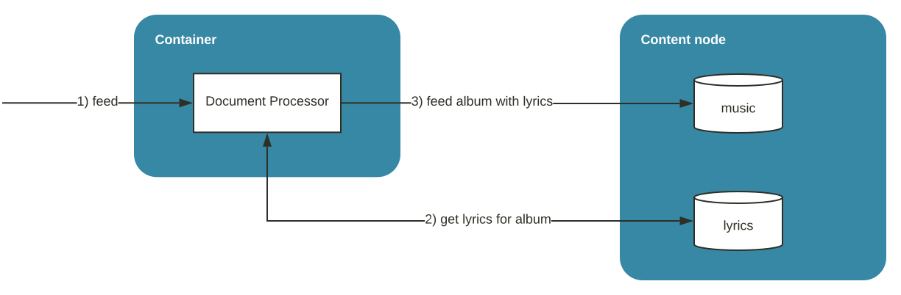

<!-- Copyright Vespa.ai. Licensed under the terms of the Apache 2.0 license. See LICENSE in the project root. -->

<picture>
  <source media="(prefers-color-scheme: dark)" srcset="https://assets.vespa.ai/logos/Vespa-logo-green-RGB.svg">
  <source media="(prefers-color-scheme: light)" srcset="https://assets.vespa.ai/logos/Vespa-logo-dark-RGB.svg">
  
</picture>

# Vespa sample applications - document processing

Data written to Vespa pass through document processing,
where [indexing](https://docs.vespa.ai/en/indexing.html) is one example.
Applications can add custom processing, normally done before indexing.
This is done by adding a [Document Processor](https://docs.vespa.ai/en/document-processing.html).
Such processing is synchronous, and this is problematic for processing
that requires other resources with high latency -
this can saturate the threadpool.

This application demonstrates how to use _Progress.LATER_
and the asynchronous [Document API](https://docs.vespa.ai/en/document-api-guide.html). Summary:
- Document Processors: modify / enrich data in the feed pipeline
- Multiple Schemas: store different kinds of data, like different database tables
- Enrich data from multiple sources: here, look up data in one schema and add to another
- Document API: write asynchronous code to fetch data

Flow:
1. Feed album document with the _music_ schema
1. Look up in the _lyrics_ schema if album with given ID has lyrics stored
1. Store album with lyrics in the _music_ schema




### Validate the environment:
Make sure you see at minimum 4 GB.
Refer to [Docker memory](https://docs.vespa.ai/en/operations-selfhosted/docker-containers.html#memory)
for details and troubleshooting:
<pre>
$ docker info | grep "Total Memory"
or
$ podman info | grep "memTotal"
</pre>


### Install the [Vespa CLI](https://docs.vespa.ai/en/vespa-cli):
Using [Homebrew](https://brew.sh/):
<pre>
$ brew install vespa-cli
</pre>
You can also [download Vespa CLI](https://github.com/vespa-engine/vespa/releases) for Windows, Linux and macOS.


### Set local target:
<pre data-test="exec">
$ vespa config set target local
</pre>


### Start a Vespa Docker container:
<pre data-test="exec">
$ docker run --detach --name vespa --hostname vespa-container \
  --publish 127.0.0.1:8080:8080 --publish 127.0.0.1:19071:19071 \
  vespaengine/vespa
</pre>


### Verify it is ready to use:
<pre data-test="exec">
$ vespa status deploy --wait 300
</pre>


### Initialize <code>myapp/</code> to a copy of a sample application package:
<pre data-test="exec">
$ vespa clone examples/document-processing myapp && cd myapp
</pre>


### Build it:
<pre data-test="exec">
$ mvn -U clean package
</pre>


### Deploy it:
<pre data-test="exec">
$ vespa deploy --wait 300
</pre>


### Feed a _lyrics_ document:
... and get the document after the feed as well:
<pre data-test="exec">
$ vespa document src/test/resources/A-Head-Full-of-Dreams-lyrics.json
</pre>
<pre data-test="exec">
$ vespa document get id:mynamespace:lyrics::a-head-full-of-dreams
</pre>


### Feed a _music_ document:
<pre data-test="exec">
$ vespa document src/test/resources/A-Head-Full-of-Dreams.json
</pre>


### Validate that the Document Processor works
Get the document to validate - see lyrics in music document:
<pre data-test="exec" data-test-assert-contains="Oh, I think I landed In a world">
$ vespa document get id:mynamespace:music::a-head-full-of-dreams
</pre>
Compare, the original document did not have lyrics - it has been added in the
[LyricsDocumentProcessor](src/main/java/ai/vespa/example/album/LyricsDocumentProcessor.java):
<pre>
$ cat src/test/resources/A-Head-Full-of-Dreams.json
</pre>


### Review logs:
Inspect what happened:
<pre data-test="exec" data-test-assert-contains="Found lyrics">
docker exec vespa sh -c '/opt/vespa/bin/vespa-logfmt | grep LyricsDocumentProcessor'
</pre>

```
...LyricsDocumentProcessor	info	In process
...LyricsDocumentProcessor	info	  Added to requests pending: 1
...LyricsDocumentProcessor	info	  Request pending ID: 1, Progress.LATER
...LyricsDocumentProcessor	info	In process
...LyricsDocumentProcessor	info	  Request pending ID: 1, Progress.LATER
...LyricsDocumentProcessor	info	In handleResponse
...LyricsDocumentProcessor	info	  Async response to put or get, requestID: 1
...LyricsDocumentProcessor	info	  Found lyrics for : document 'id:mynamespace:lyrics::1' of type 'lyrics'
...LyricsDocumentProcessor	info	In process
...LyricsDocumentProcessor	info	  Set lyrics, Progress.DONE
```
In the first invocation of process, an async request is made - set `Progress.LATER`
In the second invocation of process, the async request has not yet completed (there can be many such invocations) -
set `Progress.LATER`
Then, the handler for the async operation is invoked as the call has completed
In the subsequent process invocation, we see that the async operation has completed - set `Progress.DONE`


### Shutdown and remove the container:
<pre data-test="after">
$ docker rm -f vespa
</pre>


### Further reading:
* [Getting started](https://docs.vespa.ai/en/getting-started.html)
* [Developer guide](https://docs.vespa.ai/en/developer-guide.html)
