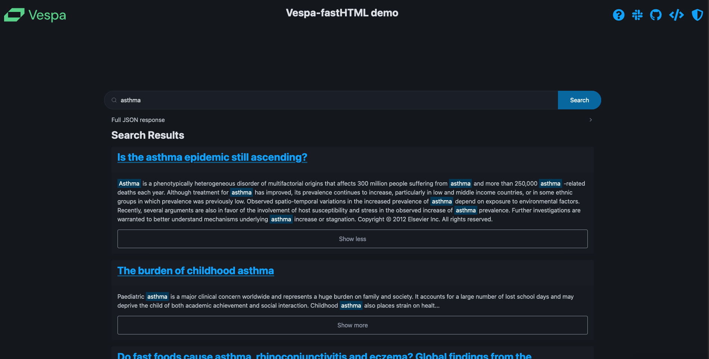
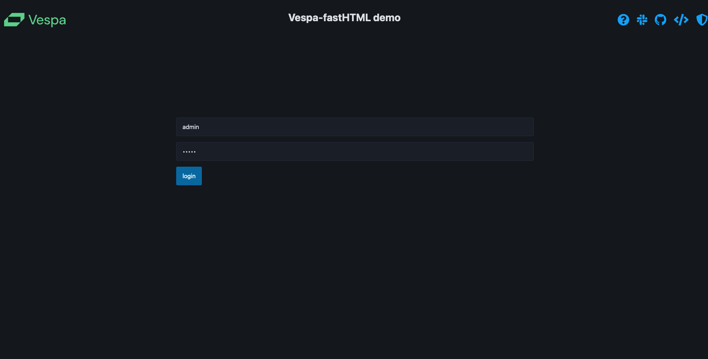
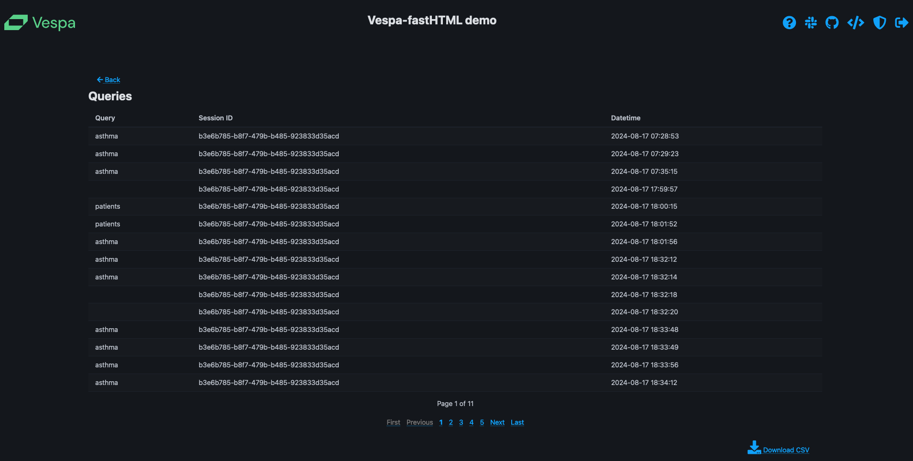

<!-- Copyright Yahoo. Licensed under the terms of the Apache 2.0 license. See LICENSE in the project root. -->

<picture>
  <source media="(prefers-color-scheme: dark)" srcset="https://assets.vespa.ai/logos/Vespa-logo-green-RGB.svg">
  <source media="(prefers-color-scheme: light)" srcset="https://assets.vespa.ai/logos/Vespa-logo-dark-RGB.svg">
  
</picture>


# FastHTML Vespa frontend

This is a simple frontend for Vespa search engine. It is built using [FastHTML](https://www.fastht.ml/) and written in pure Python.

Search page             |  Login page         |  Query logs
:-------------------------:|:-------------------------:|:-------------------------:
  |   |  

### Features

- Simple search interface, with links to search results.
- Accordion with full JSON-response from Vespa.
- SQLite DB for storing queries.
- Admin authentication for viewing and downloading queries.
- Deployment options - Docker + [Huggingface spaces](https://huggingface.co/spaces/).

### Why?

We have recognized the need, both for ourselves and others, to be able to set up a simple frontend for Vespa, without having to navigate the frontend framework jungle. Demo frontend apps often end up with a bunch of dependendcies and angry github renovate bots. :robot: :sad:

This sample-app can serve as an example of how you can build and deploy a simple frontend for Vespa, using FastHTML.

### How to use

#### 1. Clone this folder to your local machine 📂

The command below will clone the repository and only fetch the `fasthtml-demo` directory.

```bash
git clone --depth 1 --filter=blob:none --sparse https://github.com/vespa-engine/sample-apps.git temp-sample-apps && cd temp-sample-apps && git sparse-checkout set fasthtml-demo && mkdir -p ../fasthtml-demo && mv fasthtml-demo/* ../fasthtml-demp/ && cd .. && rm -rf temp-sample-apps
```

#### 2. Install dependencies 🔧

```bash
pip install -r requirements.txt
```

#### 3. Run the app locally  💻

```bash
python main.py
```

At this point, you should be able to access the app at [http://localhost:5001](http://localhost:5001).

But, you will _not_ be able to search for anything, as your environment variables are not set up.

#### 4. Deploy and feed your Vespa application ▶️

By running the `deploy_app.ipynb` notebook, you will deploy a Vespa application to the Vespa Cloud. The application is just a sample hybrid search application using the [BEIR/nfcorpus](https://huggingface.co/datasets/BeIR/nfcorpus) dataset.
Feel free to replace the dataset and application with your own.

Make sure to replace these variables at the top of the notebook with your own values:

```python
# Replace with your tenant name from the Vespa Cloud Console
tenant_name = "mytenant"
# Replace with your application name (does not need to exist yet)
application = "fasthtml"
# Token id (from Vespa Cloud Console)
token_id = "fasthtmltoken"
```

#### 5. Set up environment variables 🔐

Make sure to add the output of the `token_endpoint` from the `deploy_app.ipynb`- notebook to your `.env.example` file.
This value should be placed in the `VESPA_APP_URL` environment variable.

At the same time, you should rename the `.env.example` file to `.env`. This is added to the `.gitignore` file.

#### 6. Run the app locally 🚀

Now, you should be able to run the app locally and search for queries. 

```bash
python main.py
```

Open your browser and navigate to [http://localhost:5001](http://localhost:5001).

### Deployment

If you want to deploy the app, you set the `DEV_MODE=False` in `main.py`.
This will disable loading of environment variables from the `.env` file, and instead use the environment variables set in the deployment environment.

#### Docker 🐳

You can build and run the app using Docker.

Note that there are two Dockerfiles in the repo:

- `Dockerfile` is for building the image for Huggingface Spaces.
- `Dockerfile.nonhf` is for building an image that can be run locally or on any other platform.

Build the image:

```bash
docker build -t fhtdemoimg . -f Dockerfile.nonhf 
```

**Run the container:**

- Makes the environment variables in the `.env` file available to the container.
- Will mount the `db/` folder to the container, so that the SQLite database is persisted between runs.
- Sets the hostname to `dockerhost`, so that we can know use that to enable hot-reloading in the FastHTML app.
- Maps the default Starlette port `5001` to `8000` on the host.

```bash
docker run --name fhtdemo --rm --env-file .env -p 8000:5001 -h dockerhost -v $(pwd)/db:/code/db fhtdemoimg
```

#### Huggingface 🤗 Spaces

This deployment option is free. The deployment script is shamelessly copied from the [fasthtml-hf](https://github.com/AnswerDotAI/fasthtml-hf) repo. Check it out for details on cli-options, configuration and DB-backup options.

1. Get a huggingface token with `write` permissions. You can do this by going to your [Huggingface profile](https://huggingface.co/settings/tokens) and create a new token.
2. Set the `HF_TOKEN` environment variable to the token you just created.
3. Run `python deploy_hf.py <your-space-name> [--private true]` to deploy the app to Huggingface Spaces.
4. Remember to add `VESPA_APP_URL` and `VESPA_CLOUD_SECRET_TOKEN` to the environment variables in the [Huggingface Spaces settings.](https://huggingface.co/docs/hub/en/spaces-overview#managing-secrets)

### Go build some cool Vespa apps! 🚀