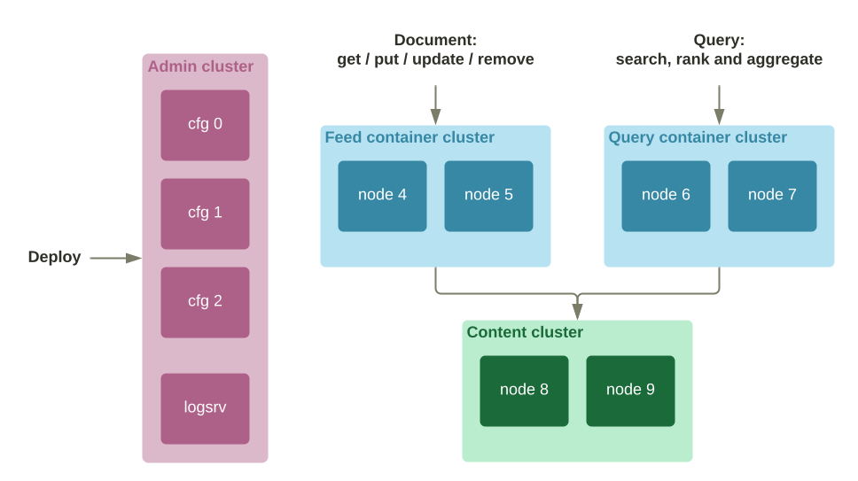
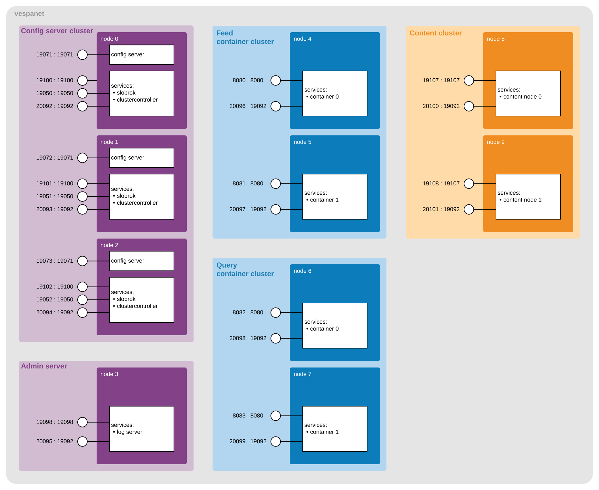
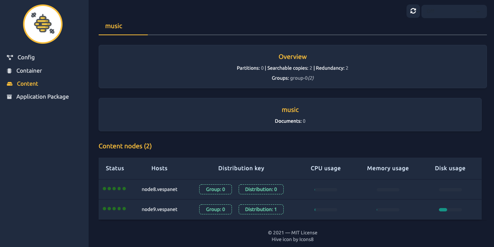
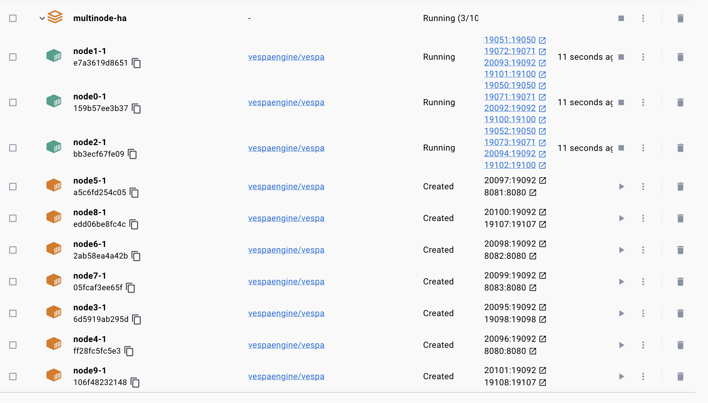
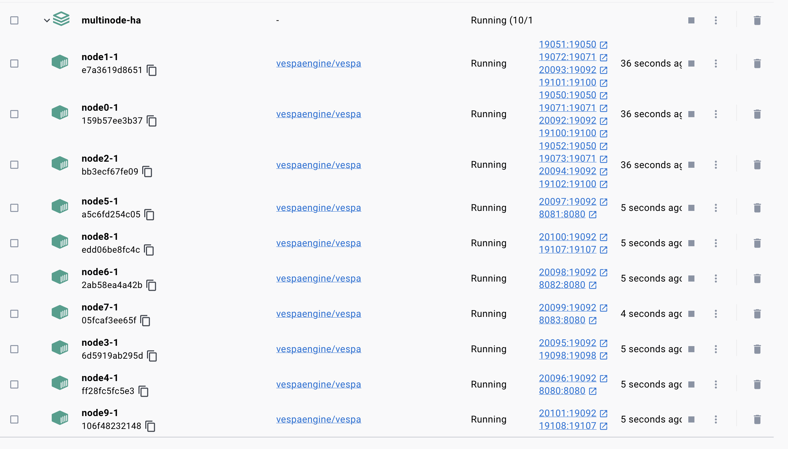

<!-- Copyright Vespa.ai. Licensed under the terms of the Apache 2.0 license. See LICENSE in the project root. -->

<picture>
  <source media="(prefers-color-scheme: dark)" srcset="https://assets.vespa.ai/logos/Vespa-logo-green-RGB.svg">
  <source media="(prefers-color-scheme: light)" srcset="https://assets.vespa.ai/logos/Vespa-logo-dark-RGB.svg">
  
</picture>


# Vespa high-availability multi-node template
This sample application is configured using clusters of nodes for HA.
This application structure will scale to applications of 100s of nodes.
Also see the smaller and simpler [multinode](../multinode) sample application.

This is a guide for functional testing, deployed on one host for simplicity.
The first part of this example sets up a multinode application of multiple container and content node clusters.
The second part secures the application using [mTLS](https://docs.vespa.ai/en/mtls.html).

A sample [docker-compose.yaml](docker-compose.yaml) is provided, refer to [Docker Compose](#docker-compose).

**Troubleshooting:** The [troubleshooting-startup-multinode](https://www.youtube.com/embed/BG7XZmXpIzo)
training video goes through various issues to help set up a multinode cluster.
See this if getting problems during the procedures below.

There are multiple ways of deploying multinode applications, on multiple platforms.
This application is a set of basic Docker containers,
and describes the important elements and integration points.
Use this app as a reference for how to distribute nodes and how to validate the instance:



See [services.xml](services.xml) for the configuration - in this guide:

* the config cluster is built from 3 config server nodes, node[0,1,2].
  See the `admin` section.
* the admin server node that hosts the log server is hosted on node3.
  See the `admin` section.
* the stateless java container cluster that hosts the _stateless_ nodes for _feed_ processing on node[4,5].
  See `container` section with id="feed".
* the stateless java container cluster that hosts the _stateless_ nodes for _query_ processing on node[6,7].
  See `container` section with id="query".
* the content cluster that hosts the _stateful_ content nodes on node[8,9].
  See `content` section.

See [Process overview](#process-overview) below for more details,
why the clusters and services are configured in this way.
Also see [troubleshooting](/examples/operations/README.md#troubleshooting).


## Memory usage
This guide is tested with Docker using 12G Memory:

<pre>
$ docker info | grep "Total Memory"
or
$ podman info | grep "memTotal"
</pre>

Note that this guide is configured for minimum memory use for easier testing, adding:

    -e VESPA_CONFIGSERVER_JVMARGS="-Xms32M -Xmx128M" \
    -e VESPA_CONFIGPROXY_JVMARGS="-Xms32M -Xmx32M" \

to `docker run` commands. For real production use cases, do not do this.
Also remove annotated memory-settings in [services.xml](services.xml).


## Get started
Get the app and create the local network:

<pre data-test="exec">
$ git clone --depth 1 https://github.com/vespa-engine/sample-apps.git
$ cd sample-apps/examples/operations/multinode-HA
$ docker pull vespaengine/vespa
$ docker network create --driver bridge vespanet
</pre>

The goal of this sample application is to create a Docker network with 10 nodes,
exporting ports to be able to observe and validate that the application is fully operational:



Note that this application uses two container clusters - one for feeding and one for queries.
This allows independent scaling, as reads and writes often have different load characteristics,
e.g. batch writes with high throughput vs. user-driven queries.

See the [state and metrics API reference](https://docs.vespa.ai/en/reference/metrics.html) for ports and mappings.
This reference also documents the _state/v1/health_ API used in this guide.


## Start the config server cluster
Config servers must be started first,
as the other Vespa nodes depend on config servers for startup:
<pre data-test="exec">
$ docker run --detach --name node0 --hostname node0.vespanet \
    -e VESPA_CONFIGSERVERS=node0.vespanet,node1.vespanet,node2.vespanet \
    -e VESPA_CONFIGSERVER_JVMARGS="-Xms32M -Xmx128M" \
    -e VESPA_CONFIGPROXY_JVMARGS="-Xms32M -Xmx32M" \
    --network vespanet \
    --publish 19071:19071 --publish 19100:19100 --publish 19050:19050 --publish 20092:19092 \
    vespaengine/vespa configserver,services

$ docker run --detach --name node1 --hostname node1.vespanet \
    -e VESPA_CONFIGSERVERS=node0.vespanet,node1.vespanet,node2.vespanet \
    -e VESPA_CONFIGSERVER_JVMARGS="-Xms32M -Xmx128M" \
    -e VESPA_CONFIGPROXY_JVMARGS="-Xms32M -Xmx32M" \
    --network vespanet \
    --publish 19072:19071 --publish 19101:19100 --publish 19051:19050 --publish 20093:19092 \
    vespaengine/vespa configserver,services

$ docker run --detach --name node2 --hostname node2.vespanet \
    -e VESPA_CONFIGSERVERS=node0.vespanet,node1.vespanet,node2.vespanet \
    -e VESPA_CONFIGSERVER_JVMARGS="-Xms32M -Xmx128M" \
    -e VESPA_CONFIGPROXY_JVMARGS="-Xms32M -Xmx32M" \
    --network vespanet \
    --publish 19073:19071 --publish 19102:19100 --publish 19052:19050 --publish 20094:19092 \
    vespaengine/vespa configserver,services
</pre>

Notes:
* Use fully qualified hostnames.
* VESPA_CONFIGSERVERS lists all nodes using exactly the same names as in [hosts.xml](hosts.xml)
* Refer to [Docker containers](https://docs.vespa.ai/en/operations/docker-containers.html) for details.
* Vespa separates between starting config servers and service nodes,
  see [Vespa start/stop](https://docs.vespa.ai/en/operations-selfhosted/vespa-cmdline-tools.html#vespa-start-configserver).
  Normally config servers run both `configserver` and `services`, other nodes run `services` only.
  This because `services` has node infrastructure, e.g. log forwarding.

At this point, nothing other than config server cluster runs.
Wait for the config servers to start,
using [state/v1/health](https://docs.vespa.ai/en/reference/state-v1.html#state-v1-health):
<pre data-test="exec" data-test-wait-for='"code" : "up"'>
$ ( for port in 19071 19072 19073; do \
    curl -s http://localhost:$port/state/v1/health | head -5; \
    done )
</pre>

Later in this guide, only one of the nodes in each cluster is checked, to keep the guide short.


## Deploy the Vespa application configuration
<pre data-test="exec" data-test-assert-contains="prepared and activated.">
$ zip -r - . -x "gke/*" "img/*" "scripts/*" "pki/*" "tls/*" README.md .gitignore "*.yaml" | \
  curl --header Content-Type:application/zip --data-binary @- \
  http://localhost:19071/application/v2/tenant/default/prepareandactivate
</pre>

Ignore the `Unable to lookup IP address of host` messages from the deploy output.


## Start the admin server
This is essentially the log server:
<pre data-test="exec">
$ docker run --detach --name node3 --hostname node3.vespanet \
    -e VESPA_CONFIGSERVERS=node0.vespanet,node1.vespanet,node2.vespanet \
    --network vespanet \
    --publish 20095:19092 --publish 19098:19098 \
    vespaengine/vespa services
</pre>

Notes:
* See  `services` argument to `docker run` - a config server is not started on this node -
  see [Docker containers](https://docs.vespa.ai/en/operations/docker-containers.html) for details.
* The log server can be disk intensive, as all nodes' _vespa.log_ is rotated and forwarded here.
  For this reason, it is normally a good idea to run this on a separate node, like here -
  a full disk will not impact other nodes.

Check that the [config sentinel](https://docs.vespa.ai/en/operations-selfhosted/config-sentinel.html) is started:
<pre data-test="exec" data-test-wait-for='FAILED connectivity check'>
$ curl -s http://localhost:19098/state/v1/health
</pre>
```json
{
    "status": {
        "code":"down",
        "message":"FAILED connectivity check"
    }
}
```

This means, the Vespa infrastructure is started, but none of the services.
Checking logs:

    $ docker exec -it node3 opt/vespa/bin/vespa-logfmt | grep config-sentinel | tail -5

      WARNING : config-sentinel  sentinel.sentinel.connectivity	Only 4 of 10 nodes are up and OK, 40.0% (min is 50%)

**Important note:**
This is the [startup sequence](https://docs.vespa.ai/en/operations-selfhosted/config-sentinel.html#cluster-startup) kicking in -
container and content nodes are not started before 50% (configurable) of nodes have started.
Meaning, here we have started only 4/10, so `logserver`, `slobrok`, `metrics-proxy` and `cluster-controller`
are not started yet.


## Start the feed container cluster
The feed container cluster has the feed endpoint, normally on 8080.
<pre data-test="exec">
$ docker run --detach --name node4 --hostname node4.vespanet \
    -e VESPA_CONFIGSERVERS=node0.vespanet,node1.vespanet,node2.vespanet \
    --network vespanet \
    --publish 8080:8080 --publish 20096:19092 \
    vespaengine/vespa services

$ docker run --detach --name node5 --hostname node5.vespanet \
    -e VESPA_CONFIGSERVERS=node0.vespanet,node1.vespanet,node2.vespanet \
    --network vespanet \
    --publish 8081:8080 --publish 20097:19092 \
    vespaengine/vespa services
</pre>

As these are nodes 5 and 6 of 10, 60% of services is started, check feed container health -
this can take a minute or so:
<pre data-test="exec" data-test-wait-for='"code" : "up"'>
$ curl -s http://localhost:8080/state/v1/health | head -5
</pre>

As this is also the cluster where custom components for document processing are loaded,
inspecting the `/ApplicationStatus` endpoint is useful:

    $ curl http://localhost:8080/ApplicationStatus

We now expect the `metrics-proxy` (runs on all service nodes) to be up - and others - examples:

    $ curl http://localhost:20095/state/v1/   # metrics-proxy on node3
    $ curl http://localhost:19100/state/v1/   # slobrok on node0
    $ curl http://localhost:19051/state/v1/   # cluster-controller on node1

In short, checking `/state/v1/` for services is useful to validate that services are up.
At this point it is useful to inspect the application using
[vespa-model-inspect](https://docs.vespa.ai/en/operations-selfhosted/vespa-cmdline-tools.html#vespa-model-inspect):
```sh
$ docker exec -it node0 /opt/vespa/bin/vespa-model-inspect hosts
node0.vespanet
node1.vespanet
node2.vespanet
node3.vespanet
node4.vespanet
node5.vespanet
node6.vespanet
node7.vespanet
node8.vespanet
node9.vespanet

$ docker exec -it node0 /opt/vespa/bin/vespa-model-inspect services
config-sentinel
configproxy
configserver
container
container-clustercontroller
distributor
logd
logserver
metricsproxy-container
qrserver
searchnode
slobrok
storagenode

$ docker exec -it node0 /opt/vespa/bin/vespa-model-inspect service container
container @ node4.vespanet :
default/container.0
    tcp/node4.vespanet:8080 (STATE EXTERNAL QUERY HTTP)
    tcp/node4.vespanet:19100 (EXTERNAL HTTP)
    tcp/node4.vespanet:19101 (MESSAGING RPC)
    tcp/node4.vespanet:19102 (ADMIN RPC)
container @ node5.vespanet :
default/container.1
    tcp/node5.vespanet:8080 (STATE EXTERNAL QUERY HTTP)
    tcp/node5.vespanet:19100 (EXTERNAL HTTP)
    tcp/node5.vespanet:19101 (MESSAGING RPC)
    tcp/node5.vespanet:19102 (ADMIN RPC)
```

This tool only uses a config server, it does not check other nodes -
it displays a view of the layout of the application - what runs where.

**Important takeaway:** Vespa port allocations are dynamic.
This enables Vespa to run a set of processes as configured in services.xml on each node.
Use `vespa-model-inspect` to find where processes run and which ports to use -
this tool can be used on any Vespa node.


## Start the query container cluster
The query container cluster has the query endpoint, normally on 8080.
<pre data-test="exec">
$ docker run --detach --name node6 --hostname node6.vespanet \
    -e VESPA_CONFIGSERVERS=node0.vespanet,node1.vespanet,node2.vespanet \
    --network vespanet \
    --publish 8082:8080 --publish 20098:19092 \
    vespaengine/vespa services

$ docker run --detach --name node7 --hostname node7.vespanet \
    -e VESPA_CONFIGSERVERS=node0.vespanet,node1.vespanet,node2.vespanet \
    --network vespanet \
    --publish 8083:8080 --publish 20099:19092 \
    vespaengine/vespa services
</pre>

Check the _query_ container cluster health  - the containers will respond with "initializing":
<pre data-test="exec" data-test-wait-for='"code" : "initializing"'>
$ curl -s http://localhost:8083/state/v1/health | head -5
</pre>

At this point, inspect the differences in the "handlers" section for the container clusters:

Feed: http://localhost:8081/ApplicationStatus
```json
{
    "id": "com.yahoo.document.restapi.resource.DocumentV1ApiHandler",
    "class": "com.yahoo.document.restapi.resource.DocumentV1ApiHandler",
    "bundle": "vespaclient-container-plugin:7.553.2",
    "serverBindings": [
        "http://*/document/v1/*",
        "http://*/document/v1/*/"
    ],
    "clientBindings": [ ]
}
```
Query: http://localhost:8082/ApplicationStatus
```json
{
    "id": "com.yahoo.search.handler.SearchHandler",
    "class": "com.yahoo.search.handler.SearchHandler",
    "bundle": "container-search-and-docproc:7.553.2",
    "serverBindings": [
        "http://*/search/*"
    ],
    "clientBindings": [ ]
}
```
These are the different endpoints for the [document/v1](https://docs.vespa.ai/en/document-v1-api-guide.html)
and [query](https://docs.vespa.ai/en/query-api.html) APIs.


## Start the content cluster:
<pre data-test="exec">
$ docker run --detach --name node8 --hostname node8.vespanet \
    -e VESPA_CONFIGSERVERS=node0.vespanet,node1.vespanet,node2.vespanet \
    --network vespanet \
    --publish 19107:19107 --publish 20100:19092 \
    vespaengine/vespa services

$ docker run --detach --name node9 --hostname node9.vespanet \
    -e VESPA_CONFIGSERVERS=node0.vespanet,node1.vespanet,node2.vespanet \
    --network vespanet \
    --publish 19108:19107 --publish 20101:19092 \
    vespaengine/vespa services
</pre>


Check for content node startup:
<pre data-test="exec" data-test-wait-for='"code":"up"'>
$ curl http://localhost:19108/state/v1/health
</pre>
```json
{
    "status": {
        "code": "up"
    }
}
```

Once the content nodes are up, the _query_ container cluster should be "up" as well:
<pre data-test="exec" data-test-wait-for='"code" : "up"'>
$ curl -s http://localhost:8083/state/v1/health | head -5
</pre>


Inspect the content node _process_ metrics using `/state/v1/metrics`:
<pre data-test="exec" data-test-wait-for='"metrics":'>
$ curl http://localhost:19108/state/v1/metrics
</pre>
```json
{
    "status": {
        "code": "up"
    },
    "metrics": {
        "snapshot": {
            "from": 1643285217,
            "to": 1643285277
        },
        "values": [
            {
                "name": "metricmanager.periodichooklatency",
                "description": "Time in ms used to update a single periodic hook",
                "values": {
                    "average": 0,
                    "sum": 0,
                    "count": 255,
                    "rate": 4.25,
                    "min": 0,
                    "max": 0,
```

Dump the content node _node_ metrics (i.e. _all_ processes on the node) using `/metrics/v1/values`:
<pre data-test="exec" data-test-wait-for='"name":"vespa.searchnode"'>
$ curl http://localhost:20101/metrics/v1/values
</pre>
```json
{
    "services": [
        {
            "name": "vespa.searchnode",
            "timestamp": 1643284794,
            "status": {
                "code": "up",
                "description": "Data collected successfully"
        },
        "metrics": [
```

Test metrics from all nodes using `/metrics/v2/values`:
<pre data-test="exec" data-test-wait-for='"services":'>
$ curl http://localhost:8083/metrics/v2/values
</pre>
```json
{
    "nodes": [
        {
            "hostname": "node5.vespanet",
            "role": "hosts/node5.vespanet",
            "services": [
                {
                    "name": "vespa.container",
                    "timestamp": 1643289142,
```

Same as previous, in Prometheus format:
<pre data-test="exec" data-test-wait-for='vespa_searchnode'>
$ curl http://localhost:8083/prometheus/v1/values
</pre>
    # HELP memory_virt
    # TYPE memory_virt untyped
    memory_virt{metrictype="system",instance="distributor",vespaVersion="7.531.17",vespa_service="vespa_distributor",} 3.39165184E8 1643286737000
    memory_virt{metrictype="system",instance="logd",vespaVersion="7.531.17",vespa_service="vespa_logd",} 1.29429504E8 1643286737000


## Process overview
Notes:
* [Config sentinel](https://docs.vespa.ai/en/operations-selfhosted/config-sentinel.html)
  is useful to understand processes running,
  and also the [startup sequence](https://docs.vespa.ai/en/operations-selfhosted/config-sentinel.html#cluster-startup).
  Note that in the startup sequence, order not strictly needed as in this sample app.
* [Config servers](https://docs.vespa.ai/en/operations-selfhosted/configuration-server.html) are normally started first,
  then application deployment - make sure to get this right before troubleshooting other services.
* See [slobrok](https://docs.vespa.ai/en/slobrok.html) for the Vespa naming service
* The [cluster controller](https://docs.vespa.ai/en/content/content-nodes.html#cluster-controller) cluster
  manages the system state, and is useful in debugging cluster failures.
* The [metrics proxy](https://docs.vespa.ai/en/reference/metrics.html) is used to aggregate metrics
  from all processes on a node, serving on _http://node:19092/metrics/v1/values_


## Test feed and query endpoints
Feed 5 documents, using the document-API endpoint in the _feed_ container cluster, here mapped to 8080/8081:
<pre data-test="exec">
$ i=0; (for doc in $(ls ../../../album-recommendation/dataset/*.json); \
  do \
    curl -H Content-Type:application/json -d @$doc \
    http://localhost:8080/document/v1/mynamespace/music/docid/$i; \
    i=$(($i + 1)); echo; \
  done)
</pre>

List IDs of all documents (this can be run on any node in the cluster):
<pre data-test="exec" data-test-wait-for="id:mynamespace:music::4">
$ docker exec node0 /opt/vespa/bin/vespa-visit -i
</pre>

Run a query, using the query-API endpoint in the _query_ container cluster, here mapped to 8082/8083:
<pre data-test="exec" data-test-wait-for='"totalCount":5'>
$ curl --data-urlencode 'yql=select * from sources * where sddocname contains "music"' \
  http://localhost:8082/search/
</pre>

See the [Query Builder](https://github.com/vespa-engine/vespa/tree/master/client/js/app#query-builder)
for a GUI to build and run queries.


## Clean up after testing
<pre data-test="exec">
$ docker rm -f node0 node1 node2 node3 node4 node5 node6 node7 node8 node9
$ docker network rm vespanet
</pre>


## Integrations
[Vispana](https://github.com/vispana/vispana) is a Vespa.ai web client tool
designed to quickly understand the status of a cluster.
To use Vispana with this example app, add it to the same Docker network:

    docker run -p 4000:4000 --network vespanet vispana/vispana

Use _http://node0.vespanet:19071_ as the config server endpoint:

    http://localhost:4000/content?config_host=http://node0.vespanet:19071/




## Secure Vespa with mutually authenticated TLS
This section secures the application using [mTLS](https://docs.vespa.ai/en/mtls.html).
Configure Vespa with mTLS for inter-process communication - in this guide:
* Set `VESPA_TLS_CONFIG_FILE=/var/tls/tls.json`.
  The existence of this environment variable will start Vespa in secure mode,
  using configuration in `/var/tls/tls.json`.
  In this example,`tls.json` is mapped into the Docker container using `--volume $(pwd)/tls/:/var/tls/`
* The _vespanet_ network is set up using overlay, and each node is assigned an IPv4 address

Configuration files:
```
tls
├── ca-client.pem
├── ca-vespa.pem
├── host.csr
├── host.key
├── host.pem
└── tls.json
```

Run the helper script to generate these credentials - inspect the `pki` and `tls` directories at will:
<pre data-test="exec">
$ ./scripts/generate-cert-chains.sh
</pre>

**Workaround:** In some environments, this file is only readable by owner
and subsequent reads inside the Docker container fails.
Make readable to everyone as a workaround:
<pre data-test="exec">
$ chmod 644 tls/host.key
</pre>

Start Docker network:
<pre data-test="exec">
$ docker swarm init
$ docker network create --driver overlay --subnet 10.0.10.0/24 --attachable vespanet
</pre>

Start config servers:
<pre data-test="exec">
$ docker run --detach --name node0 --hostname node0.vespanet \
  -e VESPA_CONFIGSERVERS=node0.vespanet,node1.vespanet,node2.vespanet \
  -e VESPA_CONFIGSERVER_JVMARGS="-Xms32M -Xmx128M" \
  -e VESPA_CONFIGPROXY_JVMARGS="-Xms32M -Xmx32M" \
  -e VESPA_TLS_CONFIG_FILE=/var/tls/tls.json \
  --network vespanet \
  --publish 19071:19071 --publish 19100:19100 --publish 19050:19050 --publish 20092:19092 \
  --volume $(pwd)/tls/:/var/tls/ \
  --ip 10.0.10.10 \
  vespaengine/vespa

$ docker run --detach --name node1 --hostname node1.vespanet \
  -e VESPA_CONFIGSERVERS=node0.vespanet,node1.vespanet,node2.vespanet \
  -e VESPA_CONFIGSERVER_JVMARGS="-Xms32M -Xmx128M" \
  -e VESPA_CONFIGPROXY_JVMARGS="-Xms32M -Xmx32M" \
  -e VESPA_TLS_CONFIG_FILE=/var/tls/tls.json \
  --network vespanet \
  --publish 19072:19071 --publish 19101:19100 --publish 19051:19050 --publish 20093:19092 \
  --volume $(pwd)/tls/:/var/tls/ \
  --ip 10.0.10.11 \
  vespaengine/vespa

$ docker run --detach --name node2 --hostname node2.vespanet \
  -e VESPA_CONFIGSERVERS=node0.vespanet,node1.vespanet,node2.vespanet \
  -e VESPA_CONFIGSERVER_JVMARGS="-Xms32M -Xmx128M" \
  -e VESPA_CONFIGPROXY_JVMARGS="-Xms32M -Xmx32M" \
  -e VESPA_TLS_CONFIG_FILE=/var/tls/tls.json \
  --network vespanet \
  --publish 19073:19071 --publish 19102:19100 --publish 19052:19050 --publish 20094:19092 \
  --volume $(pwd)/tls/:/var/tls/ \
  --ip 10.0.10.12 \
  vespaengine/vespa
</pre>

Check config server cluster startup, using the health API, now over https:
<pre data-test="exec" data-test-wait-for='"code" : "up"'>
$ ( for port in 19071 19072 19073; do \
    curl -s --key pki/vespa/host.key --cert pki/vespa/host.pem --cacert pki/vespa/ca-vespa.pem \
    https://localhost:$port/state/v1/health; \
  done | head -5 )
</pre>

Deploy the application, now with a [TLS config change](https://docs.vespa.ai/en/jdisc/http-server-and-filters.html#tls)
for https ports for container clusters for secure client access:
<pre data-test="exec">
$ mv services.xml services.xml.open; mv services.xml.secure services.xml
</pre>
<pre data-test="exec" data-test-assert-contains="prepared and activated.">
$ zip -r - . -x "tls/*" "pki/*" "scripts/*" "gke/*" "img/*" README.md .gitignore services.xml.open "*.yaml" | \
    curl \
      --key pki/vespa/host.key --cert pki/vespa/host.pem --cacert pki/vespa/ca-vespa.pem \
      --header Content-Type:application/zip --data-binary @- \
      https://localhost:19071/application/v2/tenant/default/prepareandactivate
</pre>
The changes are:
```xml
<http>
    <server id="default" port="8080" />
    <server id="secure" port="8443">
        <ssl>
            <private-key-file>/var/tls/host.key</private-key-file>
            <certificate-file>/var/tls/host.pem</certificate-file>
            <ca-certificates-file>/var/tls/ca-client.pem</ca-certificates-file>
            <client-authentication>need</client-authentication>
        </ssl>
    </server>
</http>
```

Start the admin node and the _feed_ container cluster:
<pre data-test="exec">
$ docker run --detach --name node3 --hostname node3.vespanet \
    -e VESPA_CONFIGSERVERS=node0.vespanet,node1.vespanet,node2.vespanet \
    -e VESPA_TLS_CONFIG_FILE=/var/tls/tls.json \
    --network vespanet \
    --publish 20095:19092 \
    --volume $(pwd)/tls/:/var/tls/ \
    --ip 10.0.10.13 \
    vespaengine/vespa services

$ docker run --detach --name node4 --hostname node4.vespanet \
    -e VESPA_CONFIGSERVERS=node0.vespanet,node1.vespanet,node2.vespanet \
    -e VESPA_TLS_CONFIG_FILE=/var/tls/tls.json \
    --network vespanet \
    --publish 8080:8080 --publish 8443:8443 --publish 20096:19092 \
    --volume $(pwd)/tls/:/var/tls/ \
    --ip 10.0.10.14 \
    vespaengine/vespa services

$ docker run --detach --name node5 --hostname node5.vespanet \
    -e VESPA_CONFIGSERVERS=node0.vespanet,node1.vespanet,node2.vespanet \
    -e VESPA_TLS_CONFIG_FILE=/var/tls/tls.json \
    --network vespanet \
    --publish 8081:8080 --publish 8444:8443 --publish 20097:19092 \
    --volume $(pwd)/tls/:/var/tls/ \
    --ip 10.0.10.15 \
    vespaengine/vespa services
</pre>

As more than 50% of the nodes are up, services are started - check admin node metrics proxy:
<pre data-test="exec" data-test-wait-for='"code" : "up"'>
$ curl -s --key pki/vespa/host.key --cert pki/vespa/host.pem --cacert pki/vespa/ca-vespa.pem \
    https://localhost:20095/state/v1/health | head -5
</pre>

Check the _feed_ container cluster health - also using client certificates as configured in `services.xml`:
<pre data-test="exec" data-test-wait-for='"code" : "up"'>
$ curl -s --key pki/vespa/host.key --cert pki/vespa/host.pem --cacert pki/vespa/ca-vespa.pem \
    https://localhost:8080/state/v1/health | head -5
</pre>
<pre data-test="exec" data-test-wait-for='"code" : "up"'>
$ curl -s --key pki/client/client.key --cert pki/client/client.pem --cacert pki/vespa/ca-vespa.pem \
    https://localhost:8443/state/v1/health | head -5
</pre>


Start the _query_ container cluster:
<pre data-test="exec">
$ docker run --detach --name node6 --hostname node6.vespanet \
    -e VESPA_CONFIGSERVERS=node0.vespanet,node1.vespanet,node2.vespanet \
    -e VESPA_TLS_CONFIG_FILE=/var/tls/tls.json \
    --network vespanet \
    --publish 8082:8080 --publish 8445:8443 --publish 20098:19092 \
    --volume $(pwd)/tls/:/var/tls/ \
    --ip 10.0.10.16 \
    vespaengine/vespa services

$ docker run --detach --name node7 --hostname node7.vespanet \
    -e VESPA_CONFIGSERVERS=node0.vespanet,node1.vespanet,node2.vespanet \
    -e VESPA_TLS_CONFIG_FILE=/var/tls/tls.json \
    --network vespanet \
    --publish 8083:8080 --publish 8446:8443 --publish 20099:19092 \
    --volume $(pwd)/tls/:/var/tls/ \
    --ip 10.0.10.17 \
    vespaengine/vespa services
</pre>

Check the _query_ container cluster health  - the containers will respond with "initializing":
<pre data-test="exec" data-test-wait-for='"code" : "initializing"'>
$ curl -s --key pki/vespa/host.key --cert pki/vespa/host.pem --cacert pki/vespa/ca-vespa.pem \
    https://localhost:8082/state/v1/health | head -5
</pre>
<pre data-test="exec" data-test-wait-for='"code" : "initializing"'>
$ curl -s --key pki/client/client.key --cert pki/client/client.pem --cacert pki/vespa/ca-vespa.pem \
    https://localhost:8445/state/v1/health | head -5
</pre>

Start the content cluster:
<pre data-test="exec">
$ docker run --detach --name node8 --hostname node8.vespanet \
    -e VESPA_CONFIGSERVERS=node0.vespanet,node1.vespanet,node2.vespanet \
    -e VESPA_TLS_CONFIG_FILE=/var/tls/tls.json \
    --network vespanet \
    --publish 19107:19107 --publish 20100:19092 \
    --volume $(pwd)/tls/:/var/tls/ \
    --ip 10.0.10.18 \
    vespaengine/vespa services

$ docker run --detach --name node9 --hostname node9.vespanet \
    -e VESPA_CONFIGSERVERS=node0.vespanet,node1.vespanet,node2.vespanet \
    -e VESPA_TLS_CONFIG_FILE=/var/tls/tls.json \
    --network vespanet \
    --publish 19108:19107 --publish 20101:19092 \
    --volume $(pwd)/tls/:/var/tls/ \
    --ip 10.0.10.19 \
    vespaengine/vespa services
</pre>

Check health:
<pre data-test="exec" data-test-wait-for='"code":"up"'>
$ curl -s --key pki/vespa/host.key --cert pki/vespa/host.pem --cacert pki/vespa/ca-vespa.pem \
    https://localhost:19107/state/v1/health | head -5
</pre>

Now the query containers will respond with "up":
<pre data-test="exec" data-test-wait-for='"code" : "up"'>
$ curl -s --key pki/vespa/host.key --cert pki/vespa/host.pem --cacert pki/vespa/ca-vespa.pem \
    https://localhost:8082/state/v1/health | head -5
</pre>
<pre data-test="exec" data-test-wait-for='"code" : "up"'>
$ curl -s --key pki/client/client.key --cert pki/client/client.pem --cacert pki/vespa/ca-vespa.pem \
    https://localhost:8445/state/v1/health | head -5
</pre>


## Test feed and query endpoints
Set credentials for the [Vespa CLI](https://docs.vespa.ai/en/vespa-cli.html):
```
export VESPA_CLI_DATA_PLANE_CA_CERT_FILE=pki/vespa/ca-vespa.pem
export VESPA_CLI_DATA_PLANE_CERT_FILE=pki/client/client.pem
export VESPA_CLI_DATA_PLANE_KEY_FILE=pki/client/client.key
```
Feed documents:
```
vespa feed -t https://localhost:8443 ../../../album-recommendation/dataset/documents.jsonl
```
Visit documents:
```
vespa visit -t https://localhost:8443
```
Query documents:
```
vespa query -t https://localhost:8445 'select * from music where true'
```
Note that the _feed_ and _query_ container cluster nodes are mapped to 8443 and 8445, respectively.


## Test feed and query endpoints using curl
Feed 5 documents, using the document-API endpoint in the _feed_ container cluster, here mapped to 8080/8081:
<pre data-test="exec">
$ i=0; (for doc in $(ls ../../../album-recommendation/dataset/*.json); do \
    curl -s --key pki/client/client.key --cert pki/client/client.pem --cacert pki/vespa/ca-vespa.pem \
      -H Content-Type:application/json -d @$doc \
      https://localhost:8443/document/v1/mynamespace/music/docid/$i; \
    i=$(($i + 1)); echo; \
  done)
</pre>

List IDs of all documents (this can be run on any node in the cluster):
<pre data-test="exec" data-test-wait-for="id:mynamespace:music::4">
$ docker exec node0 /opt/vespa/bin/vespa-visit -i
</pre>

Run a query, using the query-API endpoint in the _query_ container cluster, here mapped to 8082/8083:
<pre data-test="exec" data-test-wait-for='"totalCount":5'>
$ curl -s --key pki/client/client.key --cert pki/client/client.pem --cacert pki/vespa/ca-vespa.pem \
    --data-urlencode 'yql=select * from sources * where sddocname contains "music"' \
    https://localhost:8445/search/
</pre>


## Security Q/A

_I'm getting zookeeper errors regarding my certs once the config nodes are launched.
The actual error is "PKIX path building failed unable to find valid certification path to requested target."
I'm using a root key provided in `tls_paths.json`,
and I tried updated the Java keystore, which didn't seem to have an effect._

The PKIX path error is likely from a client that fails to accept a server certificate.
This may indicate that the CA certificate configuration is invalid.
Make sure to use a PEM file as CA bundle - Vespa supports neither JKS nor PKCS#12.

_I notice that `TLS.json` and `services.secure.xml` have different files for the ca-certificates file field - why?
Also, some of the curl requests utilize the Vespa keys while others use the client keys.
Are the exposed ports (19107,8080,8082, ...) utilizing the Vespa keys,
while the internal ports (8445, 8443, ...) use client keys?_

The local container port 8443 is intended for ingress traffic (search/feed),
while the other ports are intended for local management only.
From a security standpoint, it is ideal to utilize disjunct certificate chains for those two aspects.
8080 and 8443 will serve identical APIs, although in this example 8080 is intended for health/state monitoring.
Separate CAs is though less useful if 8443 ports are protected by a WAF or layer 7 load balancer.


## Appendix

### Deploy output
Normal deploy output in this guide, as the service nodes are not started yet:
```json
{
  "log": [
    {
      "time": 1642578267697,
      "level": "WARNING",
      "message": "Unable to lookup IP address of host: node4.vespanet",
      "applicationPackage": true
    },
    {
      "time": 1642578268248,
      "level": "WARNING",
      "message": "Unable to lookup IP address of host: node5.vespanet",
      "applicationPackage": true
    },
    {
      "time": 1642578268701,
      "level": "WARNING",
      "message": "Unable to lookup IP address of host: node6.vespanet",
      "applicationPackage": true
    },
    {
      "time": 1642578269060,
      "level": "WARNING",
      "message": "Unable to lookup IP address of host: node7.vespanet",
      "applicationPackage": true
    },
    {
      "time": 1642578269444,
      "level": "WARNING",
      "message": "Unable to lookup IP address of host: node3.vespanet",
      "applicationPackage": true
    },
    {
      "time": 1642578269870,
      "level": "WARNING",
      "message": "Unable to lookup IP address of host: node8.vespanet",
      "applicationPackage": true
    },
    {
      "time": 1642578270221,
      "level": "WARNING",
      "message": "Unable to lookup IP address of host: node9.vespanet",
      "applicationPackage": true
    }
  ],
  "tenant": "default",
  "url": "http://localhost:19071/application/v2/tenant/default/application/default/environment/prod/region/default/instance/default",
  "message": "Session 2 for tenant 'default' prepared and activated.",
  "configChangeActions": {
    "restart": [],
    "refeed": [],
    "reindex": []
  }
}
```


### Ports
Ports mapped in this guide:
```sh
$ netstat -an | egrep '1907[1,2,3]|1905[0,1,2]|19098|2009[2,3,4,5,6,7,8,9]|2010[0,1]|1910[0,1,2]|808[0,1,2,3]|1910[7,8]' | sort
tcp46      0      0  *.19050                *.*                    LISTEN
tcp46      0      0  *.19051                *.*                    LISTEN
tcp46      0      0  *.19052                *.*                    LISTEN
tcp46      0      0  *.19071                *.*                    LISTEN
tcp46      0      0  *.19072                *.*                    LISTEN
tcp46      0      0  *.19073                *.*                    LISTEN
tcp46      0      0  *.19098                *.*                    LISTEN
tcp46      0      0  *.19100                *.*                    LISTEN
tcp46      0      0  *.19101                *.*                    LISTEN
tcp46      0      0  *.19102                *.*                    LISTEN
tcp46      0      0  *.19107                *.*                    LISTEN
tcp46      0      0  *.19108                *.*                    LISTEN
tcp46      0      0  *.20092                *.*                    LISTEN
tcp46      0      0  *.20093                *.*                    LISTEN
tcp46      0      0  *.20094                *.*                    LISTEN
tcp46      0      0  *.20095                *.*                    LISTEN
tcp46      0      0  *.20096                *.*                    LISTEN
tcp46      0      0  *.20097                *.*                    LISTEN
tcp46      0      0  *.20098                *.*                    LISTEN
tcp46      0      0  *.20099                *.*                    LISTEN
tcp46      0      0  *.20100                *.*                    LISTEN
tcp46      0      0  *.20101                *.*                    LISTEN
tcp46      0      0  *.8080                 *.*                    LISTEN
tcp46      0      0  *.8081                 *.*                    LISTEN
tcp46      0      0  *.8082                 *.*                    LISTEN
tcp46      0      0  *.8083                 *.*                    LISTEN
```

## Clean up after testing
<pre data-test="after">
$ docker rm -f node0 node1 node2 node3 node4 node5 node6 node7 node8 node9
$ docker network rm vespanet
$ docker swarm leave --force
</pre>


## Docker Compose
[docker-compose.yaml](docker-compose.yaml) is a sample file to start up the 10-node cluster -
use `docker compose up` - sequence:

1. Start the config servers, wait for OK healthcheck
2. Start the rest of the nodes
3. Deploy application to the config servers

When the config servers are started, but not yet full initialized, the status looks like:



If the status stays like this, troubleshoot the config server
[startup sequence](https://docs.vespa.ai/en/operations-selfhosted/configuration-server.html#start-sequence).

When all nodes are up, it looks like:



Finally, deploy the application:

    $ zip -r - . -x "gke/*" "img/*" "scripts/*" "pki/*" "tls/*" README.md .gitignore "*.yaml" | \
      curl --header Content-Type:application/zip --data-binary @- \
      http://localhost:19071/application/v2/tenant/default/prepareandactivate
