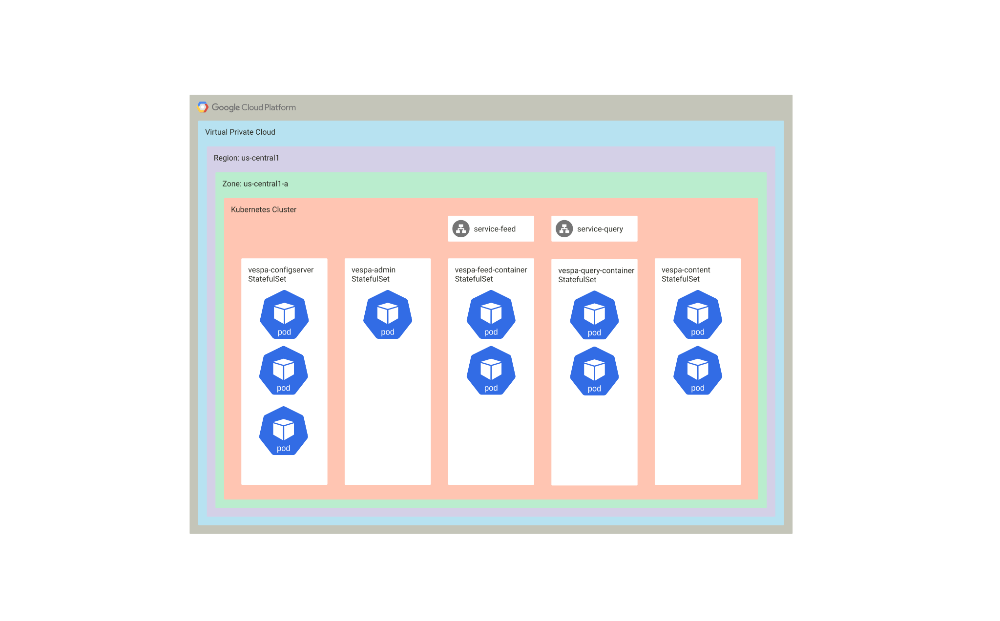

<!-- Copyright Vespa.ai. Licensed under the terms of the Apache 2.0 license. See LICENSE in the project root. -->

<picture>
  <source media="(prefers-color-scheme: dark)" srcset="https://vespa.ai/assets/vespa-ai-logo-heather.svg">
  <source media="(prefers-color-scheme: light)" srcset="https://vespa.ai/assets/vespa-ai-logo-rock.svg">
  
</picture>

# Multinode-HA using Google Cloud Kubernetes Engine - GKE
This guide uses the multinode-HA configuration and principles and deploys using GKE.
It is built on [basic-search-on-gke](../../basic-search-on-gke).
Overview:



Prerequisites:
* A Google project
* [gcloud command line](https://cloud.google.com/sdk/docs/install)
* [kubectl](https://kubernetes.io/docs/tasks/tools/)

The guide uses port-forwards to access ports in the application -
set up these forwards in separate terminal windows.
See [config/service-feed.yml](config/service-feed.yml) and [config/service-feed.yml](config/service-query.yml)
for setting up LoadBalancers.

Get started:
```
git clone --depth 1 https://github.com/vespa-engine/sample-apps.git
cd sample-apps/examples/operations/multinode-HA/gke
```

Replace with your own project ID and preferred region/zone:
```
gcloud init
gcloud config set project resonant-diode-123456
gcloud services enable containerregistry.googleapis.com
gcloud config set compute/region europe-west1
gcloud config set compute/zone europe-west1-b
```


## Cluster setup
Set up a cluster with 24G RAM:
```
gcloud container clusters create vespa \
  --num-nodes=3 \
  --machine-type=n1-standard-2 \
  --disk-size=20
  
gcloud container clusters get-credentials vespa
```
This is a minimum-configuration to start the multinode-HA application on GKE.


## Config server cluster startup
A Vespa application's nodes are configured using a config server cluster -
everything depends on a successful config server cluster startup, here using three instances:
```
kubectl apply \
  -f config/configmap.yml \
  -f config/headless.yml \
  -f config/configserver.yml
```

Note that the [StatefulSet](config/configserver.yml) definition for config servers does not have a `readinessProbe`.
This is important to start all three config servers for zookeeper quorum and subsequent OK status -
[details](https://docs.vespa.ai/en/operations-selfhosted/configuration-server.html#start-sequence).

Pay attention to the config server names, referred in [config/configmap.yml](config/configmap.yml) -
`VESPA_CONFIGSERVERS` is used on all nodes to get configuration.
Make sure all config servers are running well:
```
kubectl get pods
NAME                   READY   STATUS    RESTARTS   AGE
vespa-configserver-0   1/1     Running   0          2m25s
vespa-configserver-1   1/1     Running   0          2m13s
vespa-configserver-2   1/1     Running   0          2m4s
```

Check a status page:
```
kubectl port-forward pod/vespa-configserver-0 19071
```
```
curl http://localhost:19071/state/v1/health
```

Observe status up:
```json
{
    "time" : 1678268549957,
    "status" : {
        "code" : "up"
    },
    "metrics" : {
        "snapshot" : {
            "from" : 1.678268489718E9,
            "to" : 1.678268549718E9
        }
    }
}
```

If you are not able to see this status page,
do [troubleshooting](https://docs.vespa.ai/en/operations-selfhosted/configuration-server.html#start-sequence).
Note both "configserver,services" are started in [config/configserver.yml](config/configserver.yml).


## Vespa startup
Start the admin node, feed container cluster, query container cluster and content node pods:
```
kubectl apply \
  -f config/service-feed.yml \
  -f config/service-query.yml \
  -f config/admin.yml \
  -f config/feed-container.yml \
  -f config/query-container.yml \
  -f config/content.yml
```

Make sure all pods start:
```
kubectl get pods
NAME                      READY   STATUS    RESTARTS   AGE
vespa-admin-0             1/1     Running   0          2m43s
vespa-configserver-0      1/1     Running   0          20m
vespa-configserver-1      1/1     Running   0          20m
vespa-configserver-2      1/1     Running   0          20m
vespa-content-0           1/1     Running   0          2m43s
vespa-content-1           1/1     Running   0          2m36s
vespa-feed-container-0    1/1     Running   0          2m43s
vespa-feed-container-1    1/1     Running   0          2m41s
vespa-query-container-0   1/1     Running   0          2m43s
vespa-query-container-1   1/1     Running   0          2m41s
```

At this point, all pods should be running.
The Vespa [application package](https://docs.vespa.ai/en/application-packages.html) is not yet deployed,
so none of the Vespa services are running.


## Deploy the application package
```
kubectl port-forward pod/vespa-configserver-0 19071
```
```
zip -r - . -x README.md "config/*" | \
  curl --header Content-Type:application/zip \
  --data-binary @- \
  http://localhost:19071/application/v2/tenant/default/prepareandactivate
```

Expected output:
```json
{
    "log":[],
    "tenant":"default",
    "session-id":"5",
    "url":"http://localhost:19071/application/v2/tenant/default/application/default/environment/prod/region/default/instance/default",
    "message":"Session 5 for tenant 'default' prepared and activated.",
    "configChangeActions":{
        "restart":[],
        "refeed":[],
        "reindex":[]
    }
}
```

Vespa is now starting up in all pods - spot-check the vespa service health before continuing - status should be "up".
Check a content node (these do not have a service endpoint, access the instance in a pod directly):
```
kubectl port-forward pod/vespa-content-0 19107
```
```
curl http://localhost:19107/state/v1/health
```

Feed container:
```
kubectl port-forward svc/vespa-feed 8080
```
```
curl http://localhost:8080/state/v1/health
```

Query container:
```
kubectl port-forward svc/vespa-query 8080
```
```
curl http://localhost:8080/state/v1/health
```

See troubleshooting at the end of this readme if services do not start.
At this point, the Vespa application should be fully operational.


## Feed data
Feed data to the feed endpoint:
```
kubectl port-forward svc/vespa-feed 8080
```
```
i=0; (for doc in $(ls ../../../../album-recommendation/ext/*.json); \
  do \
    curl -H Content-Type:application/json -d @$doc \
    http://localhost:8080/document/v1/mynamespace/music/docid/$i; \
    i=$(($i + 1)); echo; \
  done)
```


## Run a query
```
kubectl port-forward svc/vespa-query 8080
```
```
curl --data-urlencode 'yql=select * from sources * where true' \
  http://localhost:8080/search/
```

Expect a result like:
```json
{
    "root": {
        "id": "toplevel",
        "relevance": 1,
        "fields": {
            "totalCount": 5
        },
        "coverage": {
            "coverage": 100,
            "documents": 5,
            "full": true,
            "nodes": 2,
            "results": 1,
            "resultsFull": 1
        },

```


## Teardown
Also see section below for deleting resources. Delete the `vespa` cluster:
```
gcloud container clusters delete vespa
```

Remember to delete the disks used, too.


## Misc / troubleshooting
Clean pods for new deployments:
```
kubectl delete StatefulSet vespa-admin vespa-configserver vespa-content vespa-feed-container vespa-query-container
kubectl delete service vespa-internal vespa-feed vespa-query
kubectl delete configmap vespa-config
```

Troubleshoot a pod startup failure (e.g. look for "Insufficient memory"):
```
kubectl describe pod vespa-feed-container-1
```

Access a port in the application on a pod or a service - set up in a separate terminal:
```
kubectl port-forward pod/vespa-query-container-0 8081:8080
kubectl port-forward svc/vespa-feed 8080
```

Get logs from a pod:
```
kubectl logs vespa-query-container-0
```

Get logs from an initContainers step:
```
logs vespa-content-0 -c chown-var
```

For reference: [kubectl cheatsheet](https://kubernetes.io/docs/reference/kubectl/cheatsheet/).
