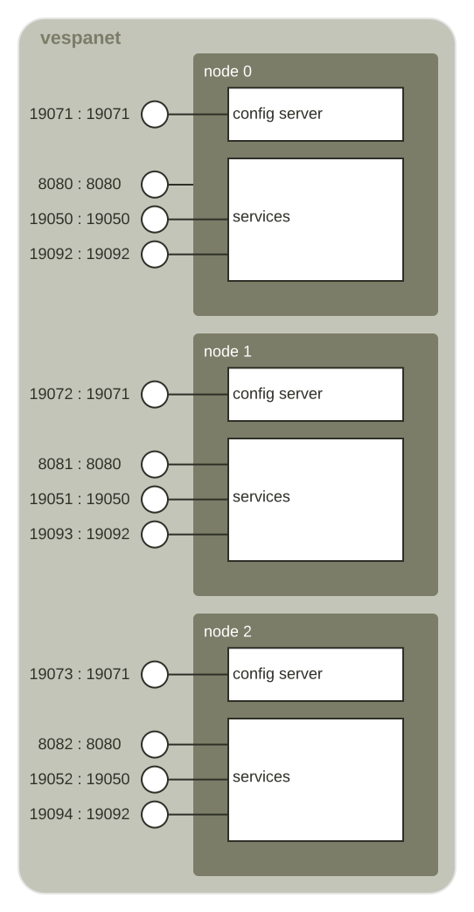
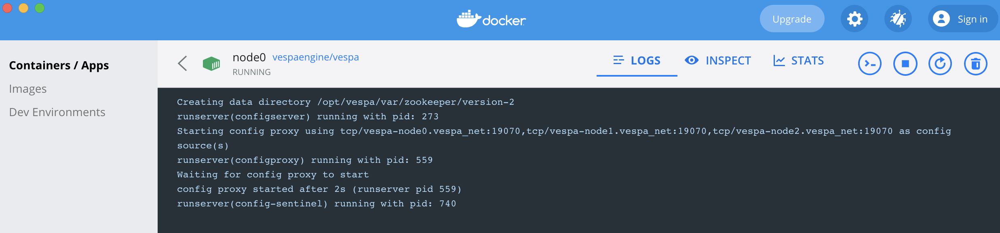
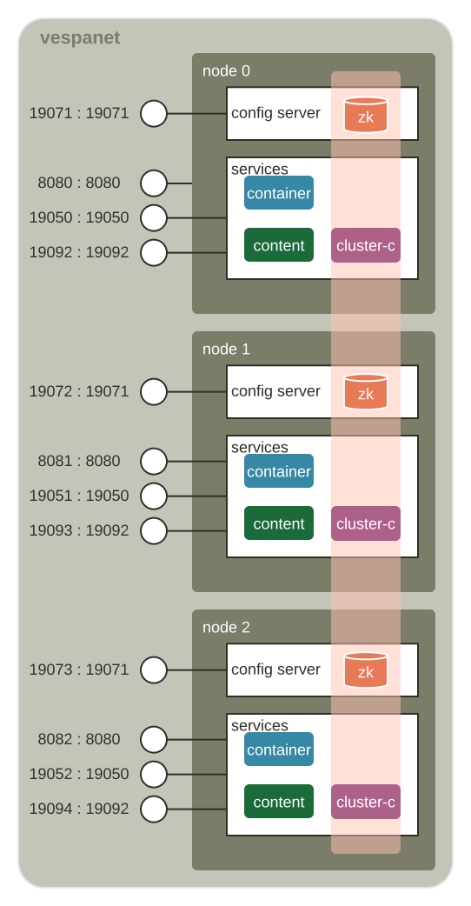

<!-- Copyright Vespa.ai. Licensed under the terms of the Apache 2.0 license. See LICENSE in the project root. -->

<picture>
  <source media="(prefers-color-scheme: dark)" srcset="https://assets.vespa.ai/logos/Vespa-logo-green-RGB.svg">
  <source media="(prefers-color-scheme: light)" srcset="https://assets.vespa.ai/logos/Vespa-logo-dark-RGB.svg">
  
</picture>

# Multinode testing and observability

This is a guide into some aspects of how a multi-node Vespa cluster works.
This example uses three nodes - this is a simplified setup and not a template for multinode systems.
See [multinode-HA](/examples/operations/multinode-HA) for a template.

This is a guide for functional testing, deployed on one host for simplicity.
The [configuration server operations](https://docs.vespa.ai/en/operations/configuration-server.html)
guide is a good resource for troubleshooting.

The guide goes through the use of [Apache ZooKeeper](https://zookeeper.apache.org/)
by the Vespa clustercontrollers. Summary:

* Clustercontrollers manage content node states.
* Clustercontrollers use ZooKeeper to coordinate and save the _cluster state_.
* By default, the ZooKeeper cluster runs on config servers.
* As the ZooKeeper quorum requires minimum two nodes up,
  content node state changes will not be distributed in case of only one config server up.
* When content nodes do not get cluster state updates,
  replicas are [not activated](https://docs.vespa.ai/en/proton.html#sub-databases) for queries,
  causing partial query results.
  In order to avoid duplicates, only _one_ bucket of documents are _active_ -
  the other replicas are _not active_ for queries.

Note that this guide is configured for minimum memory use for easier testing, adding:

    -e VESPA_CONFIGSERVER_JVMARGS="-Xms32M -Xmx128M" \
    -e VESPA_CONFIGPROXY_JVMARGS="-Xms32M -Xmx32M" \

to `docker run` commands. For real production use cases, do not do this.
Also remove annotated memory-settings in [services.xml](services.xml).

## Example cluster setup
Prerequisites:
* Docker with 12G Memory
* git
* zip

<pre data-test="exec">
$ docker info | grep "Total Memory"
$ git clone --depth 1 https://github.com/vespa-engine/sample-apps.git
$ cd sample-apps/examples/operations/multinode
$ docker network create --driver bridge vespanet
</pre>

The nodes communicate over a Docker network, this guide stops docker containers to simulate node stops.
Ports are mapped out of Docker containers for ease of use / inspect interfaces:

Use Docker for Mac dashboard to see output / status:

Also refer to https://github.com/vespa-engine/docker-image/blob/master/Dockerfile, start script in
https://github.com/vespa-engine/docker-image/blob/master/include/start-container.sh,
to understand how Vespa is started in a Docker container using the _vespaengine/vespa_ image.

## Start 3 nodes
<pre data-test="exec">
$ docker run --detach --name node0 --hostname node0.vespanet \
    -e VESPA_CONFIGSERVERS=node0.vespanet,node1.vespanet,node2.vespanet \
    -e VESPA_CONFIGSERVER_JVMARGS="-Xms32M -Xmx128M" \
    -e VESPA_CONFIGPROXY_JVMARGS="-Xms32M -Xmx32M" \
    --network vespanet \
    --publish 8080:8080 --publish 19071:19071 --publish 19050:19050 --publish 19092:19092 \
    vespaengine/vespa configserver,services
$ docker run --detach --name node1 --hostname node1.vespanet \
    -e VESPA_CONFIGSERVERS=node0.vespanet,node1.vespanet,node2.vespanet \
    -e VESPA_CONFIGSERVER_JVMARGS="-Xms32M -Xmx128M" \
    -e VESPA_CONFIGPROXY_JVMARGS="-Xms32M -Xmx32M" \
    --network vespanet \
    --publish 8081:8080 --publish 19072:19071 --publish 19051:19050 --publish 19093:19092 \
    vespaengine/vespa configserver,services
$ docker run --detach --name node2 --hostname node2.vespanet \
    -e VESPA_CONFIGSERVERS=node0.vespanet,node1.vespanet,node2.vespanet \
    -e VESPA_CONFIGSERVER_JVMARGS="-Xms32M -Xmx128M" \
    -e VESPA_CONFIGPROXY_JVMARGS="-Xms32M -Xmx32M" \
    --network vespanet \
    --publish 8082:8080 --publish 19073:19071 --publish 19052:19050 --publish 19094:19092 \
    vespaengine/vespa configserver,services
</pre>

Notes:
* Use fully qualified hostnames.
* [VESPA_CONFIGSERVERS](https://docs.vespa.ai/en/operations-selfhosted/files-processes-and-ports.html#environment-variables)
  lists all nodes using exactly the same names as in [hosts.xml](hosts.xml)

Wait for last config server to start:
<pre data-test="exec" data-test-wait-for="200 OK">
$ curl -s --head http://localhost:19073/ApplicationStatus
</pre>

    HTTP/1.1 200 OK
    Date: Thu, 17 Jun 2021 11:26:19 GMT
    Content-Type: application/json
    Content-Length: 12732

Make sure all ports are listed before continuing:
<pre data-test="exec">
$ netstat -an | egrep '1907[1,2,3]|1905[0,1,2]|808[0,1,2]|1909[2,3,4]' | sort
</pre>

    tcp46      0      0  *.19050                *.*                    LISTEN
    tcp46      0      0  *.19051                *.*                    LISTEN
    tcp46      0      0  *.19052                *.*                    LISTEN
    tcp46      0      0  *.19071                *.*                    LISTEN
    tcp46      0      0  *.19072                *.*                    LISTEN
    tcp46      0      0  *.19073                *.*                    LISTEN
    tcp46      0      0  *.19092                *.*                    LISTEN
    tcp46      0      0  *.19093                *.*                    LISTEN
    tcp46      0      0  *.19094                *.*                    LISTEN
    tcp46      0      0  *.8080                 *.*                    LISTEN
    tcp46      0      0  *.8081                 *.*                    LISTEN
    tcp46      0      0  *.8082                 *.*                    LISTEN

## Deploy a three-node Vespa application
<pre data-test="exec" data-test-assert-contains="prepared and activated.">
$ zip -r - . -x "img/*" README.md .gitignore | \
  curl --header Content-Type:application/zip --data-binary @- \
  localhost:19071/application/v2/tenant/default/prepareandactivate
</pre>

Wait for services to start:
<pre data-test="exec" data-test-wait-for='"code" : "up"'>
$ curl -s http://localhost:8082/state/v1/health
</pre>

## Clustercontroller status pages
Check that this works:
<pre data-test="exec" data-test-assert-contains="Status Page">
$ curl http://localhost:19050/clustercontroller-status/v1/music
</pre>
Then open these in a browser:
* http://localhost:19050/clustercontroller-status/v1/music
* http://localhost:19051/clustercontroller-status/v1/music
* http://localhost:19052/clustercontroller-status/v1/music

0 is normally master, 1 is next (and hence has an overview table), 2 is cold.

## Do a node stop / start and observe changes to cluster state
<pre>
$ docker stop node2
</pre>
Observe at http://localhost:19050/clustercontroller-status/v1/music that
storage and distributor on node2 go to state down, then start is again:
<pre>
$ docker start node2
</pre>

Observe at http://localhost:19050/clustercontroller-status/v1/music that
storage and distributor go to state up again (this can take a minute or two).

## Stop / start primary clustercontroller
<pre>
$ docker stop node0
</pre>
http://localhost:19050/clustercontroller-status/v1/music now goes blank as node0 is stopped.

Observe at http://localhost:19051/clustercontroller-status/v1/music that
storage and distributor on node0 go to state down.
Also see in "Master state" further down that this goes to primary after 60 seconds.

<pre>
$ docker start node0
</pre>
Observe 0 is master again

## Stop two clustercontrollers
<pre>
$ docker stop node0 node1
</pre>
http://localhost:19050/clustercontroller-status/v1/music and http://localhost:19050/clustercontroller-status/v1/music
now go blank as node0 and node1 are stopped.

Find at http://localhost:19052/clustercontroller-status/v1/music that node2 never becomes master!
To understand, review https://stackoverflow.com/questions/32152467/can-zookeeper-remain-highly-available-if-one-of-three-nodes-fails :

> in a 3 node cluster, if 2 of the nodes die, the third one will not be serving requests.
> The reason for that is that the one remaining node cannot know if it is in fact the only survivor
> or if it has been partitioned off from others.
> Continuing to serve request at that point could cause a split brain scenario and violate the core ZooKeeper guarantee.

By default, clustercontrollers use a ZooKeeper cluster running on the config servers:

With config server on node0 and node1 out, the ZooKeeper cluster quorum (the green part in the illustration) is broken -
the clustercontrollers will not update the cluster state.
This can be observed on node2's clustercontroller status page,
where the current cluster state lags what node2's clustercontroller is observing
(but cannot write to ZooKeeper):

<pre>
[2021-06-18 07:57:52.246] WARNING : container-clustercontroller Container.com.yahoo.vespa.clustercontroller.core.database.DatabaseHandler
  Fleetcontroller 0: Failed to connect to ZooKeeper at node0.vespanet:2181,node1.vespanet:2181,node2.vespanet:2181
  with session timeout 30000: java.lang.NullPointerException
at org.apache.zookeeper.ClientCnxnSocketNetty.onClosing(ClientCnxnSocketNetty.java:247)
at org.apache.zookeeper.ClientCnxn$SendThread.close(ClientCnxn.java:1465)
at org.apache.zookeeper.ClientCnxn.disconnect(ClientCnxn.java:1508)
at org.apache.zookeeper.ClientCnxn.close(ClientCnxn.java:1537)
at org.apache.zookeeper.ZooKeeper.close(ZooKeeper.java:1614)
at com.yahoo.vespa.clustercontroller.core.database.ZooKeeperDatabase.&lt;init&gt;(ZooKeeperDatabase.java:120)
at com.yahoo.vespa.clustercontroller.core.database.ZooKeeperDatabaseFactory.create(ZooKeeperDatabaseFactory.java:8)
at com.yahoo.vespa.clustercontroller.core.database.DatabaseHandler.connect(DatabaseHandler.java:197)
at com.yahoo.vespa.clustercontroller.core.database.DatabaseHandler.doNextZooKeeperTask(DatabaseHandler.java:252)
at com.yahoo.vespa.clustercontroller.core.FleetController.tick(FleetController.java:604)
at com.yahoo.vespa.clustercontroller.core.FleetController.run(FleetController.java:1127)
at java.base/java.lang.Thread.run(Thread.java:829)
</pre>

<pre>
$ docker start node0 node1
</pre>
Observe 0 is master again.

Kubernetes users sometimes have issues with the Zookeeper cluster at startup,
see [troubleshooting](/examples/operations/README.md#troubleshooting).

## Feed data, check distribution
Make sure the three nodes are started and up - then feed 5 documents:
<pre data-test="exec" data-test-wait-for="id:mynamespace:music::4">
$ i=0; (for doc in $(ls ../../../album-recommendation/dataset/*.json); \
    do \
      curl -H Content-Type:application/json -d @$doc \
      http://localhost:8080/document/v1/mynamespace/music/docid/$i; \
      i=$(($i + 1)); echo; \
    done)
</pre>
<!-- Wrap for-loop in ( ) for test framework, as it expects single-line using \ -->

Use [vespa-visit](https://docs.vespa.ai/en/content/visiting.html) to validate all documents are fed:
<pre data-test="exec" data-test-assert-contains="id:mynamespace:music::4">
$ docker exec node0 bash -c "/opt/vespa/bin/vespa-visit -i"
</pre>

The redundancy configuration in [services.xml](services.xml) is 3 replicas,
i.e. one replica per node.
Using [metrics](https://docs.vespa.ai/en/operations/metrics.html), expect 5 documents per node:
<pre data-test="exec" data-test-wait-for="content.proton.documentdb.documents.total.last">
$ (for port in 19092 19093 19094; \
    do \
      curl -s http://localhost:$port/metrics/v1/values | \
      jq '.services[] | select (.name=="vespa.searchnode") | .metrics[].values' | \
      grep content.proton.documentdb.documents.total.last; \
    done)
</pre>
<!-- Wrap for-loop in ( ) for test framework, as it expects single-line using \ -->

## Run queries while stopping nodes
Query any of the nodes using 8080, 8081 or 8082 - this query selects _all_ documents:
<pre data-test="exec" data-test-assert-contains='{"totalCount":5}'>
$ curl --data-urlencode 'yql=select * from sources * where sddocname contains "music"' \
  http://localhost:8080/search/
</pre>

Check http://localhost:19050/clustercontroller-status/v1/music, then set node2 down:
<pre>
$ docker stop node2
$ sleep 5
$ curl --data-urlencode 'yql=select * from sources * where sddocname contains "music"' \
  http://localhost:8080/search/
</pre>

See _{"totalCount":5}_. Then stop node1:
<pre>
$ docker stop node1
$ sleep 5
$ curl --data-urlencode 'yql=select * from sources * where sddocname contains "music"' \
  http://localhost:8080/search/
</pre>

We see that the last clustercontroller is still up.
Count documents on the content node:
<pre>
$ docker exec node0 /opt/vespa/bin/vespa-proton-cmd --local getState
...
"onlineDocs", "5"
</pre>

However, query results are partial, 5 documents are **not** returned - check _"{"totalCount": }"_.

Look at "SSV" which is "cluster state version" in the table -
this shows the view the content node has of the cluster:

Compare this with the state changes in the table below, find a higher state number,
which is not yet published due to missing quorum.

The replica activation is missing on node0, as the cluster state with two nodes down was never made
due to missing ZooKeeper quorum.

## Single-node clustercontroller
It is possible to set up clusters with only _one_ clustercontroller - changes:
<pre>
&lt;host name="node3.vespanet"&gt;
    &lt;alias&gt;node3&lt;/alias&gt;
&lt;/host&gt;

&lt;admin version='2.0'&gt;
    &lt;adminserver hostalias="node3" /&gt;
    &lt;configservers&gt;
        &lt;configserver hostalias="node0" /&gt;
        &lt;configserver hostalias="node1" /&gt;
        &lt;configserver hostalias="node2" /&gt;
    &lt;/configservers&gt;
    &lt;cluster-controllers standalone-zookeeper="true"&gt;
        &lt;cluster-controller hostalias="node3" /&gt;
    &lt;/cluster-controllers&gt;
&lt;/admin&gt;

$ docker run --detach --name node3 --hostname node3.vespanet \
    -e VESPA_CONFIGSERVERS=node0.vespanet,node1.vespanet,node2.vespanet \
    --network vespanet \
    --publish 8083:8080 --publish 19074:19071 --publish 19053:19050 --publish 19095:19092 \
    vespaengine/vespa services
</pre>

Here, two content nodes, like node0 and node1, can go down while node2 serves the full data set in queries.

The clustercontroller can also go down with no impact to query serving, assuming all content nodes do not change state.
I.e. if the single clustercontroller is down, and one content node goes down thereafter,
the cluster state is not updated, and partial query results is expected.

## Clean up after testing
<pre data-test="after">
$ docker rm -f node0 node1 node2
$ docker network rm vespanet
</pre>
