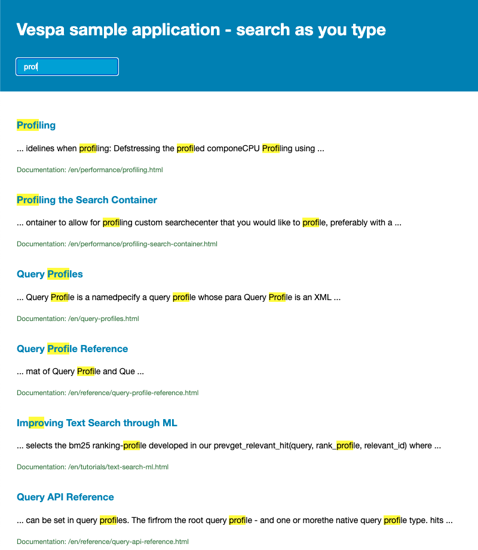
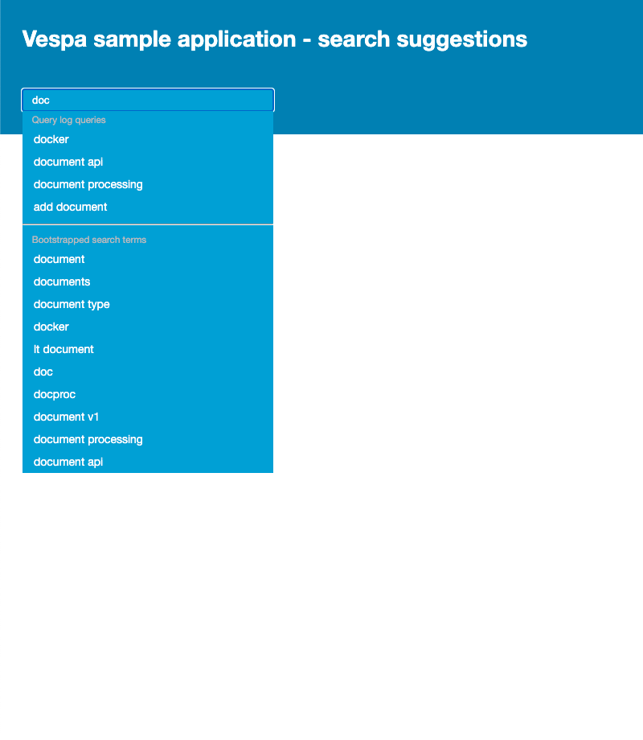

<!-- Copyright Vespa.ai. Licensed under the terms of the Apache 2.0 license. See LICENSE in the project root. -->

# Vespa sample application - incremental search

In some cases we want to search with incomplete queries while the queries are being written,
but using traditional document ranking is often not favorable as searching trough substrings is needed.

These two applications are different examples of how you can use vespa for incremental search
by searching through substrings.

### search-as-you-type

[search-as-you-type](search-as-you-type) is a sample application
which uses n-gram search to match and rank documents while the user is typing out the query.
The highest ranking documents are retrieved,
and the matching portions of the documents are highlighted.

### search-suggestions

[search-suggestions](search-suggestions) is a sample application
which uses indexed prefix search to match and rank documents from a query log / terms extracted from document corpus.
and gives query suggestions (autocomplete) based on previously written queries while the user is typing.

