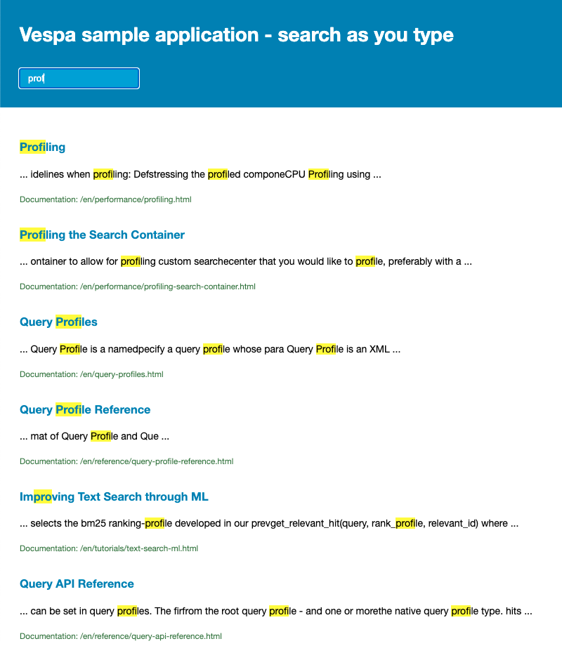
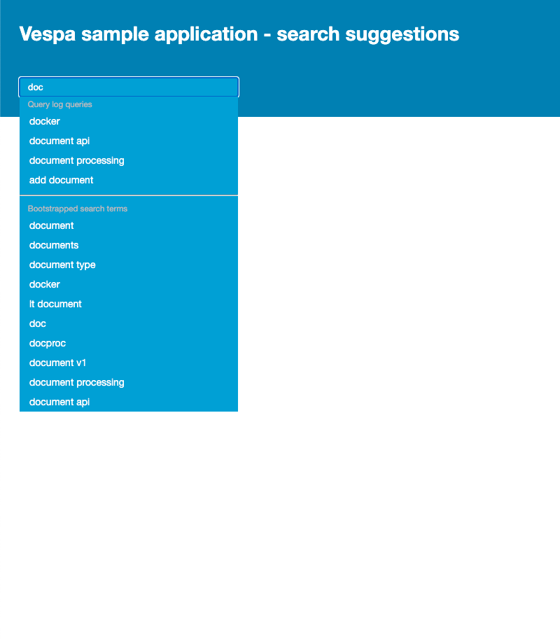

<!-- Copyright Vespa.ai. Licensed under the terms of the Apache 2.0 license. See LICENSE in the project root. -->

# Vespa sample application - incremental search

In some cases we want to search with incomplete queries while the queries are being written,
but using traditional document ranking is often not favorable as searching trough substrings is needed.

The applications beelow are different examples of how you can use vespa for incremental search
by searching through substrings.

Good resources to read before implementing autocomplete are:

* [vinted.engineering/2026/04/22/personalized-search-autocomplete/](https://vinted.engineering/2026/04/22/personalized-search-autocomplete/)
* [Autocomplete with edge n-grams](https://docs.vespa.ai/en/linguistics/lucene-linguistics.html#recipe-autocomplete-with-edge-n-grams)

The above articles will get you going using egde n-grams with lexical transforms integrated.
Below, find examples on how to use other techniques, also covered in Vinted's blog post.

### search-as-you-type

[search-as-you-type](search-as-you-type) is a sample application
which uses n-gram search to match and rank documents while the user is typing out the query.
The highest ranking documents are retrieved,
and the matching portions of the documents are highlighted.

### search-suggestions

[search-suggestions](search-suggestions) is a sample application
which uses indexed prefix search to match and rank documents from a query log / terms extracted from document corpus.
and gives query suggestions (autocomplete) based on previously written queries while the user is typing.

