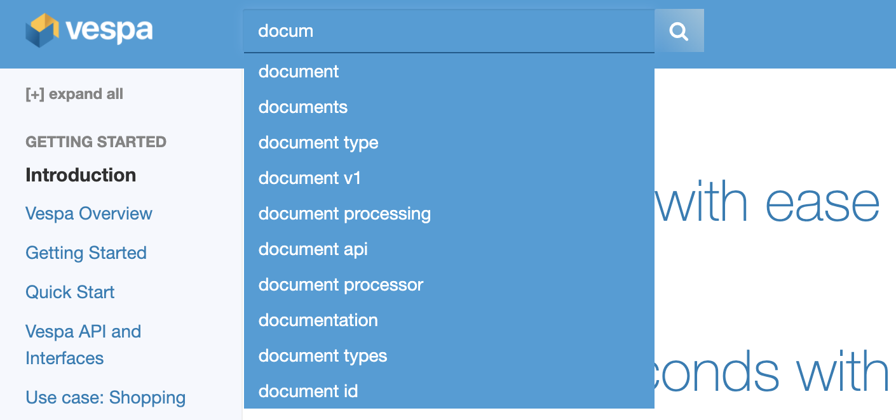

<!-- Copyright Yahoo. Licensed under the terms of the Apache 2.0 license. See LICENSE in the project root. -->

# Vespa sample application - search suggestions

This sample application is a demo of how one can build search suggestions from a document corpus.
It uses documents from [Vespa Documentation](https://github.com/vespa-engine/documentation)
and extracts terms and phrases.
[Prefix search](https://docs.vespa.ai/en/text-matching-ranking.html#prefix-search) is used,
so suggestions are shown as the user types.

This sample application is also deployed for [vespa-documentation-search](https://github.com/vespa-cloud/vespa-documentation-search),
see [schema](https://github.com/vespa-cloud/vespa-documentation-search/blob/main/src/main/application/schemas/term.sd).
Note an enhancement to this sample app:

    field terms type array<string> {
        indexing: summary | attribute
        attribute: fast-search
    }

This to solve the problem of prefix searching every term in the phrase.
Example: A user searching for "rank" should have a suggestion for "learning to rank".
Hence, the script generating suggestions should create something like:

        "update": "id:term:term::learning/to/rank",
        "create": true,
        "fields": {
            "term":  { "assign": "learning to rank" },
            "terms": { "assign": ["learning to rank", "to rank", "rank"] },

With this, prefix queries will hit "inside" phrases, too.

Another consideration is how to remove noise.
A simple approach is to require at least two instances of a word in the corpus.

A simplistic ranking based on term frequencies is used -
a real application could implement a more sophisticated ranking for better suggestions.

## Quick start
Requirements:
* [Docker](https://www.docker.com/) Desktop installed and running. 4GB available memory for Docker is recommended.
  Refer to [Docker memory](https://docs.vespa.ai/en/operations/docker-containers.html#memory)
  for details and troubleshooting
* Operating system: Linux, macOS or Windows 10 Pro (Docker requirement)
* Architecture: x86_64
* [Homebrew](https://brew.sh/) to install [Vespa CLI](https://docs.vespa.ai/en/vespa-cli.html), or download
  a vespa cli release from [Github releases](https://github.com/vespa-engine/vespa/releases).
* [Java 11](https://openjdk.java.net/projects/jdk/11/) installed.
* [Apache Maven](https://maven.apache.org/install.html) This sample app uses custom Java components and Maven is used
  to build the application.

**Validate environment, must be minimum 4GB:**

Refer to [Docker memory](https://docs.vespa.ai/en/operations/docker-containers.html#memory)
for details and troubleshooting:
<pre>
$ docker info | grep "Total Memory"
</pre>

Install [Vespa CLI](https://docs.vespa.ai/en/vespa-cli.html).

<pre >
$ brew install vespa-cli
</pre>

Set target env, it's also possible to deploy to [Vespa Cloud](https://cloud.vespa.ai/)
using target cloud.

For local deployment using docker image use

<pre data-test="exec">
$ vespa config set target local
</pre>

For cloud deployment using [Vespa Cloud](https://cloud.vespa.ai/) use

<pre>
$ vespa config set target cloud
$ vespa config set application tenant-name.myapp.default
$ vespa auth login 
$ vespa auth cert
</pre>

Where tenant-name is the tenant created when signing up for cloud.

Pull and start the vespa docker container image:

<pre data-test="exec">
$ docker pull vespaengine/vespa
$ docker run --detach --name vespa --hostname vespa-container \
  --publish 8080:8080 --publish 19071:19071 \
  vespaengine/vespa
</pre>

Download this sample application
<pre data-test="exec">
$ vespa clone incremental-search/search-suggestions myapp && cd myapp
</pre>

Build the application package
<pre data-test="exec" data-test-expect="BUILD SUCCESS" data-test-timeout="300">
$ mvn clean package -U
</pre>

Verify that configuration service (deploy api) is ready

<pre data-test="exec">
$ vespa status deploy --wait 300
</pre>

Deploy the application

<pre data-test="exec" data-test-assert-contains="Success">
$ vespa deploy --wait 300
</pre>

Wait for the application endpoint to become available

<pre data-test="exec">
$ vespa status --wait 300
</pre>

**Feed the example documents**
Feed documents using the [vespa-cli](https://docs.vespa.ai/en/vespa-cli.html):

<pre data-test="exec">
$ while read -r line; do echo $line > tmp.json; vespa document tmp.json; done < example_feed.jsonl
</pre>

**Check the website, write queries and view suggestions**

Open http://localhost:8080/site/ in a browser.
To validate the site is up:
<pre data-test="exec" data-test-assert-contains="search suggestions">
$ curl -s http://localhost:8080/site/
</pre>

**Do a prefix query**
Using [YQL](https://docs.vespa.ai/en/query-language.html) using *contains* with prefix annotation:
<pre data-test="exec" data-test-assert-contains="id:term:term::streaming">
$ vespa query 'yql=select documentid,term from sources term where term contains ([{"prefix":true}]"stre");'
</pre>

YQL with userQuery() and [simple query language](https://docs.vespa.ai/en/reference/simple-query-language-reference.html)

<pre data-test="exec" data-test-assert-contains="id:term:term::streaming">
vespa query 'yql=select documentid,term from sources term where ([{"defaultIndex":"term"}]userQuery());' 'query=str*'
</pre>

Using regular expression [YQL](https://docs.vespa.ai/en/query-language.html) with *matches* instead of *contains*:

<pre data-test="exec" data-test-assert-contains="id:term:term::streaming">
$ vespa query 'yql=select documentid,term from sources term where term matches "stre"'
</pre>

**Shutdown and remove the docker container**

<pre data-test="after">
$ docker rm -f vespa
</pre>

## Appendix 

### Indexed prefix search

Indexed prefix search matches documents where the prefix of the term matches the query terms.

To do an indexed prefix search the query needs \[{"prefix":true}],
see [example](https://docs.vespa.ai/en/streaming-search.html#match-mode).
It is important to note that this type of prefix search is not supported for fields set to _index_ in the schema. 
Therefore, all fields for prefix search has to be _attributes_.

Indexed prefix search is faster than using streaming search,
and is also more suitable for situations where multiple concurrent queries might occur and performance is important.

### The sample application

In this sample application indexed prefix search is used to implement search suggestions
based on users' previous queries.
By storing user-input as documents you can get some queries that are not suitable for suggestion.
A way to remedy this is by filtering out user queries that contain terms that are added to a block list
or have a set of accepted terms.
In this sample application a [document processor](https://docs.vespa.ai/en/document-processing.html)
is used to filter out such queries during document feeding.
For demonstration purposes we have implemented both a block list and a set of accepted terms,
but usually only one of these is needed.
