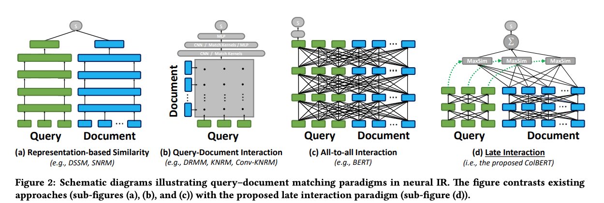

<!-- Copyright Vespa.ai. Licensed under the terms of the Apache 2.0 license. See LICENSE in the project root.-->

<picture>
  <source media="(prefers-color-scheme: dark)" srcset="https://assets.vespa.ai/logos/Vespa-logo-green-RGB.svg">
  <source media="(prefers-color-scheme: light)" srcset="https://assets.vespa.ai/logos/Vespa-logo-dark-RGB.svg">
  
</picture>

# MS Marco Passage Ranking

## Short description
MS Marco Passage Ranking demonstrates how to efficiently represent three ways of applying Transformer-based ranking
models for text ranking in Vespa:
Dense vector search retrieval, re-ranking using a cross-encoder and re-ranking using ColBERT.

## Features
- Simple single-stage sparse retrieval accelerated by the
  [WAND](https://docs.vespa.ai/en/using-wand-with-vespa.html)
  dynamic pruning algorithm with [BM25](https://docs.vespa.ai/en/reference/bm25.html) ranking.
- Dense (vector) search retrieval for efficient candidate retrieval
  using Vespa's support for [approximate nearest neighbor search](https://docs.vespa.ai/en/approximate-nn-hnsw.html).
- Re-ranking using a *cross-encoder* with cross attention between the query and document terms.
- Re-ranking using the [Late contextual interaction over BERT (ColBERT)](https://arxiv.org/abs/2004.12832) model.
- [Multiphase retrieval and ranking](https://docs.vespa.ai/en/phased-ranking.html)
  combining efficient retrieval (WAND or ANN) with re-ranking stages.
- Using Vespa [embedder](https://docs.vespa.ai/en/embedding.html) functionality.
- Hybrid ranking functionality

## Transformers for Ranking

*Illustration from [ColBERT paper](https://arxiv.org/abs/2004.12832)*.

From the feature list above:
- Dense (vector) search retrieval for efficient candidate retrieval
  is illustrated in figure **a**.
- Re-ranking using a *cross-encoder* with cross attention between the query and document terms
  is illustrated in figure **c**.
- Re-ranking using the [Late contextual interaction over BERT (ColBERT)](https://arxiv.org/abs/2004.12832) model
  is illustrated in figure **d**.

To use this sample application to the best, find more details in the blog posts:
- [Post one: Introduction to neural ranking and the MS Marco passage ranking dataset](https://blog.vespa.ai/pretrained-transformer-language-models-for-search-part-1/).
- [Post two: Efficient retrievers, sparse, dense, and hybrid retrievers](https://blog.vespa.ai/pretrained-transformer-language-models-for-search-part-2/).
- [Post three: Re-ranking using multi-representation models (ColBERT)](https://blog.vespa.ai/pretrained-transformer-language-models-for-search-part-3/).
- [Post four: Re-ranking using cross-encoders](https://blog.vespa.ai/pretrained-transformer-language-models-for-search-part-4/).

## Retrieval and Ranking
There are several ranking profiles defined in the *passage* document schema.
See [vespa ranking documentation](https://docs.vespa.ai/en/ranking.html)
for an overview of how to represent ranking in Vespa.

## Quick start
Make sure to read and agree to the terms and conditions of [MS Marco](https://microsoft.github.io/msmarco/)
before downloading the dataset. The following is a quick start recipe for getting started with a tiny slice of
the ms marco passage ranking dataset.

Requirements:

* [Docker](https://www.docker.com/) Desktop installed and running. 6 GB available memory for Docker.
  Refer to [Docker memory](https://docs.vespa.ai/en/operations-selfhosted/docker-containers.html#memory)
  for details and troubleshooting
* Alternatively, deploy using [Vespa Cloud](https://cloud.vespa.ai/)
* Operating system: Linux, macOS, or Windows 10 Pro (Docker requirement)
* Architecture: x86_64 or arm64
* [Homebrew](https://brew.sh/) to install [Vespa CLI](https://docs.vespa.ai/en/vespa-cli.html), or download
  a vespa-cli release from [GitHub releases](https://github.com/vespa-engine/vespa/releases).
* python (requests, tqdm, ir_datasets)

Validate Docker resource settings, which should be a minimum of 6 GB:
<pre>
$ docker info | grep "Total Memory"
or
$ podman info | grep "memTotal"
</pre>

Install [Vespa CLI](https://docs.vespa.ai/en/vespa-cli.html):
<pre>
$ brew install vespa-cli
</pre>

Install python dependencies for exporting the passage dataset:

<pre data-test="exec">
$ pip3 install ir_datasets
</pre>

For local deployment using docker image:
<pre data-test="exec">
$ vespa config set target local
</pre>

Pull and start the vespa container image:
<pre data-test="exec">
$ docker pull vespaengine/vespa
$ docker run --detach --name vespa --hostname vespa-container \
  --publish 127.0.0.1:8080:8080 --publish 127.0.0.1:19071:19071 \
  vespaengine/vespa
</pre>

Verify that the configuration service (deploy API) is ready:
<pre data-test="exec">
$ vespa status deploy --wait 300
</pre>

Download this sample application:
<pre data-test="exec">
$ vespa clone msmarco-ranking myapp && cd myapp
</pre>

Export the cross-encoder ranker model to onnx format using the [Optimum](https://huggingface.co/docs/optimum/index)
library from HF or download an exported ONNX version of the model (like in this example)

<pre data-test="exec">
$ mkdir -p models
$ curl -L https://huggingface.co/Xenova/ms-marco-MiniLM-L-6-v2/resolve/main/onnx/model.onnx -o models/model.onnx
$ curl -L https://huggingface.co/Xenova/ms-marco-MiniLM-L-6-v2/raw/main/tokenizer.json -o models/tokenizer.json
</pre>

Deploy the application:

<pre data-test="exec" data-test-assert-contains="Success">
$ vespa deploy --wait 300
</pre>

## Feeding sample data
Feed a small sample of data:

<pre data-test="exec">
$ vespa feed ext/docs.jsonl
</pre>

## Query examples

For example, do a query for *what was the Manhattan Project*:

Note that the `@query` parameter substitution syntax requires Vespa 8.299 or above.

<pre data-test="exec" data-test-assert-contains='Manhattan'>
vespa query 'query=what was the manhattan project' \
 'yql=select * from passage where {targetHits: 100}nearestNeighbor(e5, q)'\
 'input.query(q)=embed(e5, @query)' \
 'input.query(qt)=embed(colbert, @query)' \
 'ranking=e5-colbert'
</pre>

<pre data-test="exec" data-test-assert-contains='Manhattan'>
vespa query 'query=what was the manhattan project' \
 'yql=select * from passage where userQuery() or ({targetHits: 100}nearestNeighbor(e5, q))'\
 'input.query(q)=embed(e5, @query)' \
 'input.query(qt)=embed(colbert, @query)' \
 'input.query(query_token_ids)=embed(tokenizer, @query)' \
 'ranking=e5-colbert-cross-encoder-rrf'
 </pre>

## Shutdown and remove the Docker container:

<pre data-test="after">
$ docker rm -f vespa
</pre>

### Ranking Evaluation using Ms Marco Passage Ranking development queries

With the [evaluate_passage_run.py](python/evaluate_passage_run.py)
we can run retrieval and ranking using the methods demonstrated.

To do so, we need to index the entire dataset as follows:
<pre>
ir_datasets export msmarco-passage docs --format jsonl |python3 python/to-vespa-feed.py | vespa feed -
</pre>

Note that the ir_datasets utility will download MS Marco query evaluation data,
so the first run will take some time to complete.

**BM25(WAND) Single-phase sparse retrieval**
<pre>
$ ./python/evaluate_passage_run.py --query_split dev --model bm25 --endpoint \
  http://localhost:8080/search/
</pre>

To evaluate ranking effectiveness, download the official MS Marco evaluation script:
<pre>
$ curl -L -o msmarco_eval.py https://raw.githubusercontent.com/spacemanidol/MSMARCO/master/Ranking/Baselines/msmarco_eval.py
</pre>

Generate the dev qrels (query relevancy labels) file using the *ir_datasets*:
<pre>
$ ./python/dump_passage_dev_qrels.py
</pre>

Above will write a **qrels.dev.small.tsv** file to the current directory,
now we can evaluate using the **run.dev.txt** file created by any of the evaluate_passage_run.py runs listed above:
<pre>
$ python3 msmarco_eval.py qrels.dev.small.tsv run.dev.txt
#####################
MRR @10: 0.xx
QueriesRanked: 6980
#####################
</pre>
