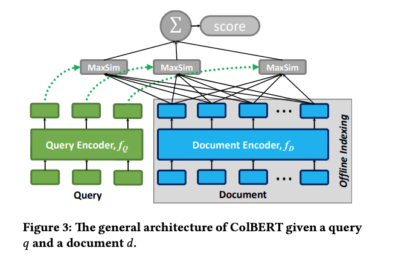

<!-- Copyright Yahoo. Licensed under the terms of the Apache 2.0 license. See LICENSE in the project root.-->

# MS Marco Passage Ranking using ColBERT - Performance and Scaling

This document describes scaling and serving performance of the ColBERT representation on Vespa. For a general intro to performance
and sizing Vespa see [Vespa performance and sizing documentation](https://docs.vespa.ai/en/performance/sizing-search.html)

*The MaxSim operator, Illustration from [ColBERT paper](https://arxiv.org/abs/2004.12832)*

The overall end to end serving performance and ranking accuracy of a trained ColBERT model depends many factors.

- The size and weights of the BERT model which is used to encode the query and the query input sequence length. In our experiments we used [Bert-Medium](https://huggingface.co/google/bert_uncased_L-8_H-512_A-8)
which has 8 layers, and uses hidden dimensionality 512. We fixed the input sequence length to max 32 tokens. Using quantization (int8) weights instead of float32 reduces the
size and run time complexity but also impacts ranking accuracy. 

- The efficiency of the retriever. In our experiments we use a sparse term based retriever accelerated 
by the [Vespa weakAnd query operator](https://docs.vespa.ai/en/using-wand-with-vespa.html). 
The Vespa weakAnd is an implementation of a dynamic pruning algorithm (WAND) which tries
to retrieve the best top-k scoring documents without exhaustive scoring all documents which matches any of the terms in the query. Vespa
does per default not remove common stop words. The Vespa weakAnd implementation will expose all hits which were evaluated to the first-phase ranking expression.

- The ColBERT MaxSim evaluation efficiency which is determined by the number of dimensions used per term and number of terms in the passage. The number of query term embeddings is fixed at 32. 

The retrieval and re-ranking can be be done using multiple threads per query but the query encoding realization is single threaded.  

Below we document how changing these parameters impacts the official evaluation metric MRR@10 as measured on 
 the *dev* query split and the end to end performance.  

# Benchmarking setup
We use the 6,980 queries in the dev set to measure end to end latency versus MRR@10.  The latency oriented experiments are run using a single
benchmarking thread and we use the [vespa-fbench](https://docs.vespa.ai/en/performance/vespa-benchmarking.html)
http benchmarking utility and latency includes everything including https and data transfer. Since we used MRR at 10 we only fetch the top 10 hits. 
The client benchmarking node is in the same region so network latency is insignificant.  

The single threaded client allows comparing latency of the overall end to end performance and it's variance with respect to the 
different queries in the dev set.  

For throughput tests with more than one client thread the same query might be performed several times during a run.
We don't perform any caching of neither the query term tensors obtained by the ColBERT query encoder
 model or caching the result of the passage ranking. 
For a production setup, caching the query tensor embeddings would likely have a high cache hit ratio. 

For every test all terms and posting 
lists are in-memory so the performance of the IO subsystem is not measured.  
Vespa allows controling how index (postings and dictionary) are
read from disk, it can use mmap (default) or prepopulate. 
See [index search tunings](https://docs.vespa.ai/en/reference/services-content.html#index-io-search)

We perform the experiments on a single content node with 2 x Xeon Gold 6240 2.60GHz (36 core, 72 threads with hyperthread). 
We also use a 16 v-cpu instance to run the stateless container node where the custom 
[searcher logic](src/main/java/ai/vespa/searcher/colbert/ColBERTSearcher.java) is implemented.
The system is deployed as an instance in [cloud.vespa.ai](https://cloud.vespa.ai/).

The performance might differ on different cpu models depending on what type of instructions they support (e.g avx512 availability) as 
Vespa uses openblas and mlas via onnx runtime to optimze evaluation where possible. 

We use 6 threads per search in all the experiments. 

## Retriever Recall and Performance

First we evaluate the the Recall@K for the dev query set using the [weakAnd query operator](https://docs.vespa.ai/en/using-wand-with-vespa.html) 
to get a sense for the re-ranking depth. We also measure latency for weakAnd versus brute force exhaustive search. 

The retriever accuracy as measured by Recall@k sets the upper bound on the re-ranker at depth k so we focus on the recall@k metric 
since we aim to re-rank the top k passages with ColBERT. 
Reported Recall@1K and MRR@10 is inline with 
[Lucene BM25 based experiments](https://github.com/castorini/anserini/blob/master/docs/experiments-msmarco-passage.md).
 

### WeakAnd versus Exhaustive OR 
Recall is measured by fetching 1000 hits and usign the *trec_eval* tool. 6,980 queries from the passage *dev* query set:

| Retriever   |  Recall@100    | Recall@500 | Recall@1000 | MRR@10  |Average number of passages ranked per query|
|----------------|-------------|------------|-------------|---------|-------------------------------------------|
|WeakAnd(K=1000) |      0.66   |      0.80  |0.85         |0.184    | 158,270                                   |
|Exhaustive OR   |      0.66   |      0.80  |0.85         |0.184    | 5,792,167                                 |

Note that we don't perform any type of stopword removal which impacts the number of passages ranked for both the WeakAnd run
and the exhaustive OR. 

We also evaluate the latency of the 6,980 queries in the *dev* set. In this case we only fetch 10 documents since that is what 
we intend to return to the end user, this to not let the time it takes transfering and rendering 
a large result set to the client dominate the latency benchmark.
 

| Search        |  Recall@1000| Average latency(ms)| 90P latency (ms) | 99P Latency  (ms)          |99.9P Latency (ms)  |
|---------------|-------------|--------------------|------------------|----------------------------|------------------------------------------|
|WeakAnd(k=1000)|   0.85      | 15.53              | 23.20            | 36.06                      | 128.53             |
|Exhaustive OR  |      0.85   |103.01              |169.81            |274.07                      | 384.86             |

As we can see we have as significant cost saving without any impact on Recall@k metric replacing exhaustive OR search with Weak And.
For a deployed system we would need about 7x more resources with the exhaustive version to match the latency/cost of using the WAND retriever. 

# End to end benchmark with ColBERT

The following experiments are end to end with WAND K = 1000 for 6980 queries from the *dev* query set and re-ranking 1K using
the ColBERT MaxSim tensor. End to end also includes query encoding via BERT. 

Latency and throughput is measured end to end including https. In this benchmark we use a quantized (int8) version
of the query encoder, this reduces the MRR@10 from 0.354 to 0.342 but it is significantly faster to encode the query.

| MRR@10  |  Average Latency | 90P Latency| 99P Latency | QPS     | Clients | Re-rank depth| Quantized BERT|
|---------|------------------|------------|-------------|---------|---------|--------------|-------------- |
|0.342    |      34.08       |  42.30     |55.71        | 29.27   |  1      |     1000     | Yes           |
|0.342    |      33.24       |  41.30     |57.70        | 60.16   |  2      |     1000     | Yes           |
|0.342    |      33.53       |  42.70     |60.85        | 119.28  |  4      |     1000     | Yes           |
|0.342    |      40.62       |  51.60     |71.00        | 196.94  |  8      |     1000     | Yes           |
|0.342    |      44.11       |  61.50     |78.60        | 271.94  |  12     |     1000    | Yes           |
|0.342    |      48.56       |  56.20     |83.60        | 329.43  |  16     |     1000    | Yes           |
|0.342    |      57.72       |  74.50     |102.20       | 346.43  |  20     |     1000    | Yes           |

At 240 QPS the content node is at 50% cpu(36 cores) util and after that hyper threading causes latency to become higher.
At 346 QPS the content node is at 85% cpu util and we reach 99p 102 ms where we have reached the maxium throughput we can get out
of a single content node with this type of cpu.  

# Scaling ColBERT evaluation with Vespa 

There are three main components which can be scaled independently:

* The stateless container nodes powering the http api. Stateless container nodes can be scaled horizontally to increase total overall throughput 
* The passage or document types where the retrieval and ranking is performed can be scaled horizontally to handle a larger document volume.  

