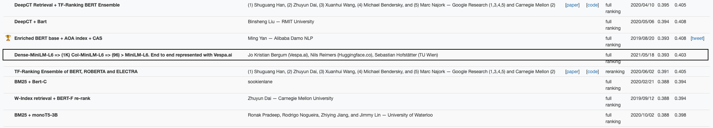
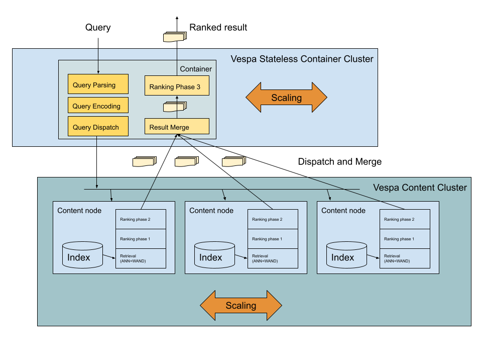
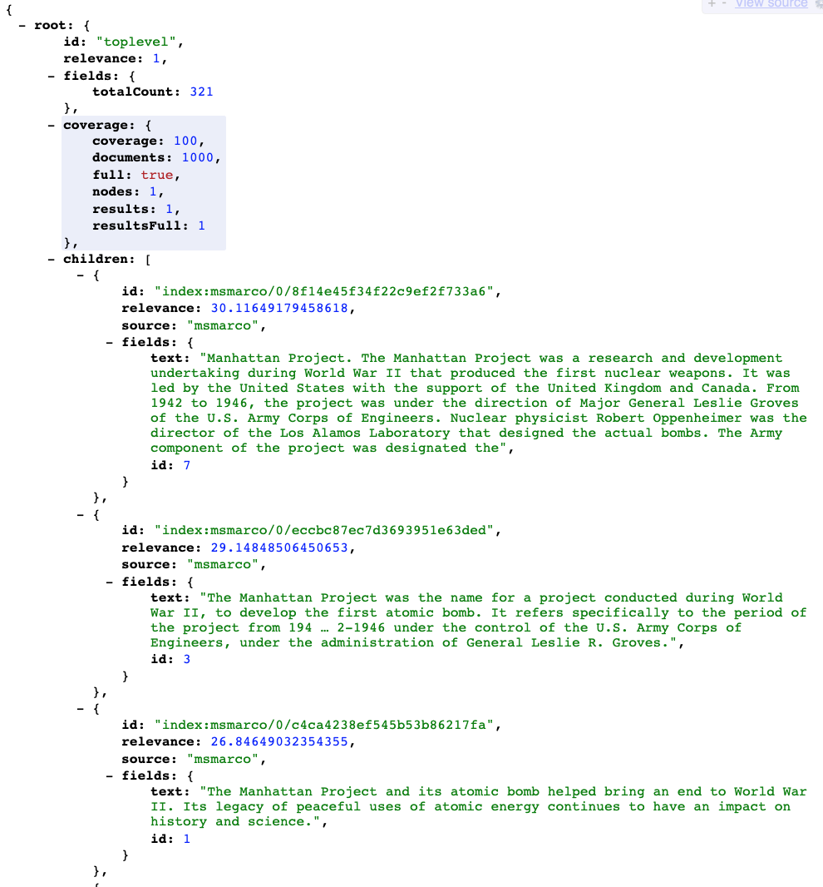

<!-- Copyright Yahoo. Licensed under the terms of the Apache 2.0 license. See LICENSE in the project root.-->

# MS Marco Passage Ranking using Transformers 

This sample application demonstrates how to efficiently represent three different ways of applying pretrained Transformer
models for text ranking in Vespa.
The three methods are described in detail in  these blog posts:

* [Pretrained language models for search - part 1 ](https://blog.vespa.ai/pretrained-transformer-language-models-for-search-part-1/)
* [Pretrained language models for search - part 2 ](https://blog.vespa.ai/pretrained-transformer-language-models-for-search-part-2/)
* [Pretrained language models for search - part 3 ](https://blog.vespa.ai/pretrained-transformer-language-models-for-search-part-3/)
* [Pretrained language models for search - part 4 ](https://blog.vespa.ai/pretrained-transformer-language-models-for-search-part-4/)

With this sample application you can reproduce the submission made by the Vespa team to the
[MS Marco Passage Ranking Leaderboard](https://microsoft.github.io/MSMARCO-Passage-Ranking-Submissions/leaderboard/) 
submission which currently ranks #15, above many huge ensemble models using large Transformer models.

## Transformers for Ranking 

*Illustration from [ColBERT paper](https://arxiv.org/abs/2004.12832)*

This sample application demonstrates:

- Simple single stage sparse retrieval accelerated by the
  [WAND](https://docs.vespa.ai/en/using-wand-with-vespa.html)
  dynamic pruning algorithm with [BM25](https://docs.vespa.ai/en/reference/bm25.html) ranking.  
- Dense (vector) search retrieval to replace sparse (BM25) for efficient candidate retrieval
  using Vespa's support for fast
  [approximate nearest neighbor search](https://docs.vespa.ai/en/approximate-nn-hnsw.html).
  It demonstrates how to also embed the query encoder model which convert the query text to dense vector representation.
  This model is a representation model. Illustrated in figure **a**. 
- Re-ranking using the [Late contextual interaction over BERT (ColBERT)](https://arxiv.org/abs/2004.12832) model
  where the ColBERT query encoder is also embedded in the Vespa serving stack.
  A Vespa tensor expressions is used to calculate the *MaxSim*. This method is illustrated in figure **d**. 
- Re-ranking using all to all cross attention between the query and document.
  This is the most effective model (ranking accuracy)
  but also the most computationally complex model due to the increased input sequence length (query + passage).
  This method is illustrated in figure **c**.
- [Multiphase retrieval and ranking](https://docs.vespa.ai/en/phased-ranking.html)
  combining efficient retrieval (WAND or ANN) with re-ranking stages.
- Custom [searcher plugins](https://docs.vespa.ai/en/searcher-development.html) to build the application serving logic.
  It also features [custom document processors](https://docs.vespa.ai/en/document-processing.html) .
- Accelerated [Stateless ML model evaluation](https://blog.vespa.ai/stateless-model-evaluation/)
  for transformer based query encoding and final ranking phase using transformer batch re-ranking. 

  

### Transformer Models 
This sample application uses pre-trained Transformer models fine-tuned for MS Marco passage ranking from
[Huggingface 🤗](https://huggingface.co/).

All three Transformer based models used in this sample application are based on
[MiniLM](https://arxiv.org/abs/2002.10957) which is a distilled BERT model
which can be used as a drop in replacement for BERT. 
It uses the same sub word tokenization routine and shares the vocabulary with the original BERT base model.
The MiniLM model has roughly the same accuracy as the more known big brother *bert-base-uncased* on many tasks,
but with fewer parameters which lowers the computational complexity significantly.  
 
The original MiniLM has 12 layers, this work uses 6 layer versions with only about 22.7M trainable parameters.

The sample application uses the following three models:

- Dense retrieval using bi-encoder [sentence-transformers/msmarco-MiniLM-L-6-v3 🤗](https://huggingface.co/sentence-transformers/msmarco-MiniLM-L-6-v3)
  The original model uses mean pooling over the last layer of the MiniLM model.
  A simple L2 normalization is used to normalize vectors to unit length (1) so that
  one can use innerproduct distance metric instead of angular distance metric.
  The L2 normalization stage is added to the ONNX execution graph.
  Using innerproduct saves computations compared to angular distance during the approximate nearest neighbor search. 
- Contextualized late interaction (COLBert) [vespa-engine/col-minilm 🤗](https://huggingface.co/vespa-engine/col-minilm).
- Cross all to all encoder [cross-encoder/ms-marco-MiniLM-L-6-v2 🤗](https://huggingface.co/cross-encoder/ms-marco-MiniLM-L-6-v2). 
  Sometimes also referred to as BERT-mono or BERT-cat in scientific literature.
  This is a model which take both the query and the passage as input. 
 
Code to export these models to [ONNX](https://docs.vespa.ai/en/onnx.html) format for efficient serving in Vespa.ai
is available in the [model export notebook](src/main/python/model-exporting.ipynb).
All three models are [quantized](https://onnxruntime.ai/docs/performance/quantization.html)
for accelerated inference on CPU using int8 weights. 
The quantized model versions are hosted on S3 and are free to download and import into the sample application.

### MS Marco Passage Ranking Evaluation 

The official ranking evaluation metric on MS Marco passage leaderboard is
[MRR@10](https://en.wikipedia.org/wiki/Mean_reciprocal_rank) 
and below are the results of two passage ranking submissions.
The results include both the **eval** and **dev** query set. 

The MS Marco Passage ranking leaderboard is sorted by the score on the *eval* set. 
See [MSMarco Passage Ranking Leaderboard](https://microsoft.github.io/msmarco/).
 
For reference the official baseline using [BM25](https://en.wikipedia.org/wiki/Okapi_BM25) and 
a tuned BM25 using *Apache Lucene 8* is included. 
Apache Lucene powers text ranking search for search engines like *Apache Solr* and *Elasticsearch*. 

| Model                                     | Eval  | Dev   |
|-------------------------------------------|-------|-------|
| BM25 (Official baseline)                  | 0.165 | 0.167 |
| BM25 (Lucene8, tuned)                     | 0.190 | 0.187 |
| **BM25 => ColBERT**                       | 0.347 | 0.354 |
| **dense => ColBERT => Cross all to all**  | 0.393 | 0.403 |

Methods in bold are end to end represented using Vespa.

# Vespa Sample application 
The following section goes into the details of this sample application and how to reproduce the MS Marco submissions. 

## Vespa document model 

Vectors or generally tensors are first-class citizens in the Vespa document model.
The [passage](src/main/application/schemas/passage.sd) document schema is given below:

<pre>
schema passage {

  document passage {

    field text type string {
      indexing: summary | index
      index: enable-bm25
    }
    
    field text_token_ids type tensor&lt;float&gt;(d0[128])  {
      indexing: summary | attribute
      attribute:paged
    }
    
    field dt type tensor&lt;bfloat16&gt;(dt{}, x[32]){
      indexing: summary | attribute
    }
    
    field mini_document_embedding type tensor&lt;float&gt;(d0[384]) {
      indexing: attribute | index
      attribute {
        distance-metric: innerproduct
      }
      index {
        hnsw {
          max-links-per-node: 32
          neighbors-to-explore-at-insert: 500
        }
      }
    }
    field id type int {
      indexing: summary |attribute
    }
  }
} 
</pre> 

The *text* field indexes the original passage text
and the *dt* tensor field stores the contextual multi-term embedding from the ColBERT model. 
*dt* is an example of a mixed tensor which mixes sparse/mapped ("dt") dimension and dense "x". 
Using a mixed sparse/dense tensor allows storing variable length text where the number of terms is not fixed. 

The ColBERT model uses 32 vector dimensions per term, this is denoted by <em>x[32]</em>.
The tensor cell type is
[bfloat16 (2 bytes) per tensor cell](https://docs.vespa.ai/en/tensor-user-guide.html#cell-value-types).
This tensor cell type is used to reduce memory footprint compared to float (4 bytes per value). 

See [Vespa Tensor Guide](https://docs.vespa.ai/en/tensor-user-guide.html) for an introduction to Vespa tensors.
The *id* field is the passage id from the dataset. 

The *text_token_ids* contains the BERT token vocabulary ids
and is only used by the final cross all to all interaction re-ranking model. 
Storing the tokenized subword token ids from the BERT vocabulary avoids passage side tokenization at query serving time. 

The *text_token_ids* is also an example of a
[paged tensor attribute](https://docs.vespa.ai/en/attributes.html#paged-attributes). 
Using paged attribute enables storing more passages per node,
at the cost of potentially slower access time,
depending on memory pressure and document access locality.
As this field is only used during re-ranking, the number of page-ins are limited by the re-ranking depth. 

The *mini_document_embedding* field is the dense vector produced by the sentence encoder model.
HNSW indexing is enabled for efficient fast approximate nearest neighbor search.
The hnsw settings controls vector accuracy versus speed, 
see more on [hnsw indexing in Vespa](https://docs.vespa.ai/en/approximate-nn-hnsw.html).

## Retrieval and Ranking 
There are several ranking profiles defined in the *passage* document schema. 
See [Vespa Ranking Documentation](https://docs.vespa.ai/en/ranking.html)
for an overview of how to represent ranking in Vespa.

The baseline ranking model is using [bm25](https://docs.vespa.ai/en/reference/bm25.html). 

Below is the *bm25* ranking profile, defined in the passage document schema:

<pre> 
rank-profile bm25 {
  num-threads-per-search: 6
  first-phase {
    expression: bm25(text)
  }
}
</pre>

The *bm25* ranking feature (above scoped to field text) has two hyperparameters
and are left untouched with (b=0.75, k=1.2).
 
The *num-threads-per-search* specifies that retrieval and ranking should be using 6 threads per search. 
Vespa supports using multiple threads to evaluate a query which allows tuning latency versus throughput.
The setting can only tune down the default which is specified in [services.xml](src/main/application/services.xml). 

See [Vespa performance and sizing guide](https://docs.vespa.ai/en/performance/sizing-search.html)
for more on using threads per search.

The *ColBERT* MaxSim model is expressed using a second phase ranking expression,
see [phased ranking](https://docs.vespa.ai/en/phased-ranking.html). 
The first-phase is inherited from the *bm25* ranking profile. 
The top-k passages as scored by the first phase bm25 ranking feature are re-ranked using the ColBERT MaxSim operator.
The re-ranking count or re-ranking depth is configurable and can also be overridden at query time.
 
The ColBERT MaxSim operator is expressed using Vespa's
[tensor expression language](https://docs.vespa.ai/en/reference/ranking-expressions.html#tensor-functions). 

<pre> 
rank-profile bm25-colbert inherits bm25 {
  num-threads-per-search: 6
  second-phase {
    rerank-count: 1000
    expression {
      sum(
        reduce(
          sum(
            query(qt) * cell_cast(attribute(dt),float), x
          ),
          max, dt
        ),
        qt
      )
    }
  }
}
</pre>

The *query(qt)* represent the ColBERT query tensor which is computed at the stateless container
before retrieving and ranking passages.  
The query tensor hold the per term contextual embeddings.
The *attribute(dt)* expression reads the document tensor which stores the per term contextual embedding. 

The **cell_cast** is used to cast from bfloat16 format in memory to float,
this helps the search core to recognize the tensor expression 
and HW accelerate the inner dotproducts using vector instructions.  

The query tensor type is defined in the application package in
[search/query-profiles/types/root.xml](src/main/application/search/query-profiles/types/root.xml):
<pre>
&lt;field name="ranking.features.query(qt)" type="tensor&lt;float&gt;(qt{},x[32])"/&gt;
</pre> 

There are several ranking profiles defined in the passage schema and the most accurate model

<pre>
  rank-profile dense-colbert-mini-lm {
    num-threads-per-search: 12

    function input_ids() {
        expression: tokenInputIds(128, query(query_token_ids), attribute(text_token_ids))
    }

    function token_type_ids() {
      expression: tokenTypeIds(128, query(query_token_ids), attribute(text_token_ids))
    }

    function attention_mask() {
      expression: tokenAttentionMask(128, query(query_token_ids), attribute(text_token_ids))
    }

    #Max score is 32 * 1.0
    function maxSimNormalized() {
      expression {
        sum(
          reduce(
            sum(
              query(qt) * attribute(dt), x
            ),
            max, dt
          ),
          qt
        )/32.0
       }
    }
    function dense() {
      expression: closeness(field,mini_document_embedding)
    }

    function crossModel() {
      expression: onnx(minilmranker){d0:0,d1:0}
    }

    first-phase {
        expression: maxSimNormalized()
    }

    second-phase {
      rerank-count: 24
      expression: 0.2*crossModel() + 1.1*maxSimNormalized() + 0.8*dense()
    }
  }
</pre>

This ranking model uses the ColBERT MaxSim expression in the first-phase,
the number of hits exposed to the first-phase is controlled by the targetNumHits used with the dense retriever
(approximate nearest neighbor search query operator). 
Finally, the top k hits from the ColBERT MaxSim are re-ranked using the cross all to all interaction model. 
The final score is a linear combination of all three stages.
The *dense()* and *maxSimNormalized* functions are not re-evaluated in the second phase. 
Also note that these re-ranking steps are performed per node without crossing the network.  

### Query Encoders 

Both the multi-representation ColBERT model and the single representation sentence-encoder query encoder model
are represented in Vespa using Vespa's support for stateless model inference as described in
[Accelerating stateless model evaluation on Vespa](https://blog.vespa.ai/stateless-model-evaluation/).
The models are invoked from custom searchers
and their tensor output is used when searching (approximate nearest neighbor search) and ranking phases. 

The following models are evaluated in the stateless container cluster:

- Single representation model [QueryEmbeddingSearcher](src/main/java/ai/vespa/searcher/QueryEmbeddingSearcher.java)
- ColBERT representation model [ColBERTSearcher](src/main/java/ai/vespa/searcher/colbert/ColBERTSearcher.java)

These two encoders are evaluated in parallel and invoked by
[QueryEncodingSearcher](src/main/java/ai/vespa/searcher/QueryEncodingSearcher.java) 

## Scaling and Serving Performance

The following illustrates a scalable deployment using Vespa where the stateless container cluster 
handles query parsing and query tokenization in the stateless container cluster.
The query encoding models are also evaluated in the stateless container using model evaluation.

Each content node index a partition of the total document volume
and a single query retrieves and rank documents as specified in the ranking profile
which happens locally on each node involved in the query. 
In the stateless container one can re-rank the globally top-k documents
after obtaining merging the results from the content nodes.  
Merging might also include diversifying the result set using [Vespa grouping](https://docs.vespa.ai/en/grouping.html)
or custom application logic.
Having a final global re-ranker avoids fruitless re-ranking over hits
that are regardless removed by custom application logic. 
 
Moving the most cpu costly ranking model to the stateless layer allows easier auto-scaling to scale with query traffic
and as the input size to the model is limited (e.g. 100 hits),
the network does not become a limiting throughput bottleneck. 
See [Vespa performance and sizing guide](https://docs.vespa.ai/en/performance/sizing-search.html)
for more on sizing and scaling Vespa search. 
 

See also [Scaling and performance evaluation of ColBERT on Vespa.ai](colbert-performance-scaling.md) and 
the blog post [Pretrained Transformer Language Models for Search - part 4](https://blog.vespa.ai/pretrained-transformer-language-models-for-search-part-4/)
also has a section on serving performance. 

## Reproducing this work 

Make sure to go read and agree to the terms and conditions of [MS Marco](https://microsoft.github.io/msmarco/) 
before downloading the dataset. Note that the terms and conditions does not permit using the MS Marco Document/Passage data for commercial use.

## Quick start

The following is a quick start recipe on how to get started with a tiny set of sample data.
The sample data only contains the first 1000 documents of the full MS Marco passage ranking dataset
and includes pre-computed ColBERT document tensors

This should be able to run on for instance a laptop.
For the full dataset to reproduce the submission to the MS Marco Passage ranking leaderboard see 
[full evaluation](#full-evaluation).

Requirements:

* [Docker](https://www.docker.com/) Desktop installed and running. 6GB available memory for Docker is recommended.
  Refer to [Docker memory](https://docs.vespa.ai/en/operations/docker-containers.html#memory)
  for details and troubleshooting
* Operating system: Linux, macOS or Windows 10 Pro (Docker requirement)
* Architecture: x86_64
* [Homebrew](https://brew.sh/) to install [Vespa CLI](https://docs.vespa.ai/en/vespa-cli.html), or download 
 a vespa cli release from [Github releases](https://github.com/vespa-engine/vespa/releases).
* [Java 11](https://openjdk.java.net/projects/jdk/11/) installed. 
* [Apache Maven](https://maven.apache.org/install.html) This sample app uses custom Java components and Maven is used
to build the application. 
* zstd: `brew install zstd`

Validate Docker resource settings, should be minimum 6GB:

<pre>
$ docker info | grep "Total Memory"
</pre>

Install [Vespa CLI](https://docs.vespa.ai/en/vespa-cli.html). 

<pre >
$ brew install vespa-cli
</pre>

Set target env, it's also possible to deploy to [Vespa Cloud](https://cloud.vespa.ai/)
using target cloud. 

For local deployment using docker image use 

<pre data-test="exec">
$ vespa config set target local
</pre>

For cloud deployment using [Vespa Cloud](https://cloud.vespa.ai/) use

<pre>
$ vespa config set target cloud
$ vespa config set application tenant-name.myapp.default
$ vespa auth login 
$ vespa auth cert
</pre>

See also [Cloud Vespa getting started guide](https://cloud.vespa.ai/en/getting-started). It's possible
to switch between local deployment and cloud deployment by changing the `config target`. 

Pull and start the vespa docker container image:

<pre data-test="exec">
$ docker pull vespaengine/vespa
$ docker run --detach --name vespa --hostname vespa-container \
  --publish 8080:8080 --publish 19071:19071 \
  vespaengine/vespa
</pre>

Verify that configuration service (deploy api) is ready

<pre data-test="exec">
$ vespa status deploy --wait 300
</pre>

Download this sample application 

<pre data-test="exec">
$ vespa clone msmarco-ranking myapp && cd myapp
</pre>

Download GBDT model which is used by [document ranking](document-ranking.md),
this step is required since both passage and document ranking is represented
in the same sample application. 

<pre data-test="exec">
$ mkdir -p src/main/application/models
$ curl -L -o src/main/application/models/docranker.json.zst \
  https://data.vespa.oath.cloud/sample-apps-data/docranker.json.zst 
$ zstd -f -d src/main/application/models/docranker.json.zst 
</pre>

## Build the application package. 
This step also downloads the three ONNX models used in this application package. The download
script used is found [here](src/main/bash/download_models.sh). 

<pre data-test="exec" data-test-expect="BUILD SUCCESS" data-test-timeout="300">
$ mvn clean package -U
</pre>

Make sure that the used Java version is 11.
The above mvn command will download models, build and package the vespa application package. 

Deploy the application. This step deploys the application package built in the previous step:

<pre data-test="exec" data-test-assert-contains="Success">
$ vespa deploy --wait 300
</pre>

Wait for the application endpoint to become available 

<pre data-test="exec">
$ vespa status --wait 300
</pre>

Running [Vespa System Tests](https://docs.vespa.ai/en/reference/testing.html)
which runs a set of basic tests to verify that the application is working as expected. 
<pre data-test="exec" data-test-assert-contains="Success">
$ vespa test src/test/application/tests/system-test/passage-ranking-system-test.json
</pre>
<pre data-test="exec" data-test-assert-contains="Success">
$ vespa test src/test/application/tests/system-test/document-ranking-system-test.json
</pre>

## Feeding Sample Data 

Feed the sample documents using the [vespa-feed-client](https://docs.vespa.ai/en/vespa-feed-client.html):

<pre data-test="exec">
$ curl -L -o vespa-feed-client-cli.zip \
    https://search.maven.org/remotecontent?filepath=com/yahoo/vespa/vespa-feed-client-cli/7.527.20/vespa-feed-client-cli-7.527.20-zip.zip
$ unzip -o vespa-feed-client-cli.zip
</pre>

Download the sample data:

<pre data-test="exec">
$ curl -L -o sample-feed/colmini-passage-feed-sample.jsonl.zst \
    https://data.vespa.oath.cloud/colbert_data/colmini-passage-feed-sample.jsonl.zst
</pre>

Feed the data :

<pre data-test="exec">
$ zstdcat sample-feed/colmini-passage-feed-sample.jsonl.zst | \
    ./vespa-feed-client-cli/vespa-feed-client \
     --stdin --endpoint http://localhost:8080
</pre>

Now all the data is indexed and one can play around with the search interface.
Note, only searching 1K demo passages.

For example do a query for *what was the Manhattan Project*: 

In this case using dense retrieval and ColBERT re-ranking: 

<pre>
$ cat sample-feed/query.json
{
  "query": "what was the manhattan project?",
  "hits": 5,
  "queryProfile": "dense-colbert"
}
</pre>

<pre data-test="exec" data-test-assert-contains="29.545">
$ curl -H Content-Type:application/json --data @sample-feed/query.json \
    http://localhost:8080/search/ | python3 -m json.tool
</pre>

Sample screenshot. 

### Retrieval and (re)ranking examples

A set of predefined methods for doing different retrieval and re-ranking methods is 
configured using [query profiles](https://docs.vespa.ai/en/query-profiles.html). 
See query profile definitions in
[src/main/application/search/query-profiles](src/main/application/search/query-profiles)

Examples of retrieval and ranking methods demonstrated with this sample application:

| **Retrieval method** | **Ranking model**                      | **Query example link**                                                                                           |
|------------------|--------------------------------------------|--------------------------------------------------------------------------------------------------------------|
| sparse (wand)    | bm25                                       | [sparse-bm25](http://localhost:8080/search/?query=what+was+the+Manhattan%20Project&queryProfile=sparse-bm25) |
| sparse (wand)    | bm25 => col-MiniLM                         | [sparse-colbert](http://localhost:8080/search/?query=what+was+the+Manhattan%20Project&queryProfile=sparse-colbert) |
| dense (ann)      | dense                                      | [dense](http://localhost:8080/search/?query=what+was+the+Manhattan%20Project&queryProfile=dense) |
| dense (ann)      | dense => col-MiniLM                        | [dense-colbert](http://localhost:8080/search/?query=what+was+the+Manhattan%20Project&queryProfile=dense-colbert) |
| dense (ann)      | dense => col-MiniLM => MiniLM              | [dense-colbert-cross](http://localhost:8080/search/?query=what+was+the+Manhattan%20Project&queryProfile=dense-colbert-cross&rerank-count=24) |
| dense (ann)      | dense => col-MiniLM => Container re-ranking| [dense-colbert-cross-container](http://localhost:8080/search/?query=what+was+the+Manhattan%20Project&queryProfile=dense-colbert-container-rerank&rerank-count=24) |

The last retrieval and ranking method fetches the title_token_ids tensor of the top-k globally ranked documents
and the re-ranking using the cross attention model happens in the stateless container layer.
This enables separating the cpu intensive re-ranking step from the content nodes (storage)
which with enables faster auto-scaling,
as one can scale the number of containers of the stateless container serving cluster
more easily than content node auto-scaling. 

It's possible to control approximate nearest neighbor search (ANN) and WAND top-k parameters.
Also, the second-phase ranking expression re-rank count could be overridden by the query parameter rerank-count. 

* *&ann.hits=x* sets the targetNumber of hits that should be retrieved by the dense retriever
  and exposed to the first-phase ranking expression.
* *&wand.hits=x* sets the targetNumber of hits that should be retrieved by the sparse wand retriever
  and exposed to the first-phase ranking expression.
* *$rerank-count=x* sets the number of hits which are re-ranked by the expression in the *second-phase* expression
  in the ranking profile. 

## Shutdown and remove the Docker container:

<pre data-test="after">
$ docker rm -f vespa
</pre>

## Full Evaluation

Full evaluation requires the content node to run on an instance with at least 256 GB of memory.
For optimal serving performance a cpu with avx512 support is recommended.
In our experiments we have used 2 x Xeon Gold 6263CY 2.60GHz (48, 96 threads) and 256 GB of Memory. 
SSD persistent drive is recommended for faster feeding and random access
for the paged title_text_token dense tensor field.
 

### Download Data
Download the preprocessed document feed data which includes ColBERT multi-term representations,
and the sentence transformer single representation embedding.
The data is compressed using [ZSTD](https://facebook.github.io/zstd/): 

Each file is just below 20 GB of data:

<pre>
$ for i in 1 2 3; do curl -L -o sample-feed/colmini-passage-feed-$i.jsonl.zst \
  https://data.vespa.oath.cloud/colbert_data/colmini-passage-feed-$i.jsonl.zst; done
</pre>

Note that we stream through the data using *zstdcat* as the uncompressed representation is large (170 GB). 

<pre>
$ zstdcat sample-feed/colmini-passage-feed-*.zst | \
    ./vespa-feed-client-cli/vespa-feed-client \
     --stdin --endpoint http://localhost:8080
</pre>

Indexing everything on a single node using real time indexing takes a few hours,
depending on HW configuration (1500-2000 puts/s). 

### Ranking Evaluation using Ms Marco Passage Ranking development queries

With the [evaluate_passage_run.py utility](src/main/python/evaluate_passage_run.py)
we can run retrieval and ranking using the methods demonstrated in this sample application.

Install python dependencies.
There are no run time python dependencies in Vespa, but to run the evaluation the following is needed:

<pre>
$ pip3 install torch numpy ir_datasets requests tqdm
</pre>

Note that the ir_datasets utility will download MS Marco query evaluation data,
so the first run will take some time to complete. 

**BM25(WAND) Single phase sparse retrieval**
<pre>
$ ./src/main/python/evaluate_passage_run.py --query_split dev --query_profile sparse-bm25 --endpoint \
  http://localhost:8080/search/
</pre>

**BM25(WAND) + ColMiniLM re-ranking**
<pre>
$ ./src/main/python/evaluate_passage_run.py --query_split dev --query_profile sparse-colbert --endpoint \
    http://localhost:8080/search/
</pre>

**dense(ANN) Single phase dense retrieval**
<pre>
$ ./src/main/python/evaluate_passage_run.py --query_split dev --query_profile dense --endpoint \
    http://localhost:8080/search/
</pre>

**dense(ANN) + ColMiniLM re-ranking**
<pre>
$ ./src/main/python/evaluate_passage_run.py --query_split dev --query_profile dense-colbert --endpoint \
   http://localhost:8080/search/
</pre>

**dense(ANN) + ColMiniLM re-ranking + CrossMiniLm**
<pre>
$ ./src/main/python/evaluate_passage_run.py --query_split dev --query_profile dense-colbert-cross --endpoint \
    http://localhost:8080/search/
</pre>

**dense(ANN) + ColMiniLM re-ranking + Container CrossMiniLm**
<pre>
$ ./src/main/python/evaluate_passage_run.py --query_split dev --query_profile dense-colbert-container-rerank --endpoint \
    http://localhost:8080/search/
</pre>

To evaluate ranking accuracy download the official MS Marco evaluation script:

<pre>
$ curl -L -o msmarco_eval.py https://raw.githubusercontent.com/spacemanidol/MSMARCO/master/Ranking/Baselines/msmarco_eval.py
</pre>

Generate the dev qrels (query relevancy labels) file using the *ir_datasets*:

<pre>
$ ./src/main/python/dump_passage_dev_qrels.py
</pre>

Above will write a **qrels.dev.small.tsv** file to the current directory,
now we can evaluate using the **run.dev.txt** file created by any of the evaluate_passage_run.py runs listed above:

<pre>
$ python3 msmarco_eval.py qrels.dev.small.tsv run.dev.txt
#####################
MRR @10: 0.xx
QueriesRanked: 6980
#####################
</pre>

# Appendix ColBERT 

Model training and offline text to tensor processing

* The *ColBERT* model is trained the instructions from the
  [ColBERT repository](https://github.com/stanford-futuredata/ColBERT) 
  using the MS Marco Passage training set.
  The *bert-base-uncased* is replaced with the *MiniLM-L6*. 
  The model was trained using cosine similarity (innerproduct as the vectors are unit length normalized).
* The dimensionality of the token tensor is reduced from 384 (MiniLM hidden dimensionality)
  to 32 dimensions by a linear layer.
* A GPU powered indexing routine from the mentioned *ColBERT repository*
  was used to obtain the ColBERT passage representation. 

-------------------

Further reading:
* https://docs.vespa.ai/en/vespa-quick-start.html
* https://docs.vespa.ai/en/getting-started.html

#### Notebook test
Ignore this. This is for CI testing of sample-apps.
<pre data-test="exec" data-test-assert-contains="1 passed">
$ python3 -m pytest  --nbmake src/main/python/model-exporting.ipynb 
</pre>
