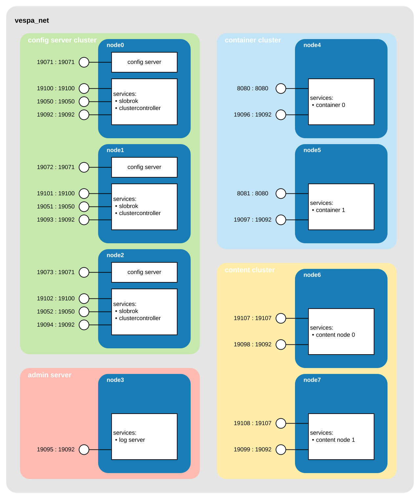

<!-- Copyright Yahoo. Licensed under the terms of the Apache 2.0 license. See LICENSE in the project root. -->


# Vespa high-availability multi-node template
This sample application is configured using clusters of nodes for HA.
This application structure will scale to applications of 100s of nodes.
Also see the smaller and simpler [multinode](../multinode) sample application.

There are multiple ways of deploying such applications, on multiple platforms.
This application is a set of basic Docker containers,
and describes the important elements and integration points.
Use this app as a reference for how to distribute nodes and how to validate the instance.
High-level Vespa architecture:


See [services.xml](src/main/application/services.xml) for the configuration -
in this guide:

* the config cluster is built from 3 config server nodes, node[0,1,2].
  See the `admin` section in services.xml.
* the admin server node that hosts the log server is hosted on node4.
  See the `admin` section in services.xml.
* the stateless java container cluster that hosts the _stateless_ nodes on node[4,5].
  See `container` section in services.xml.
* the content cluster that hosts the _stateful_ content nodes on node[6,7].
  See `content` section in services.xml.

See [Process overview](#Process-overview) below for more details,
why the clusters and services are configured in this way.

This guide is tested with Docker using 20G Memory:

<pre data-test="exec">
$ docker info | grep "Total Memory"
$ git clone --depth 1 https://github.com/vespa-engine/sample-apps.git
$ cd sample-apps/operations/multinode-HA
$ docker network create --driver bridge vespa_net
</pre>

The goal of this sample application is to create a Docker network with 8 nodes,
exporting ports to be able to observe and validate that the application is fully operational:




## Start the config server cluster
Config servers are normally started first,
as the other Vespa nodes depend on config servers for startup:
<pre data-test="exec">
$ docker run --detach --name node0 --hostname node0.vespa_net \
    -e VESPA_CONFIGSERVERS=node0.vespa_net,node1.vespa_net,node2.vespa_net \
    --network vespa_net \
    --publish 19071:19071 --publish 19100:19100 --publish 19050:19050 --publish 19092:19092 \
    vespaengine/vespa
$ docker run --detach --name node1 --hostname node1.vespa_net \
    -e VESPA_CONFIGSERVERS=node0.vespa_net,node1.vespa_net,node2.vespa_net \
    --network vespa_net \
    --publish 19072:19071 --publish 19101:19100 --publish 19051:19050 --publish 19093:19092 \
    vespaengine/vespa
$ docker run --detach --name node2 --hostname node2.vespa_net \
    -e VESPA_CONFIGSERVERS=node0.vespa_net,node1.vespa_net,node2.vespa_net \
    --network vespa_net \
    --publish 19073:19071 --publish 19102:19100 --publish 19052:19050 --publish 19094:19092 \
    vespaengine/vespa
</pre>

Notes:
* Use fully qualified hostnames.
* VESPA_CONFIGSERVERS lists all nodes using exactly the same names as in
  [hosts.xml](src/main/application/hosts.xml)
* Refer to the
  [Docker start script](https://github.com/vespa-engine/docker-image/blob/master/include/start-container.sh)
  for details.

Vespa separates between starting config servers and service nodes,
see [Vespa start/stop](https://docs.vespa.ai/en/reference/files-processes-and-ports.html#vespa-start-stop).
Normally config servers run both the `config server` _and_ `services`, other nodes run `services` only.
This because `services` has node infrastructure, e.g. log forwarding.

At this point, nothing other than config server cluster runs.
Wait for last config server to start -
checking for 19071 on config server nodes is useful for that
(find the port mappings in the illustration above):
<pre data-test="exec" data-test-wait-for="200 OK">
$ curl -s --head http://localhost:19073/ApplicationStatus
</pre>

    HTTP/1.1 200 OK
    Date: Tue, 02 Nov 2021 10:20:10 GMT
    Content-Type: application/json
    Content-Length: 13109


## Deploy the Vespa application configuration
<!-- ToDo: vespa-cli -->
<pre data-test="exec" data-test-assert-contains="prepared and activated.">
$ (cd src/main/application && zip -r - .) | \
  curl --header Content-Type:application/zip --data-binary @- \
  localhost:19071/application/v2/tenant/default/prepareandactivate
</pre>

As the Docker start script will start both the config server and services,
we expect to find responses on 19100 (`slobrok`) and 19050 (`cluster-controller`).
**Important note:** Vespa has a feature to not enable `services` before 50% of the nodes are up,
see [startup sequence](https://docs.vespa.ai/en/config-sentinel.html#cluster-startup).
Meaning, here we have started only 3/8, so `slobrok` and `cluster-controller` are not started yet -
find log messages like

    [2021-11-02 10:30:22.220] WARNING : config-sentinel  sentinel.sentinel.connectivity
                                        Only 3 of 7 nodes are up and OK, 42.9% (min is 50%)


## Start admin server
This is essentially the log server:
<pre data-test="exec">
$ docker run --detach --name node3 --hostname node3.vespa_net \
    -e VESPA_CONFIGSERVERS=node0.vespa_net,node1.vespa_net,node2.vespa_net \
    --network vespa_net \
    --publish 19095:19092 \
    vespaengine/vespa services
</pre>

Notes:
* See  _services_ argument to start script - a config server is not started on this node.
* The log server can be disk intensive, as vespa.log is rotated and forwarded here.
  It is normally a good idea to run this on a separate node, like here, for this reason -
  a full disk will not hit the other nodes then. 

As this is node 4 of 8, 50% of services is started, and we expect the `metric proxy`
(runs on all service nodes) to be up - and others:

    $ curl http://localhost:19095/state/v1/   # metrics proxy on node4
    $ curl http://localhost:19100/state/v1/   # slobok on node0
    $ curl http://localhost:19051/state/v1/   # cluster-controller on node1

In short, checking `/state/v1/` for services is useful to validate that services are up.
At this point it is useful to inspect the application using `vespa-model-inspect`:
```sh
$ docker exec -it node0 /bin/sh -c "/opt/vespa/bin/vespa-model-inspect hosts"
node0.vespa_net
node1.vespa_net
node2.vespa_net
node3.vespa_net
node4.vespa_net
node5.vespa_net
node6.vespa_net
node7.vespa_net

$ docker exec -it node0 /bin/sh -c "/opt/vespa/bin/vespa-model-inspect services"
config-sentinel
configproxy
configserver
container
container-clustercontroller
distributor
logd
logserver
metricsproxy-container
searchnode
slobrok
storagenode
transactionlogserver

$ docker exec -it node0 /bin/sh -c "/opt/vespa/bin/vespa-model-inspect service container"
container @ node4.vespa_net : 
default/container.0
    tcp/node4.vespa_net:8080 (STATE EXTERNAL QUERY HTTP)
    tcp/node4.vespa_net:19100 (EXTERNAL HTTP)
    tcp/node4.vespa_net:19101 (MESSAGING RPC)
    tcp/node4.vespa_net:19102 (ADMIN RPC)
container @ node5.vespa_net : 
default/container.1
    tcp/node5.vespa_net:8080 (STATE EXTERNAL QUERY HTTP)
    tcp/node5.vespa_net:19100 (EXTERNAL HTTP)
    tcp/node5.vespa_net:19101 (MESSAGING RPC)
    tcp/node5.vespa_net:19102 (ADMIN RPC)
```

This tool does only uses a config server, it does not check other nodes -
it displays a view of the layout of the application - what runs where. 

**Important takeaway:** Vespa port allocations are dynamic.
This enables Vespa to run a set of processes as configured in services.xml on each node.
Use `vespa-model-inspect` to find where processes run and which ports to use -
this tool can be used on any Vespa node.


## Start the container cluster
The container cluster has the feed and query endpoints, normally on 8080.
<pre data-test="exec">
$ docker run --detach --name node4 --hostname node4.vespa_net \
    -e VESPA_CONFIGSERVERS=node0.vespa_net,node1.vespa_net,node2.vespa_net \
    --network vespa_net \
    --publish 8080:8080 --publish 19096:19092 \
    vespaengine/vespa services
$ docker run --detach --name node5 --hostname node5.vespa_net \
    -e VESPA_CONFIGSERVERS=node0.vespa_net,node1.vespa_net,node2.vespa_net \
    --network vespa_net \
    --publish 8081:8080 --publish 19097:19092 \
    vespaengine/vespa services
</pre>

As this is also the cluster where custom components are loaded,
checking the `/ApplicationStatus` endpoint is useful

    $ curl http://localhost:8080/ApplicationStatus


## Start the content cluster:
<pre data-test="exec">
$ docker run --detach --name node6 --hostname node6.vespa_net \
    -e VESPA_CONFIGSERVERS=node0.vespa_net,node1.vespa_net,node2.vespa_net \
    --network vespa_net \
    --publish 19107:19107 --publish 19098:19092 \
    vespaengine/vespa services
$ docker run --detach --name node7 --hostname node7.vespa_net \
    -e VESPA_CONFIGSERVERS=node0.vespa_net,node1.vespa_net,node2.vespa_net \
    --network vespa_net \
    --publish 19108:19107 --publish 19099:19092 \
    vespaengine/vespa services
</pre>


## Process overview
Notes:
* [Config sentinel](https://docs.vespa.ai/en/config-sentinel.html)
  is useful to understand processes running,
  and also the [startup sequence](https://docs.vespa.ai/en/config-sentinel.html#cluster-startup).
  Note that in the startup sequence, order not strictly needed as in this sample app.
* [Config servers](https://docs.vespa.ai/en/cloudconfig/configuration-server.html) are normally started first,
  then application deployment - make sure to get this right before troubleshooting other services.
* See [slobrok](https://docs.vespa.ai/en/slobrok.html) for the Vespa naming service
* The [cluster controller](http://docs.vespa.ai/en/content/content-nodes.html#cluster-controller) cluster
  manages the system state, and is useful in debugging cluster failures.


## Clean up after testing
<pre data-test="after">
$ docker rm -f node0 node1 node2 node3 node4 node5 node6 node7
$ docker network rm vespa_net
</pre>


## Troubleshooting
This section is WIP, ToDo.

Refer to the [FAQ](https://docs.vespa.ai/en/faq.html).

[Admin procedures](https://docs.vespa.ai/en/operations/admin-procedures.html)
is a useful resource.


## Appendix

### Deploy output
Normal deploy output in this guide, as the service nodes are not started yet:
```json
{
  "log": [
    {
      "time": 1635853384031,
      "level": "WARNING",
      "message": "Unable to lookup IP address of host: node4.vespa_net",
      "applicationPackage": true
    },
    {
      "time": 1635853384044,
      "level": "WARNING",
      "message": "Unable to lookup IP address of host: node5.vespa_net",
      "applicationPackage": true
    },
    {
      "time": 1635853384071,
      "level": "WARNING",
      "message": "Unable to lookup IP address of host: node3.vespa_net",
      "applicationPackage": true
    },
    {
      "time": 1635853384164,
      "level": "WARNING",
      "message": "Unable to lookup IP address of host: node6.vespa_net",
      "applicationPackage": true
    },
    {
      "time": 1635853384768,
      "level": "WARNING",
      "message": "Unable to lookup IP address of host: node7.vespa_net",
      "applicationPackage": true
    }
  ],
  "tenant": "default",
  "url": "http://localhost:19071/application/v2/tenant/default/application/default/environment/prod/region/default/instance/default",
  "message": "Session 2 for tenant 'default' prepared and activated.",
  "configChangeActions": {
    "restart": [],
    "refeed": [],
    "reindex": []
  }
}
```


### Ports
Ports mapped in this guide:
```sh
$ netstat -an | egrep '1907[1,2,3]|1905[0,1,2]|1909[2,3,4,5,6,7,8,9]|1910[0,1,2]|808[0,1]|1910[7,8]' | sort

tcp46      0      0  *.19050                *.*                    LISTEN     
tcp46      0      0  *.19051                *.*                    LISTEN     
tcp46      0      0  *.19052                *.*                    LISTEN     
tcp46      0      0  *.19071                *.*                    LISTEN     
tcp46      0      0  *.19072                *.*                    LISTEN     
tcp46      0      0  *.19073                *.*                    LISTEN     
tcp46      0      0  *.19092                *.*                    LISTEN     
tcp46      0      0  *.19093                *.*                    LISTEN     
tcp46      0      0  *.19094                *.*                    LISTEN     
tcp46      0      0  *.19095                *.*                    LISTEN     
tcp46      0      0  *.19096                *.*                    LISTEN     
tcp46      0      0  *.19097                *.*                    LISTEN     
tcp46      0      0  *.19098                *.*                    LISTEN     
tcp46      0      0  *.19099                *.*                    LISTEN     
tcp46      0      0  *.19100                *.*                    LISTEN     
tcp46      0      0  *.19101                *.*                    LISTEN     
tcp46      0      0  *.19102                *.*                    LISTEN     
tcp46      0      0  *.19107                *.*                    LISTEN     
tcp46      0      0  *.19108                *.*                    LISTEN     
tcp46      0      0  *.8080                 *.*                    LISTEN     
tcp46      0      0  *.8081                 *.*                    LISTEN
```
