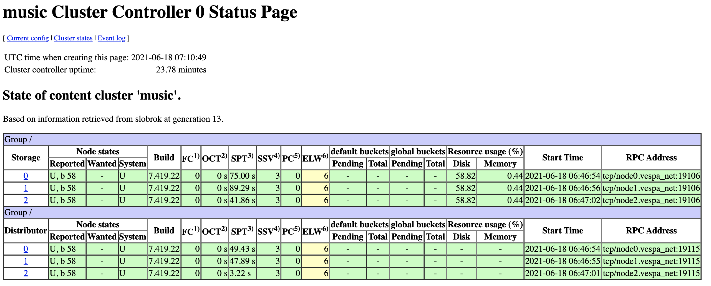
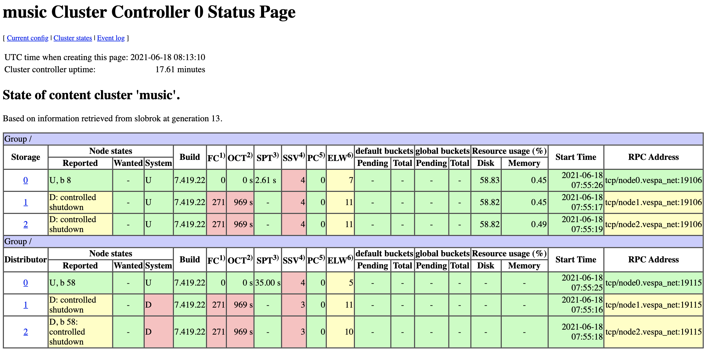

---
# Copyright Verizon Media. Licensed under the terms of the Apache 2.0 license. See LICENSE in the project root.
title: "Multinode"
---

This is a guide into how a multi-node Vespa cluster works.

It uses three nodes, all configured equally.
<!-- ToDo: explain the adminserver, what goes there -->

The nodes communicate over a Docker network

Prerequisites:
* Docker with 16G Memory

<pre>
$ docker info | grep "Total Memory"
$ cd sample-apps/operations/multinode
$ docker network create --driver bridge vespa_net
</pre>

### Start 3 nodes
<pre>
$ docker run --detach --name node0 --hostname node0.vespa_net \
    -e VESPA_CONFIGSERVERS=node0.vespa_net,node1.vespa_net,node2.vespa_net \
    --network vespa_net \
    --publish 8080:8080 --publish 19071:19071 --publish 19050:19050 --publish 19092:19092 \
    vespaengine/vespa
$ docker run --detach --name node1 --hostname node1.vespa_net \
    -e VESPA_CONFIGSERVERS=node0.vespa_net,node1.vespa_net,node2.vespa_net \
    --network vespa_net \
    --publish 8081:8080 --publish 19072:19071 --publish 19051:19050 --publish 19093:19092 \
    vespaengine/vespa
$ docker run --detach --name node2 --hostname node2.vespa_net \
    -e VESPA_CONFIGSERVERS=node0.vespa_net,node1.vespa_net,node2.vespa_net \
    --network vespa_net \
    --publish 8082:8080 --publish 19073:19071 --publish 19052:19050 --publish 19094:19092 \
    vespaengine/vespa
</pre>

Notes:
* Fully qualified hostnames.
* VESPA_CONFIGSERVERS lists all nodes using exactly the same names

Use Docker for Mac dashboard to see output / status:

Ports are mapped out of Docker containers for ease of use / inspect interfaces in this guide.

Wait for last config server to start:
<pre>
$ curl -s --head http://localhost:19073/ApplicationStatus

HTTP/1.1 200 OK
Date: Thu, 17 Jun 2021 11:26:19 GMT
Content-Type: application/json
Content-Length: 12732
</pre>

Note config server start in Docker image if matches hostname - see  
https://github.com/vespa-engine/docker-image/blob/master/Dockerfile , start script in
https://github.com/vespa-engine/docker-image/blob/master/include/start-container.sh

Make sure all ports are listed before continuing:
<pre>
$ netstat -an | egrep '1907[1,2,3]|1905[0,1,2]|808[0,1,2]|1909[2,3,4]' | sort
tcp46      0      0  *.19050                *.*                    LISTEN     
tcp46      0      0  *.19051                *.*                    LISTEN     
tcp46      0      0  *.19052                *.*                    LISTEN     
tcp46      0      0  *.19071                *.*                    LISTEN     
tcp46      0      0  *.19072                *.*                    LISTEN     
tcp46      0      0  *.19073                *.*                    LISTEN     
tcp46      0      0  *.19092                *.*                    LISTEN     
tcp46      0      0  *.19093                *.*                    LISTEN     
tcp46      0      0  *.19094                *.*                    LISTEN     
tcp46      0      0  *.8080                 *.*                    LISTEN     
tcp46      0      0  *.8081                 *.*                    LISTEN     
tcp46      0      0  *.8082                 *.*                    LISTEN   
</pre>

### Deploy a 3-node Vespa application

<pre>
$ (cd src/main/application && zip -r - .) | \
  curl --header Content-Type:application/zip --data-binary @- \
  localhost:19071/application/v2/tenant/default/prepareandactivate
</pre>

Using Docker for Mac, we see each Docker container use 2.9G memory, just as part of bootstrap -
This increases little with use, hence the 16G Docker requirement.

Wait for services to start:
<pre>
$ curl -s --head http://localhost:8082/ApplicationStatus
</pre>

### Inspect clustercontroller status pages
check that this works:
<pre>
$ curl http://localhost:19050/clustercontroller-status/v1/music
</pre>
Then open these in a browser:
* http://localhost:19050/clustercontroller-status/v1/music 
* http://localhost:19051/clustercontroller-status/v1/music 
* http://localhost:19052/clustercontroller-status/v1/music 

0 is normally master, 1 is next (and hence has a table), 2 is cold

### Do a node stop / start and observe changes to system state
<pre>
$ docker stop node2
</pre>

observe in http://localhost:19050/clustercontroller-status/v1/music that 
storage and distributor on node2 go to state down

<pre>
$ docker start node2
</pre>

Then observe in http://localhost:19050/clustercontroller-status/v1/music that
storage and distributor nodes go to state up again (this can take a minute or two on slower HW).

### Stop/start primary clustercontroller
<pre>
$ docker stop node0
</pre>

http://localhost:19050/clustercontroller-status/v1/music now goes blank as node0 is stopped

observe in http://localhost:19051/clustercontroller-status/v1/music that
storage and distributor on node0 go to state down.
Also see in "Master state" further down that this goes to primary after 60 seconds

<pre>
$ docker start node0
</pre>

observe 0 is master again

### Stop two clustercontrollers
<pre>
$ docker stop node0 node1
</pre>

http://localhost:19050/clustercontroller-status/v1/music and http://localhost:19050/clustercontroller-status/v1/music
now goes blank as node0 and node1 are stopped

observe in http://localhost:19052/clustercontroller-status/v1/music that
this never becomes master!
To understand, review https://stackoverflow.com/questions/32152467/can-zookeeper-remain-highly-available-if-one-of-three-nodes-fails :

> in a 3 node cluster, if 2 of the nodes die, the third one will not be serving requests.
> The reason for that is that the one remaining node cannot know if it is in fact the only survivor
> or if it has been partitioned off from others.
> Continuing to serve request at that point could cause a split brain scenario and violate the core ZooKeeper guarantee.

<pre>
$ docker start node0 node1
</pre>

observe 0 is master again

### Feed data, check distribution
Make sure the three nodes are started and up - then feed 5 documents:
<pre>
$ i=0; for doc in $(ls ../../album-recommendation-selfhosted/src/test/resources);
    do curl -H Content-Type:application/json -d @../../album-recommendation-selfhosted/src/test/resources/$doc \
    http://localhost:8080/document/v1/mynamespace/music/docid/$i; \
    i=$(($i + 1)); echo;
    done
</pre>
The redundancy configuration in [services.xml](src/main/application/services.xml) is 3 replicas,
i.e. one replica per node.

List document IDs:
<pre>
$ docker exec node0 bash -c "/opt/vespa/bin/vespa-visit -i"
</pre>

[vespa-visit](https://docs.vespa.ai/en/content/visiting.html) uses all nodes -
with redundancy=3, expect 5 documents per node:
<pre>
$ for port in 19092 19093 19094;
    do curl -s http://localhost:$port/metrics/v1/values | \
    jq '.services[] | select (.name=="vespa.searchnode") | .metrics[].values' | grep content.proton.documentdb.documents.total.last;
    done
</pre>

### Run queries while stopping nodes
Query any of 8080, 8081 and 8082:
<pre>
$ curl http://localhost:8080/search/?yql=select%20%2A%20from%20sources%20%2A%20where%20sddocname%20contains%20%22music%22%3B
</pre>

Check http://localhost:19050/clustercontroller-status/v1/music, set node2 down:
<pre>
$ docker stop node2
$ sleep 5
$ curl http://localhost:8080/search/?yql=select%20%2A%20from%20sources%20%2A%20where%20sddocname%20contains%20%22music%22%3B
</pre>

See "{"totalCount":5}". Then stop node1:

<pre>
$ docker stop node1
$ sleep 5
$ curl http://localhost:8080/search/?yql=select%20%2A%20from%20sources%20%2A%20where%20sddocname%20contains%20%22music%22%3B
</pre>

(we now see that the cluster controller is still up, with one)

<pre>
$ docker exec node0 bash -c "/opt/vespa/bin/vespa-proton-cmd --local getState"
...
"onlineDocs", "5"
</pre>

<pre>
[2021-06-18 07:57:52.246] WARNING : container-clustercontroller Container.com.yahoo.vespa.clustercontroller.core.database.DatabaseHandler	Fleetcontroller 0: Failed to connect to ZooKeeper at node0.vespa_net:2181,node1.vespa_net:2181,node2.vespa_net:2181 with session timeout 30000: java.lang.NullPointerException
at org.apache.zookeeper.ClientCnxnSocketNetty.onClosing(ClientCnxnSocketNetty.java:247)
at org.apache.zookeeper.ClientCnxn$SendThread.close(ClientCnxn.java:1465)
at org.apache.zookeeper.ClientCnxn.disconnect(ClientCnxn.java:1508)
at org.apache.zookeeper.ClientCnxn.close(ClientCnxn.java:1537)
at org.apache.zookeeper.ZooKeeper.close(ZooKeeper.java:1614)
at com.yahoo.vespa.clustercontroller.core.database.ZooKeeperDatabase.<init>(ZooKeeperDatabase.java:120)
at com.yahoo.vespa.clustercontroller.core.database.ZooKeeperDatabaseFactory.create(ZooKeeperDatabaseFactory.java:8)
at com.yahoo.vespa.clustercontroller.core.database.DatabaseHandler.connect(DatabaseHandler.java:197)
at com.yahoo.vespa.clustercontroller.core.database.DatabaseHandler.doNextZooKeeperTask(DatabaseHandler.java:252)
at com.yahoo.vespa.clustercontroller.core.FleetController.tick(FleetController.java:604)
at com.yahoo.vespa.clustercontroller.core.FleetController.run(FleetController.java:1127)
at java.base/java.lang.Thread.run(Thread.java:829)
</pre>

### Single-node clustercontroller
It is possible to set up clusters with only one clustercontroller - changes:
<pre>
&lt;host name="node3.vespa_net"&gt;
    &lt;alias&gt;node3&lt;/alias&gt;
&lt;/host&gt;

&lt;admin version='2.0'&gt;
    &lt;adminserver hostalias="node3" /&gt;
    &lt;configservers&gt;
        &lt;configserver hostalias="node0" /&gt;
        &lt;configserver hostalias="node1" /&gt;
        &lt;configserver hostalias="node2" /&gt;
    &lt;/configservers&gt;
    &lt;cluster-controllers standalone-zookeeper="true"&gt;
        &lt;cluster-controller hostalias="node3" /&gt;
    &lt;/cluster-controllers&gt;
&lt;/admin&gt;

$ docker run --detach --name node3 --hostname node3.vespa_net \
    -e VESPA_CONFIGSERVERS=node0.vespa_net,node1.vespa_net,node2.vespa_net \
    --network vespa_net \
    --publish 8083:8080 --publish 19074:19071 --publish 19053:19050 --publish 19095:19092 \
    vespaengine/vespa services
</pre>

Here, two content nodes, like node0 and node1, can go down while node2 serves the full data set in queries.

The cluster controller can also go down with no impact to query serving, assuming all content nodes do not change state.
I.e. if the single clustercontroller is down, and one content node goes down thereafter,
the cluster state is not updated, and partial query results is expected.

Pro tip: look at "SSV" which is "cluster state version" in the table -
this shows the view the content node has of the cluster.

