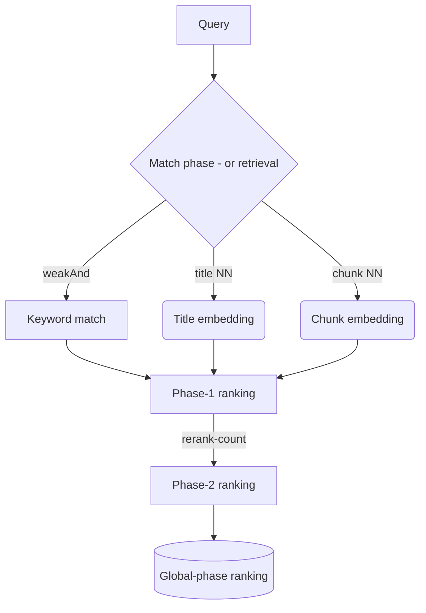

<!-- Copyright Vespa.ai. Licensed under the terms of the Apache 2.0 license. See LICENSE in the project root.-->

<picture>
  <source media="(prefers-color-scheme: dark)" srcset="https://assets.vespa.ai/logos/Vespa-logo-green-RGB.svg">
  <source media="(prefers-color-scheme: light)" srcset="https://assets.vespa.ai/logos/Vespa-logo-dark-RGB.svg">
  
</picture>

# The RAG Blueprint

Start with this if you want to create a RAG application that
* delivers state-of-the-art quality
* with any amount of data, query load.

This requires at least Vespa 8.519.55.

## Dataset

For this blueprint, we will use a synthetic dataset of documents belonging to a persona, Alex Chen, who is an AI Engineer at a fictional YC-backed startup called "SynapseFlow". The document dataset contains a mix of Alex's personal notes, technical documentation, workout logs, and other relevant information that reflects his professional and personal interests.

By feeding this dataset to Vespa, we enable a Retrieval-Augmented Generation (RAG) application to retrieve relevant documents and generate responses and insights from all Alex's documents. With Vespa, this could scale to billions of documents and thousands of queries per second, while still delivering state-of-the-art quality.

## Prerequisites

* [Docker](https://www.docker.com/) Desktop installed and running. 10GB available memory for Docker is recommended.
  Refer to [Docker memory](https://docs.vespa.ai/en/operations-selfhosted/docker-containers.html#memory)
  for details and troubleshooting
* Operating system: Linux, macOS or Windows 10 Pro (Docker requirement)
* Architecture: x86_64 or arm64
* Minimum **8 GB** memory dedicated to Docker (the default is 2 GB on Macs)
* [Homebrew](https://brew.sh/) to install [Vespa CLI](https://docs.vespa.ai/en/vespa-cli.html), or download
  a vespa cli release from [GitHub releases](https://github.com/vespa-engine/vespa/releases).

## Installing vespa-cli

This tutorial uses [Vespa-CLI](https://docs.vespa.ai/en/vespa-cli.html),
Vespa CLI is the official command-line client for Vespa.ai.
It is a single binary without any runtime dependencies and is available for Linux, macOS and Windows.

<pre>
$ brew install vespa-cli
</pre>

<pre data-test="exec">
$ vespa clone rag-blueprint rag-blueprint && cd rag-blueprint
</pre>

<pre data-test="exec">
$ docker run --detach --name vespa-rag --hostname vespa-rag \
  --publish 127.0.0.1:8080:8080 --publish 127.0.0.1:19112:19112 --publish 127.0.0.1:19071:19071 \
  vespaengine/vespa
</pre>

<pre data-test="exec">
$ vespa deploy --wait 300 ./app
</pre>

<pre data-test="exec">
$ vespa feed dataset/docs.jsonl
</pre>

<pre data-test="exec" data-test-assert-contains="yc_b2b_sales_workshop_notes.md">
$ vespa query 'query=yc b2b sales'
</pre>

### LLM-generation with OpenAI-client

The recommended way of providing an API key is through using the Secret Store in Vespa Cloud.
To enable this, you need to create a vault (if you don't have one already) and a secret through the Vespa Cloud console. If your vault is named `sample-apps` and contains a secret with the name `openai-api-key`, you would use the following configuration in your `services.xml` to set up the OpenAI client to use that secret:

```xml
  <secrets>
      <openai-api-key vault="sample-apps" name="openai-dev" />
  </secrets>
  <!-- Setup the client to OpenAI -->
  <component id="openai" class="ai.vespa.llm.clients.OpenAI">
      <config name="ai.vespa.llm.clients.llm-client">
          <apiKeySecretName>openai-api-key</apiKeySecretName>
      </config>
  </component>
```

Alternatively, for local deployments, you can set the `X-LLM-API-KEY` header in your query to use the OpenAI client for generation.

To test generation using the OpenAI client, post a query that runs the `openai` search chain, with `format=sse`. (Use `format=json` for a streaming json response including both the search hits and the LLM-generated tokens.)
<pre>
$ vespa query \
    --timeout 60 \
    --header="X-LLM-API-KEY:<your-api-key>" \
    yql='select *
    from doc
    where userInput(@query) or
    ({label:"title_label", targetHits:100}nearestNeighbor(title_embedding, embedding)) or
    ({label:"chunks_label", targetHits:100}nearestNeighbor(chunk_embeddings, embedding))' \
    query="Summarize the key architectural decisions documented for SynapseFlow's v0.2 release." \
    searchChain=openai \
    format=sse \
    hits=5 \
    traceLevel=1
</pre>

### Using a query profile

As an alternative to providing query parameters directly, Vespa supports [query-profiles](https://docs.vespa.ai/en/query-profiles.html?mode=selfhosted#using-a-query-profile), which allow you to define a set of query parameters to support different use cases. 
For this sample app, we have added a query profile named `rag`, see `app/search/query-profiles/rag.xml`.

<pre>
$ vespa query \
    --timeout 60 \
    --header="X-LLM-API-KEY:<your-api-key>" \
    query="Summarize the key architectural decisions documented for SynapseFlow's v0.2 release." \
    queryProfile=rag
</pre>

## Evaluating and improving ranking

### 1. Evaluation intro

The first thing we need is a set of representative queries, based on the expected use of our application. These can be generated manually, collected from real user queries, or you could use an LLM to generate some queries, either based on each document (see generate for how to automate this with Vespa), or based on descriptions of the domain of your data. Focus on making the queries as representative as possible to the real query load.

When we have a set of queries, the next thing we want to do is to add labels to the queries, which indicate which documents are relevant to the query. These might be binary labels (relevant or not) or graded labels (ie. 0 - not relevant, 1 - partially relevant, 2 - relevant etc.).
There might also be several documents that are relevant to (and needed to answer) a query. This depends on the nature of your (users) queries - Are you expecting queries beyond simple fact retrievals that requires multiple documents to give the right answer? 

For this sample app we will use binary labels generated by an LLM.

A short primer on Vespa's phased ranking approach (for more, see [docs](https://docs.vespa.ai/en/phased-ranking.html))



### 2. Retrieval (match-phase) evals

The first thing we want to do is to measure recall of the matching phase, or "What percentage of the relevant docs are matched across all queries. We also want to make sure we can inspect the ones that are relevant, but not matched, as well as inspect total matches (this is the number of docs that will be exposed to first-phase ranking). That way we might tune our match phase retrieval. 

We can do this easily using pyvespa TODO (wait for VespaMatchEvaluator PR). 