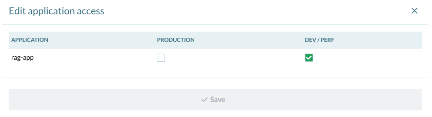

<!-- Copyright Vespa.ai. Licensed under the terms of the Apache 2.0 license. See LICENSE in the project root.-->

<picture>
  <source media="(prefers-color-scheme: dark)" srcset="https://assets.vespa.ai/logos/Vespa-logo-green-RGB.svg">
  <source media="(prefers-color-scheme: light)" srcset="https://assets.vespa.ai/logos/Vespa-logo-dark-RGB.svg">
  
</picture>

# Retrieval Augmented Generation (RAG) in Vespa

This sample application demonstrates an end-to-end Retrieval Augmented
Generation application in Vespa, where all the steps are run within Vespa. No
other systems are required.

This sample application focuses on the generation part of RAG, and builds upon
the [MS Marco passage
ranking](https://github.com/vespa-engine/sample-apps/tree/master/msmarco-ranking)
sample application. Please refer to that sample application for details on more
advanced forms of retrieval, such as vector search and cross-encoder
re-ranking. The generation steps in this sample application happen after
retrieval, so the techniques there can easily be used in this application as
well. For the purposes of this sample application, we will use a simple text
search using [BM25](https://docs.vespa.ai/en/reference/bm25.html).

We will show three versions of an end-to-end RAG application here:

1. Using an external LLM service to generate the final response.
2. Using local LLM inference to generate the final response.
3. Deploying to Vespa Cloud and using GPU accelerated LLM inference to generate
   the final response.

For details on using retrieval augmented generation in Vespa, please refer to
the [RAG in Vespa](https://docs.vespa.ai/en/llms-rag.html) documentation page.
For more on the general use of LLMs in Vespa, please refer to [LLMs in
Vespa](https://docs.vespa.ai/en/llms-in-vespa.html).


## Quick start

The following is a quick start recipe for getting started with a tiny slice of
the [MS Marco](https://microsoft.github.io/msmarco/) passage ranking dataset.
Please follow the instructions in the [MS Marco passage
ranking](https://github.com/vespa-engine/sample-apps/tree/master/msmarco-ranking) sample
application for instructions on downloading the entire dataset.

In the following we will deploy the sample application either to a local Docker
(or Podman) container or to Vespa Cloud. Querying the sample application does
not depend on the type of deployment, and is shown in the [querying](#querying)
section below.

Make sure that [Vespa CLI](https://docs.vespa.ai/en/vespa-cli.html) is
installed. Update to the newest version:
<pre>
$ brew install vespa-cli
</pre>

Download this sample application:
<pre data-test="exec">
$ vespa clone retrieval-augmented-generation rag && cd rag
</pre>


### Deploying to the Vespa Cloud using GPU
Deploy the sample application to Vespa Cloud on a GPU instance to perform the generative part.
Note that this application can fit within the free quota, so it is free to try.

In the following section, we will set the Vespa CLI target to the cloud.
Make sure you have created a tenant at
[console.vespa-cloud.com](https://console.vespa-cloud.com/). Make a note of the
tenant's name; it will be used in the next steps. For more information, see the
Vespa Cloud [getting started](https://cloud.vespa.ai/en/getting-started) guide.

Add your OpenAI API key to the Vespa secret store as described in
[Secret Management](https://cloud.vespa.ai/en/security/secret-store.html#secret-management).
Unless you already have one, create a new vault, and add your OpenAI API key as a secret.

The `services.xml` file must refer to the newly added secret in the secret store.
Replace `<my-vault-name>` and `<my-secret-name>` below with your own values:

```xml
<secrets>
    <openai-api-key vault=">my-vault-name>" name="<my-secret-name>"/>
</secrets>
```

Configure the vespa client. Replace `tenant-name` below with your tenant name.
We use the application name `rag-app` here, but you are free to choose your own
application name:
<pre>
$ vespa config set target cloud
$ vespa config set application tenant-name.rag-app
</pre>

Log in and add your public certificates to the application for Dataplane access:
<pre>
$ vespa auth login
$ vespa auth cert
</pre>

Grant application access to the secret.
Applications must be created first so one can use the Vespa Cloud Console to grant access.
The easiest way is to deploy, which will auto-create the application.
The first deployment will fail:

<pre>
$ vespa deploy --wait 900
</pre>

```
[09:47:43] warning Deployment failed: Invalid application: Vault 'my_vault' does not exist,
or application does not have access to it
```

At this point, open the console
(the link is like https://console.vespa-cloud.com/tenant/mytenant/account/secrets)
and grant access:



Deploy the application again. This can take some time for all nodes to be provisioned:
<pre>
$ vespa deploy --wait 900
</pre>

The application should now be deployed!
You can continue to the [querying](#querying) section below to test it.


### Deploying locally to a Docker container

Here, we will deploy the sample application locally to a
[Docker](https://www.docker.com/) or [Podman](https://podman.io/) container.
Please ensure that either Docker or Podman is installed and running with 12 GB
available memory.

Validate Docker resource settings, which should be a minimum of 12 GB:
<pre>
$ docker info | grep "Total Memory"
or
$ podman info | grep "memTotal"
</pre>

In the following, you can replace `docker` with `podman` and this should work
out of the box.

Pull and start the most recent Vespa container image:
<pre data-test="exec">
$ docker pull vespaengine/vespa
$ docker run --detach --name vespa-rag --hostname vespa-container \
  --publish 127.0.0.1:8080:8080 --publish 127.0.0.1:19071:19071 \
  vespaengine/vespa
</pre>

We will use a local deployment using this docker image:
<pre data-test="exec">
$ vespa config set target local
</pre>

Verify that the configuration service (deploy API) is ready:
<pre data-test="exec">
$ vespa status deploy --wait 300
</pre>

Deploy the application. This downloads the LLM file, which can take some time.
Note that if you don't want to perform local inference of the LLM, you can
remove the corresponding section in `services.xml` so the application skips
this downloading.
<pre data-test="exec">
$ vespa deploy --wait 900
</pre>

The application should now be deployed!


## Querying

Let's feed the documents:
<pre data-test="exec">
$ vespa feed ext/docs.jsonl
</pre>

Run a query first to check the retrieval:
<pre data-test="exec" data-test-assert-contains="Manhattan">
$ vespa query query="what was the manhattan project?" hits=5
</pre>


#### OpenAI

To test generation using the OpenAI client, post a query that runs the `openai` search chain:
<pre>
$ vespa query \
    --timeout 60 \
    --header="X-LLM-API-KEY:insert-api-key-here" \
    query="what was the manhattan project?" \
    hits=5 \
    searchChain=openai \
    format=sse \
    traceLevel=1
</pre>

On Vespa cloud, just skip the `--header` parameter,
as the API key is already set up in [services.xml](services.xml),
and will be retrieved from the Vespa secret store.

Here, we specifically set the search chain to `openai`.
This calls the
[RAGSearcher](https://github.com/vespa-engine/vespa/blob/master/container-search/src/main/java/ai/vespa/search/llm/RAGSearcher.java)
which is set up to use the
[OpenAI](https://github.com/vespa-engine/vespa/blob/master/model-integration/src/main/java/ai/vespa/llm/clients/OpenAI.java) client.
Note that this requires an OpenAI API key.
We also add a timeout as token generation can take some time.


#### Local

To test generation using the local LLM model, post a query that runs the `local` search chain:
<pre data-test="exec" data-test-assert-contains="Manhattan">
$ vespa query \
    --timeout 120 \
    query="what was the manhattan project?" \
    hits=5 \
    searchChain=local \
    format=sse \
    traceLevel=1
</pre>

Note that if you are submitting this query to a local Docker deployment, it can
take some time before the tokens start appearing. This is because the prompt
evaluation can take a significant amount of time, particularly on CPUs without
a lot of cores. To alleviate this a bit, you can reduce the number of hits
retrieved by Vespa to, for instance, 3.

Prompt evaluation and token generation are much more efficient on the GPU.

### Structured output

You can also specify a structured output format for the LLM.
In the example below, we provide a JSON schema to force the LLM to return the answer in 3 different
formats:

- `answer-short`: a short answer to the question
- `answer-short-french`: a translation of the short answer in French
- `answer-short-eli5`: an explanation of the answer as if the user was 5 years old

<pre data-test="exec" data-test-assert-contains="answer-short-french">
vespa query \
    --timeout 60 \
    query="what was the manhattan project?" \
    hits=5 \
    searchChain=local \
    format=sse \
    llm.json_schema="{\"type\":\"object\",\"properties\":{\"answer-short\":{\"type\":\"string\"},\"answer-short-french\":{\"type\":\"string\",\"description\":\"exact translation of short answer in French language\"},\"answer-short-eli5\":{\"type\":\"string\",\"description\":\"explain the answer like I am 5 years old\"}},\"required\":[\"answer-short\",\"answer-short-french\",\"answer-short-eli5\"],\"additionalProperties\":false}" \
    traceLevel=1
</pre>

The `llm.json_schema` parameter is used to specify the expected output format of the LLM.
The schema is defined in JSON Schema format, which allows you to specify the expected structure of the output.

## Query parameters

The parameters here are:

- `query`: the query used both for retrieval and the prompt question.
- `hits`: the number of hits that Vespa should return in the retrieval stage
- `searchChain`: the search chain set up in `services.xml` that calls the
  generative process
- `format`: sets the format to server-sent events, which will stream the tokens
  as they are generated.
- `traceLevel`: outputs some debug information, such as the actual prompt that
  was sent to the LLM and token timing.

For more information on how to customize the prompt, please refer to the [RAG
in Vespa](https://docs.vespa.ai/en/llms-rag.html) documentation.


## Shutdown and remove the RAG application

For the `local` deployments, shutdown and remove this container:
<pre data-test="after">
$ docker rm -f vespa-rag
</pre>

To remove the application from Vespa Cloud:
<pre>
$ vespa destroy
</pre>
