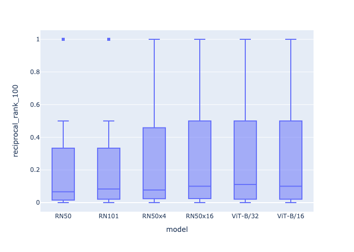

<!-- Copyright Yahoo. Licensed under the terms of the Apache 2.0 license. See LICENSE in the project root. -->


# Python-based text-image search app

This sample is an example of a text-to-image search application.
Taking a textual query, such as "two people bicycling",
it will return images containing two people on bikes.
This application is built using [CLIP (Contrastive Language-Image
Pre-Training)](https://github.com/openai/CLIP) which enables "zero-shot prediction".
This means that the system can return sensible results for images it hasn't
seen during training, allowing it to process and index any image.
In this use case, we use the [Flickr8k](https://github.com/jbrownlee/Datasets/blob/master/Flickr8k_Dataset.names)
dataset, which was not explicitly used during training of the CLIP model.

This Python-based sample application uses [pyvespa](https://pyvespa.readthedocs.io/en/latest/index.html)
to process, feed and query Vespa. This is suitable for exploration and analysis.

## Download data

We are going to use the Flickr8k dataset to allow users to follow along from their laptop.
You can use the script in `../sh/download_flickr8k.sh` to download the data,
or manually from [the Kaggle website](https://www.kaggle.com/ming666/flicker8k-dataset).

After downloading, set the `IMG_DIR` environment variable to the folder containing the PNG files.

```
export IMG_DIR=<image-folder>
```

## Compare pre-trained CLIP models for text-image retrieval

You can follow [this Jupyter
Notebook](compare-pre-trained-clip-for-text-image-search.ipynb)
for a full interactive end-to-end example that sets up a Vespa environment,
processes and feeds image data, and issues queries.
It includes an analysis over which of the six different pre-trained models in CLIP perform best.

This figure below shows the Reciprocal Rank @ 100 for each of the six
available pre-trained CLIP models.

-


## Demo the search app

After running the notebook above, you can run the streamlit demo UI.
First, set the following environment variables required by the app:

```
export VESPA_ENDPOINT=<your-vespa-endpoint>
export VESPA_CERT_PATH=<your-vespa-certificate-path>  # if using Vespa Cloud, not needed for local Docker
export IMG_DIR=<image-folder>
```

Now you are ready to run the app:

```
streamlit run app.py
```

[Animation](https://data.vespa.oath.cloud/sample-apps-data/image_demo.gif)
