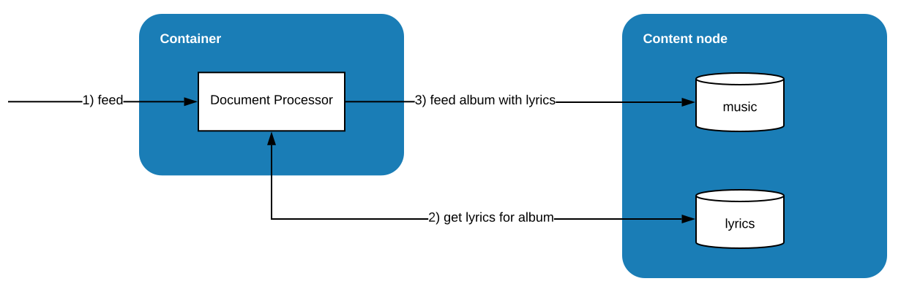

<!-- Copyright Verizon Media. Licensed under the terms of the Apache 2.0 license. See LICENSE in the project root. -->
# Vespa sample applications - album recommendations docproc

Data written to Vespa pass through document processing,
where [indexing](https://docs.vespa.ai/documentation/indexing.html) is one example.

Applications can add custom processing, normally done before indexing.
This is done by adding a [Document Processor](https://docs.vespa.ai/documentation/document-processing.html).
Such processing is synchronous, and this is problematic for processing
that requires other resources with high latency -
this can saturate the threadpool.

This application demonstrates how to use _Progress.LATER_
and the asynchronous [Document API](https://docs.vespa.ai/documentation/document-api-guide.html)

Summary:
- Document Processors: modify / enrich data in the feed pipeline
- Multiple Schemas: store different kinds of data, like different database tables
- Enrich data from multiple sources: here, look up data in one schema and add to another
- Document API: write asynchronous code to fetch data

Flow:

1. Feed album document with _music_ schema
1. Look up in _lyrics_ schema if album with given ID has lyrics stored
1. Store album with lyrics in _music_ schema 

Follow steps 1-8 in [album-recommendation-searcher](https://cloud.vespa.ai/album-recommendation-searcher) -
but do not change directory, use the _album-recommendation-docproc_ directory -
stop after setting $ENDPOINT

Feed a _lyrics_ document:
```
$ curl --cert ./data-plane-public-cert.pem --key ./data-plane-private-key.pem \
    -H "Content-Type:application/json" --data-binary @src/test/resources/A-Head-Full-of-Dreams-lyrics.json \
    $ENDPOINT/document/v1/mynamespace/lyrics/docid/1
```

Get the document to validate - dump all docs in lyrics schema:
```
$ curl --cert ./data-plane-public-cert.pem --key ./data-plane-private-key.pem \
    "$ENDPOINT/document/v1/mynamespace/lyrics/docid?wantedDocumentCount=100"
```

Feed a _music_ document:
```
$ curl --cert ./data-plane-public-cert.pem --key ./data-plane-private-key.pem \
    -H "Content-Type:application/json" --data-binary @src/test/resources/A-Head-Full-of-Dreams.json \
    $ENDPOINT/document/v1/mynamespace/music/docid/1
```

Get the document to validate - dump all docs in music schema - see lyrics in music document:
```
$ curl --cert ./data-plane-public-cert.pem --key ./data-plane-private-key.pem \
    "$ENDPOINT/document/v1/mynamespace/music/docid?wantedDocumentCount=100"
```

Use the https://console.vespa.oath.cloud to download logs, then inspect what happened:
```
Container.ai.vespa.example.album.LyricsDocumentProcessor	info	In process
Container.ai.vespa.example.album.LyricsDocumentProcessor	info	  Added to requests pending: 1
Container.ai.vespa.example.album.LyricsDocumentProcessor	info	  Request pending ID: 1, Progress.LATER
Container.ai.vespa.example.album.LyricsDocumentProcessor	info	In process
Container.ai.vespa.example.album.LyricsDocumentProcessor	info	  Request pending ID: 1, Progress.LATER
Container.ai.vespa.example.album.LyricsDocumentProcessor	info	In handleResponse
Container.ai.vespa.example.album.LyricsDocumentProcessor	info	  Async response to put or get, requestID: 1
Container.ai.vespa.example.album.LyricsDocumentProcessor	info	  Found lyrics for : document 'id:mynamespace:lyrics::1' of type 'lyrics'
Container.ai.vespa.example.album.LyricsDocumentProcessor	info	In process
Container.ai.vespa.example.album.LyricsDocumentProcessor	info	  Set lyrics, Progress.DONE
```
- In the first invocation of _process_, an async request is made - set _Progress.LATER_
- In the second invocation of _process_, the async request has not yet completed
  (there can be many such invocations)  - set _Progress.LATER_
- Then, the handler for the async operation is invoked as the call has completed
- In the subsequent _process_ invocation, we see that the async operation has completed -
  set _Progress.DONE_

Get / delete a document by ID:
```
$ curl --cert ./data-plane-public-cert.pem --key ./data-plane-private-key.pem \
    "$ENDPOINT/document/v1/mynamespace/music/docid/1"
    
$ curl -X DELETE --cert ./data-plane-public-cert.pem --key ./data-plane-private-key.pem \
    "$ENDPOINT/document/v1/mynamespace/music/docid/1"
```
